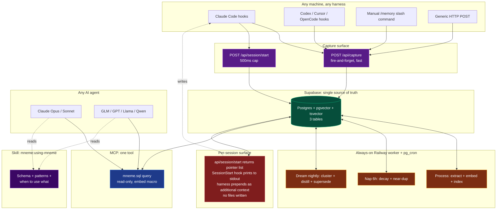
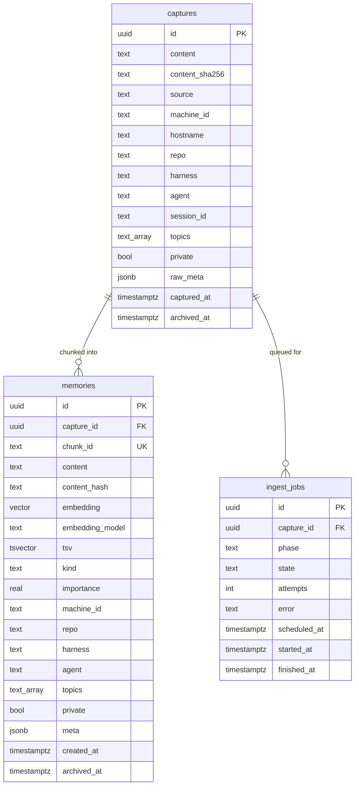
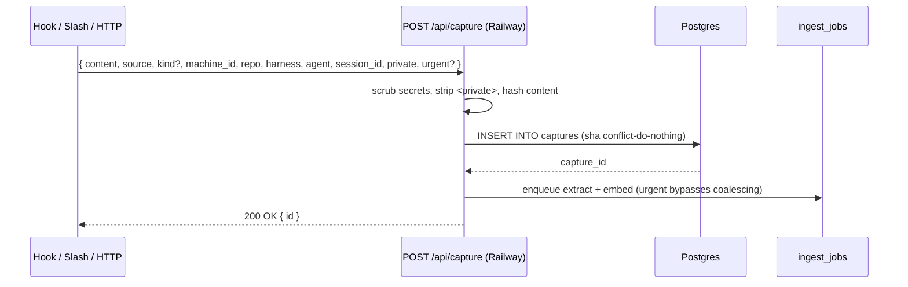
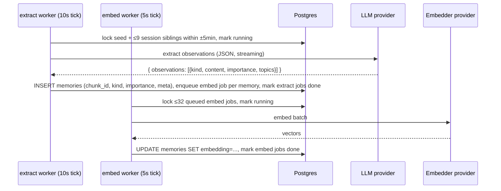
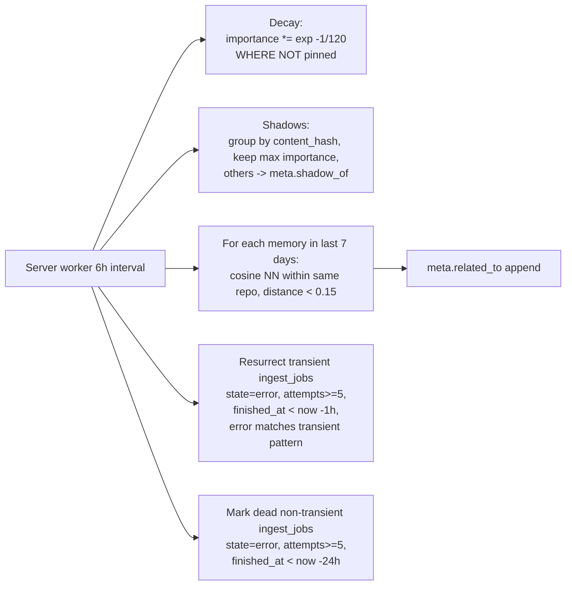
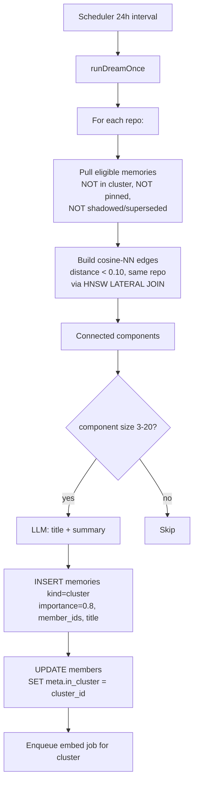
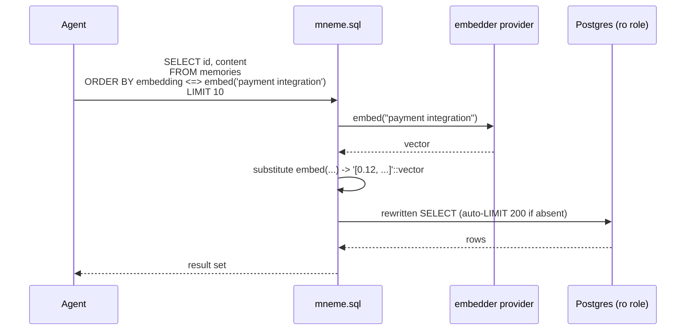
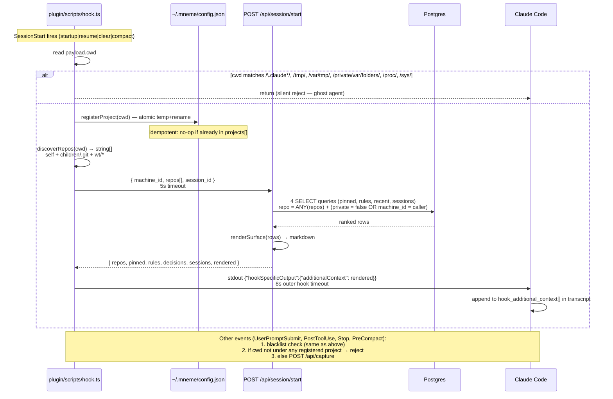

# Mneme — Architecture (v2)

> Greek muse of memory. A personal, cross-machine, cross-harness, cross-AI memory layer. Three tables. One SQL tool. A skill that teaches the agent how to walk the data.

---

## 1. Problem and Scope

### The pain
- **claude-mem** captures coding sessions richly, but is single-machine and never leaves the laptop.
- **OB1** is cross-AI and cross-machine via MCP, but has no hook surface — captures are manual.
- Switching machine, harness, or model loses context.

### What Mneme is
A personal tool for one user. Three machines. Multiple harnesses (Claude Code first-class, others via generic capture). Multiple AI providers. **Postgres + pgvector + tsvector** as the single source of truth, fronted by a one-tool MCP server and a skill that orients any agent to the data.

### What Mneme is not
- Multi-tenant.
- Team memory.
- A replacement for `git log` or your editor's history.

### Comparison with prior art

Mneme takes the best parts of four existing systems.

| Dimension | claude-mem | OB1 (Open Brain) | memsearch | mempalace | **Mneme** |
|---|---|---|---|---|---|
| Primary purpose | Local coding session memory | Personal note hub via MCP | Markdown memory for coding agents | Local memory palace | Cross-machine coding memory across harnesses |
| Storage | SQLite + Chroma (local) | Postgres + pgvector (any host) | Markdown files + Milvus / Milvus Lite | ChromaDB + SQLite KG (local) | Postgres + pgvector + tsvector (any host) |
| Capture | Hooks per event (SessionStart, UserPromptSubmit, PostToolUse, Stop, SessionEnd) + filesystem watcher | Manual via MCP `capture_thought` | Stop hook → Haiku summary + `memsearch watch` file watcher + CLI `index` | Mining (`mempalace mine`), transcript sweep, MCP `add_drawer`, Claude Code hooks | Hooks + slash + HTTP, coalesced server-side, urgent bypass |
| Cross-machine | ❌ single laptop | ✅ shared Postgres | partial (shared dir + Milvus URI) | ❌ local-first | ✅ shared Postgres |
| Cross-harness | ✅ Claude Code, Gemini CLI, OpenCode | ✅ MCP-native | ✅ Claude Code, OpenClaw, OpenCode, Codex CLI | ✅ MCP + Claude Code hooks | ✅ MCP + generic POST |
| Cross-AI | ✅ via Gemini/OpenCode plugins | ✅ any MCP client | ✅ any MCP / CLI client | ✅ any MCP client | ✅ |
| Consolidation | ❌ none | ❌ none | `memsearch compact` (LLM chunk summarisation) | ❌ | Nightly **dream**: cluster + distill |
| Importance/decay | ❌ | ❌ | ❌ | ❌ | **Nap**: exp decay + shadows + relations |
| Contradiction | ❌ | ❌ | ❌ | Bitemporal triples (`valid_from` / `valid_to`) | Bitemporal supersede via `meta.superseded_by` (deferred, see §16) |
| Dedup | `UNIQUE(content_hash, session)` | SHA-256 fingerprint | composite chunk_id with model | file-level skip on mining + cosine gating in `add_drawer` | All four, additive |
| In-session surface | ✅ Per-folder CLAUDE.md regen + SessionStart hook | ❌ pull-only via tool calls | partial (3-layer progressive retrieval) | partial (`wake-up` + hooks) | ✅ SessionStart pointer list — no files written |
| Tool surface | ~3-4 MCP tools (`search`, `timeline`, `get_observations`) | 4 + 2 ChatGPT aliases | none direct (CLI + Python API + plugins) | ~20 MCP tools | One: `mneme.sql` + skill |
| Hook resilience | Always-on Bun daemon | n/a | n/a | n/a | Local outbox + retry on next session |
| LLM in pipeline | Agent SDK summarisation at session boundaries | Optional metadata at insert | LLM compact via Haiku | Optional refinement | Coalesced 5-min batches per session |
| Privacy | `<private>` tag stripping | Row-level security | not documented | not documented | Edge scrubber on every string field + `<private>` strip + `private` flag + provider self-host option |
| License | AGPL-3.0 (`ragtime/` PolyForm-NC) | FSL-1.1-MIT | MIT | MIT | Personal tool, unlicensed |

**What Mneme inherits from each:**

- **claude-mem:** rich kind taxonomy (`bugfix`/`feature`/`decision`/`security_alert`/...), in-session surface via SessionStart hook, hook-driven capture, the always-on plugin install pattern.
- **OB1:** shared Postgres + pgvector as cross-machine source of truth, MCP as the cross-AI unifier, opaque per-client tokens.
- **memsearch:** composite `chunk_id` with embedding model in the hash (safe re-embed migration), compact-as-new-file pattern (cluster summaries flow back as captures), hybrid dense + BM25.
- **mempalace:** bitemporal pattern (`valid_to` close-out, `superseded_by`), the never-DELETE principle, dedup-as-gating-not-overwrite.

**Where Mneme diverges:** none of the four ship importance/decay (`nap`), none ship LLM-driven clustering of past memories (`dream`), and all of them ship a multi-tool MCP surface where Mneme deliberately ships one (`mneme.sql`) plus a skill. The cross-machine + bitemporal + one-tool combination is what makes Mneme distinct.

---

## 2. Design Principles (locked)

1. **Three tables for v1.** Add a fourth only when an actual reader needs it. memsearch / mempalace shape: small surface, lots of derived behavior in functions and crons.
2. **SQL is the read interface.** One MCP tool: `mneme.sql(query)`. Read-only, with an `embed()` macro for vector search. The skill teaches the agent to write the queries.
3. **Captures are sacred.** Raw `captures` are immutable. All later phases are additive: new memory rows, updated `meta jsonb`, flipped `archived_at`. Bitemporal supersede via flags, never DELETE.
4. **Progressive disclosure in the skill.** Skill description loaded at session start (~50 tokens). Body loaded when the agent decides Mneme is relevant. No memory bodies ever auto-injected into the system prompt.
5. **Privacy at the edge.** `<private>` strip + secrets regex on every POST. Paid LLM providers only when extracting (no free tiers that train on prompts).

---

## 3. Glossary

| Term | Meaning |
|---|---|
| **Capture** | Raw immutable input event from a hook, slash command, or HTTP POST. |
| **Memory** | A chunk of a capture with embedding, tsv, kind, scope, and importance. Derived rows like cluster summaries are *also* memories — same table. |
| **Kind** | One of `note`, `bugfix`, `feature`, `discovery`, `decision`, `preference`, `constraint`, `security_alert`, `reference`, `summary`, `cluster`, `claude_memory`. Extends claude-mem's observation taxonomy. |
| **Scope** | The (machine, repo, harness, agent, topic[]) tuple on every capture and memory. |
| **Importance** | Salience score in `[0, 1]`. Decays with each nap cycle. Floors at `FLOOR=0.05` for unpinned, `PIN_FLOOR=0.5` for pinned. |
| **Embed macro** | `embed('text')` inside SQL. The MCP `sql` tool replaces it with a vector literal from the configured embedder provider before execution. |
| **Nap** | Every 6 hours (scheduler-driven worker): decay importance with asymmetric floors, exact-text shadow grouping, semantic-relation linking via `meta.related_to`, resurrect transient ingest failures, retire non-transient errors to `state='dead'`. Pure SQL, no LLM. |
| **Dream** | Every 24 hours (scheduler-driven worker): per-repo cosine-NN clustering at distance < 0.10, union-find connected components, LLM-distill clusters of size 3-20 into a new `kind='cluster'` memory, mark members `meta.in_cluster`. Supersede detection is deferred (see §16). |
| **Surface** | Per-session injection of pinned + `preference`/`constraint` memories + recent decisions/features/bugfixes/discoveries + recent session summaries via the harness's SessionStart hook stdout (claude-mem pattern). Never writes to `CLAUDE.md` or any user file. Token-capped, scoped to discovered repos. |
| **Source** | The origin tag on a capture row. Today: `claude_hook` (UserPromptSubmit + PostToolUse), `claude_summary` (Stop / PreCompact), `claude_assistant` (assistant turn transcription), `claude_memory` (Anthropic auto-memory mirror), `manual:/memory` (slash), `manual:/api/memory` (direct write). Dream writes directly to `memories` and inherits `capture_id` from a seed member. |
| **Urgent capture** | Kinds `security_alert`, `decision` skip the 5-min coalescing window and extract immediately. |

---

## 4. High-Level Architecture



### Stack

Mneme is **provider-agnostic for LLM, embeddings, and host**. Concrete implementations live under `packages/server/src/llm/providers/<name>.ts` and `embedder/<name>.ts`. The LLM side runs a per-pipeline picker (`llm/pick.ts`) that prefers `openrouter` when its API key is set, falling back to `local` when its breaker is open or the key is absent; embeddings dispatch via `EMBEDDER_PROVIDER` env at startup. Today the wired LLM providers are `openrouter` (cloud, primary) and `local` (CF Worker fronting Ollama, fallback + always-available); the wired embedder is `local` (TEI). Anything bun-runnable serves the API; anything that speaks Postgres-with-pgvector serves the data.

| Layer | Reference choice | Alternatives | Notes |
|---|---|---|---|
| Storage | Postgres + pgvector + tsvector | Supabase, Neon, RDS, self-hosted Postgres | Two connection strings: `DATABASE_URL` (writer) + `MNEME_READER_DATABASE_URL` (read-only role for the MCP `sql` tool). |
| Embeddings | `local` provider → any TEI / OpenAI-compatible embeddings endpoint serving a 1024-dim model (e.g. `BAAI/bge-large-en-v1.5`) | Self-hosted TEI/Ollama; remote APIs (OpenAI, Voyage, Cohere) added by dropping in a new file under `embedder/` | `chunk_id = sha256(content_hash + ":" + embedding_model)` makes model swaps collision-safe. Schema column is `vector(1024)`; different dim ⇒ one ALTER. |
| Extraction LLM | Picker over `openrouter` (cloud, primary; configured `qwen-2.5-72b` for extract / `claude-sonnet-4` for dream) and `local` (fallback, OpenAI-compat at `compute.jalipalo.dev`) | Either tier swappable: drop a new file under `llm/providers/` and register in `pick.ts`. Per-pipeline limits live on each provider (extract chars/siblings; dream cluster chars), so the cloud path can be generous without breaking the local path's tunnel-window safety | Streaming SSE + `response_format: { type: "json_object" }` on both. Per-provider circuit breaker (3 fails → 5 min cooldown) flips the picker between them; cycle-level breaker on top pauses the entire worker if both sides fail. `LLM_PROVIDER_FORCE=local|openrouter` env overrides the picker for debug. Each memory's `meta` records `extractor_provider` + `extractor_model` (clusters: `distiller_*`) for provenance. |
| Edge | Direct HTTPS or any reverse proxy (Caddy, nginx, Traefik, Cloudflare Tunnel) | Bearer-auth gate happens in the app, not the edge — any TLS-terminating front works. | Bind container ports `127.0.0.1` only when fronting with a tunnel; expose `0.0.0.0` when running behind a managed load balancer. |
| API + worker host | Single Bun process | Railway, Fly.io, Render, DigitalOcean, a VPS, or a homelab VM — anything that runs Bun and reaches Postgres | Same Bun process serves Hono routes and runs the workers. Worker singleton is pinned to `globalThis` so `bun --hot` reloads don't multiply loops. The scheduler persists `next_run_at` to `_ops.worker_runs` so redeploys don't skip cycles. |
| Read interface | MCP (one tool) + a skill | — | `mneme.sql` reads via the `mneme_reader` Postgres role. |

Cost depends entirely on host + provider choices. See §13 for the three reference scenarios (self-hosted everything → free, mixed cloud → ~$5/mo, BYO API keys → $5/mo + provider charges).

---

## 5. Data Model

### Three tables



### What lives in `meta jsonb` instead of dedicated tables

| Use | Stored as |
|---|---|
| Near-dup links | `meta.related_to`: `["<id>", "<id>", ...]` |
| Cluster membership (on a `kind='cluster'` row) | `meta.member_ids`: `["<id>", ...]` |
| Bitemporal supersede | `meta.superseded_by`: `"<id>"` on the older memory |
| Pinned by user | `meta.pinned`: `true` |
| Source coalescing window | `meta.coalesced_from`: `["<capture_id>", ...]` |
| Future shape | We add typed columns or a fourth table only when a reader needs them. |

### Schema DDL

```sql
-- ============================================================
-- Mneme schema v1: three tables. Additive forever.
-- ============================================================

CREATE EXTENSION IF NOT EXISTS pgcrypto;
CREATE EXTENSION IF NOT EXISTS vector;

-- ----------------------------------------------------------------
-- captures: raw, immutable. sha256 dedup at ingest. Never updated.
-- ----------------------------------------------------------------
CREATE TABLE captures (
  id              UUID PRIMARY KEY DEFAULT gen_random_uuid(),
  content         TEXT NOT NULL,
  content_sha256  TEXT NOT NULL,
  source          TEXT NOT NULL,            -- 'claude_hook' | 'codex_hook' | 'cursor_hook' | 'manual' | 'http' | 'dream'
  machine_id      TEXT NOT NULL,            -- uuid string from ~/.mneme/machine.uuid
  hostname        TEXT NOT NULL,
  repo            TEXT,                     -- canonical git remote URL or NULL
  harness         TEXT NOT NULL,            -- 'claude-code' | 'codex' | 'cursor' | 'web' | 'cli'
  agent           TEXT,
  session_id      TEXT,
  topics          TEXT[] NOT NULL DEFAULT '{}',
  private         BOOLEAN NOT NULL DEFAULT false,
  raw_meta        JSONB NOT NULL DEFAULT '{}',
  captured_at     TIMESTAMPTZ NOT NULL DEFAULT now(),
  archived_at     TIMESTAMPTZ,
  UNIQUE (content_sha256, machine_id)
);

CREATE INDEX captures_repo_idx     ON captures (repo)        WHERE archived_at IS NULL;
CREATE INDEX captures_session_idx  ON captures (session_id)  WHERE archived_at IS NULL;
CREATE INDEX captures_captured_at  ON captures (captured_at DESC);

-- ----------------------------------------------------------------
-- memories: chunked, embedded, BM25-indexed.
-- chunk_id encodes embedding model -> safe re-embed migration.
-- Cluster summaries are also memories (kind='cluster').
-- ----------------------------------------------------------------
CREATE TABLE memories (
  id               UUID PRIMARY KEY DEFAULT gen_random_uuid(),
  capture_id       UUID NOT NULL REFERENCES captures(id),
  chunk_id         TEXT NOT NULL UNIQUE,      -- sha(source:start:end:content_hash:embedding_model)[:16]
  content          TEXT NOT NULL,
  content_hash     TEXT NOT NULL,
  embedding        VECTOR(1024),
  embedding_model  TEXT NOT NULL,
  tsv              TSVECTOR,
  kind             TEXT,                      -- see Glossary
  importance       REAL NOT NULL DEFAULT 1.0,

  -- denormalized scope for fast filter
  machine_id       TEXT NOT NULL,
  repo             TEXT,
  harness          TEXT NOT NULL,
  agent            TEXT,
  topics           TEXT[] NOT NULL DEFAULT '{}',
  private          BOOLEAN NOT NULL DEFAULT false,

  meta             JSONB NOT NULL DEFAULT '{}',  -- related_to, member_ids, superseded_by, pinned, ...

  created_at       TIMESTAMPTZ NOT NULL DEFAULT now(),
  archived_at      TIMESTAMPTZ
);

CREATE INDEX memories_embedding_idx  ON memories USING hnsw (embedding vector_cosine_ops)
  WITH (m = 16, ef_construction = 64);
CREATE INDEX memories_tsv_idx        ON memories USING gin (tsv);
CREATE INDEX memories_repo_idx       ON memories (repo)       WHERE archived_at IS NULL;
CREATE INDEX memories_kind_idx       ON memories (kind)       WHERE archived_at IS NULL;
CREATE INDEX memories_importance_idx ON memories (importance DESC) WHERE archived_at IS NULL;
CREATE INDEX memories_meta_idx       ON memories USING gin (meta);   -- enables related_to / superseded_by lookups

-- ----------------------------------------------------------------
-- ingest_jobs: worker queue.
-- ----------------------------------------------------------------
CREATE TABLE ingest_jobs (
  id            UUID PRIMARY KEY DEFAULT gen_random_uuid(),
  capture_id    UUID REFERENCES captures(id),  -- NULL for cron-driven dream jobs
  phase         TEXT NOT NULL,                  -- 'extract' | 'embed' | 'dream'
  state         TEXT NOT NULL,                  -- 'queued' | 'running' | 'done' | 'error'
  attempts      INT NOT NULL DEFAULT 0,
  error         TEXT,
  scheduled_at  TIMESTAMPTZ NOT NULL DEFAULT now(),
  started_at    TIMESTAMPTZ,
  finished_at   TIMESTAMPTZ
);

CREATE INDEX ingest_jobs_pending_idx
  ON ingest_jobs (scheduled_at)
  WHERE state IN ('queued', 'error');
```

---

## 6. Lifecycle Flows

### 6.1 Capture (write)

All write paths converge on `POST /api/capture`. The endpoint is source-agnostic — it scrubs, hashes, dedups, and enqueues.



**SLA:** P95 < 200 ms. Captures never block the user. If the server is unreachable, the source writes to `~/.mneme/outbox/` and retries at next session start.

**Sources** (all writes that go through `/api/capture` carry one of these tags):

| Source | Trigger | Default `kind` | Notes |
|---|---|---|---|
| `claude_hook` | Claude Code `UserPromptSubmit` and `PostToolUse` | (extracted in Process) | Coalesced by `session_id` within ±5-min window |
| `claude_summary` | Claude Code `Stop` and `PreCompact` hooks | `summary` | Session digest from the harness; skips coalescing |
| `claude_assistant` | Assistant turns transcribed from Claude Code's session JSONL | (extracted) | Lets Mneme see what *the agent said*, not just what the user prompted or what tools ran |
| `claude_memory` | Claude Code `PostToolUse(Write\|Edit)` on path `~/.claude/projects/*/memory/*.md` | `claude_memory` (frontmatter `type:` lands in `meta.original_type`) | Mirrors Anthropic auto-memory writes into Mneme |
| `manual:/memory` | `/mneme:memory <text>` slash command | (extracted) | User-authored context; goes through extract like any other capture |
| `manual:/api/memory` | `POST /api/memory` (used by `/mneme:pin <text>`) | `note` | Direct memory write bypassing extract; creates a synthetic capture for provenance and the memory in one transaction |
| Future: `codex_hook` / `cursor_hook` / `opencode_hook` | harness-native hooks | (extracted) | Phase 8 (deferred) |

**Worker-driven writes** (do not flow through `/api/capture`):

| Worker | Path | Effect |
|---|---|---|
| `extract` | locks queued ingest jobs, calls LLM outside any tx, INSERTs `memories` rows, enqueues embed jobs | Memories carry the original capture's `source` via `capture_id` |
| `embed` | locks queued embed jobs, calls embedder outside any tx, UPDATEs `memories.embedding` | Pure side-effect on existing rows |
| `nap` | pure SQL, in one transaction; touches `memories.importance`, `memories.meta`, and `ingest_jobs.state` | No new captures or memories created |
| `dream` | direct INSERT into `memories` with `kind='cluster'`, `harness='dream'`, inheriting `capture_id` / `machine_id` / `repo` from the seed (oldest) member | Cluster summary embeds via the regular embed worker queue; no `/api/capture` hop |

**Urgent bypass:** captures with `kind ∈ {security_alert, decision}` or with explicit `urgent: true` skip the 5-min coalescing window in Process and are extracted immediately.

**Slash command implementations** — see §6.1.1 for the agent-resolution pattern that bridges vague args to clean text:

- `/mneme:memory <text>` — write user-authored context. POSTs to `/api/capture` (`source='manual:/memory'`); the extract worker picks atomic observations from it like any other capture.
- `/mneme:pin <text>` — write a pinned memory directly. POSTs to `/api/memory` (a different endpoint that bypasses extract) with `pinned=true`, `kind=note`, `importance=1.0`. Creates a synthetic capture for provenance plus the memory in one transaction; embed worker vectorises it within ~2s. The chunk_id collision path upserts (merges meta, takes max importance) so re-pinning the same fact is idempotent.
- `/mneme:pin <uuid>` — actuate pin on an existing memory. POSTs to `/api/capture` with `raw_meta.kind='pin', target=<uuid>, value=true`. The endpoint flips `meta.pinned` synchronously.
- `/mneme:unpin <uuid>` — POSTs to `/api/capture` with `raw_meta.kind='pin', value=false`. Memory and importance value are preserved; the only mechanical effects are (a) it drops out of the surface aggregator's pinned block, (b) on the next nap cycle it loses `PIN_FLOOR=0.5` protection and decays toward `FLOOR=0.05`. **Not deletion** — recall still finds it. For real removal use `archived_at` (no slash for it; manual SQL).
- `/mneme:unpin <description>` — agent-resolved. Slash command's prompt instructs the agent to query `mneme.sql` for pinned memories matching the description, confirm with the user, then invoke the slash with the resolved uuid.
- `/mneme:pinned [scope]` — list currently pinned memories. Pure read via `mneme.sql`; renders each row with its full UUID for easy copy into `/mneme:unpin`.
- `/mneme:recall <query>` — agent-driven hybrid recall against `mneme.sql`. The slash prompt instructs the agent to run the default scoring template (cosine 0.55 + ts_rank 0.35 + recency 0.10) and render the top hits.
- `/mneme:summarise [<scope>]` — on-demand summary of recent in-scope memories. Read-only synthesis pass via the agent + `mneme.sql`. Persistent cluster summaries are produced by the dream worker (§6.4).
- `/mneme:setup`, `/mneme:machines`, `/mneme:revoke` — auth surface. See §9.5.

#### 6.1.1 Agent-resolution pattern for slash commands

Slash command binaries are intentionally **dumb** — they save whatever sentence/text they receive and return an id. The agent (Claude in the user's session) is **smart** — it reads the conversation context, synthesises the right shape of input, and confirms with the user before invoking.

Example: user types `/mneme:pin this homelab finding`. The slash command's prompt (e.g. `pin.md`) instructs the agent to:
1. Read recent conversation context.
2. If the arg is already a clean third-person factual sentence, use it verbatim.
3. If it's a vague reference ("this", "that thing", "the homelab finding"), synthesise a single self-contained sentence.
4. If it's a UUID, treat it as the existing-memory actuation path.
5. Show the user the exact sentence and ask "Pin this? (y/n)" before invoking.
6. Invoke `bun slash.ts pin "<resolved sentence-or-uuid>"`.

This split keeps the slash binary minimal (no LLM logic, no context window, no MCP access required) while letting the agent do what it's already good at — reading context and writing precise prose. The same pattern applies to `unpin <description>` (agent searches `mneme.sql`, confirms, invokes with uuid) and `memory <reference>` (agent synthesises a paragraph from context, invokes with that text).

### 6.2 Process (extract + embed, async per coalesced batch)

Two queue-driven workers, each tight-polling `ingest_jobs`. Both workers obey the same shape: lock a batch in a short transaction, call the external provider with **no transaction held**, then write back in another short transaction. Holding a tx across a multi-second LLM/embedder call would pin a pool client and starve `/api/capture` under load.



**Coalescing rule:** captures with the same `session_id` arriving within a ±5-minute window of the seed (and matching the seed's `private` flag and `repo`) are extracted in one LLM call. Caps come from the active provider's `extractLimits` and apply at lock + clip time — currently 30 captures / 2500 chars each / 10000 chars total on the OpenRouter path, and 10 / 1500 / 3000 on the local path (sized to fit the CF Tunnel 100s no-data window). One LLM call returns N observations, so the typical coalesced batch produces several `memories` rows from one inference. This is the cost lever vs. per-event extraction; combined with composite `chunk_id` it also makes retries idempotent.

**Provider-agnostic by construction.** The embed worker calls `embedBatch()` from `embedder/index.ts`, which picks via `EMBEDDER_PROVIDER` env at startup. The extract worker calls `pickExtract()` (similarly the dream worker calls `pickDream()`) from `llm/pick.ts`, which returns `{ provider, providerName, limits }` per cycle — different cycles can land on different providers as the per-provider breaker flips. Every concrete provider speaks an OpenAI-compatible (LLM) or TEI-compatible (embeddings) shape, so adding one is one new file under `providers/` plus one entry in `pick.ts` (LLM) or `index.ts` (embedder). Each memory's `meta` records `extractor_provider` + `extractor_model` (and `distiller_provider` + `distiller_model` for clusters) so provenance is queryable forever.

**Failure modes are bounded.** On extract failure: per-job exponential backoff (`attempts * 2 min`) up to 5 attempts, then nap escalates transient vs. dead (§6.3.1). Two breakers compose on top: the per-provider breaker in `llm/pick.ts` (3 consecutive fails → 5 min cooldown) flips the picker between `openrouter` and `local` so a single-provider outage is invisible to the queue, and the per-cycle breaker in `worker/extract.ts` (3 fails → 5 min pause) suspends the entire worker if both providers stay unhealthy. On embed failure: same per-job backoff with a 30-second base, no cycle-level circuit breaker (the embedder is faster and less likely to flap).

### 6.3 Nap (every 6h, server worker, pure SQL)

What it does, in plain language:
- **Decay:** every non-archived memory's `importance` shrinks by age (exp decay, τ = 30 days; per-cycle factor `exp(-1/120) ≈ 0.9917` at 4 naps/day).
- **Asymmetric floors:** pinned memories (`meta.pinned = true`) decay like any other memory but stop at `PIN_FLOOR = 0.5`. Unpinned memories decay all the way to `FLOOR = 0.05`. The asymmetric floor is what gives "pin" its meaning — pinned content stays in recall's high zone forever, while a fresh pin (1.0) naturally outranks a stale one (0.5) so newer pins surface first without disappearing the older ones.
- **Exact-text shadows:** memories sharing `content_hash` keep the highest-importance one; the rest get `meta.shadow_of = <kept_id>` and importance hard-decayed (×0.1 in this cycle).
- **Semantic relations:** memories within cosine 0.15 of each other (same repo) record each other in `meta.related_to`. The "seed set" each cycle is recent (last 7 days) OR never-processed memories; for each seed the LATERAL JOIN finds up to 5 nearest same-repo neighbors via the HNSW index on `memories.embedding`. Updates are mutual (a→b implies b→a) and idempotent (DISTINCT merge with the existing array). On the first nap pass, all backlog memories that lack `related_to` get processed; subsequent passes only see new arrivals (~50/day in steady state) so cost stays bounded. First-run cost on 612 memories: 4.6s, ~107 memories linked.
- **Resurrect transient ingest failures:** error-state jobs older than 1 hour whose error message matches a transient pattern (HTTP 5xx, timeout, tunnel, ECONNRESET) get reset to `queued`. Anything else stays errored.
- **Retire to dead:** error-state jobs older than 24 hours whose error message does NOT match a transient pattern get marked `state='dead'` (terminal). Operators can manually promote `dead → queued` after a model upgrade or prompt fix.



#### 6.3.1 Ingest job retry policy

Failures split into two kinds, only one of which is worth retrying:

| Kind | Pattern | What nap does |
|---|---|---|
| **Transient** | error contains `HTTP 5*`, `timed out`, `timeout`, `ECONNRESET`, `tunnel` | Reset to `queued`, attempts=0, after a 1-hour grace so the upstream can recover |
| **Dead** | anything else (malformed JSON, schema violation, content too long, code bugs) | Move to `state='dead'` (terminal). Operators can manually promote `dead → queued` after a model upgrade or prompt fix |

The 1-hour grace is a "let the storm pass" buffer — typical CF blips, tunnel rotations, and Ollama overloads are minutes, not hours. By the time nap touches a stuck job, the upstream is almost always healthy again. The original 159-job storm during the QUIC/HTTP2 incident on 2026-05-04 was resurrected manually with the same SQL pattern; nap automates the recovery so future incidents heal without operator action.

State machine for an ingest_job:
```
queued → running → done                                       (happy path)
queued → running → error → queued ...                         (transient retry, capped at attempts=5)
queued → running → error (attempts=5) →
    transient pattern + 1h grace → queued (by nap)
    other pattern                  → dead (terminal)
```

Captures themselves are immutable and never retried — the unit of retry is the *job*, not the data. Re-running an extract against the same capture is idempotent because of `chunk_id`-based dedup at the memory layer.

Implementation: a `worker/nap.ts` module sharing the same singleton-via-globalThis pattern as extract/embed/keepalive. `runNapOnce()` does all the SQL in a single transaction; `startNap()` schedules it on a 6h interval from `worker/index.ts`. No LLM in the loop. Server-side rather than pg_cron because (a) it shares the same observability/log stream as extract/embed, (b) dream will need server-side anyway for LLM calls, (c) avoids depending on a Postgres extension and keeps Mneme provider-portable. See §6.7 for how shadows/related_to/superseded_by interact at recall time.

### 6.4 Dream (every 24h, server worker, LLM in the loop)

What it does:
- **Cluster:** per-repo, find connected components in the cosine-NN graph at distance < `CLUSTER_DISTANCE = 0.10` (tighter than nap's 0.15 — cluster members must be genuinely about the same thing, not just topically adjacent).
- **Skip-list:** never cluster `kind='cluster'` rows, pinned memories, shadowed/superseded rows, or memories already in a cluster (`meta.in_cluster IS NOT NULL`). Pins are user-curated and shouldn't be subsumed; existing cluster members shouldn't recluster.
- **Distill:** for each cluster of `MIN_CLUSTER_SIZE=3` or more (cap at `MAX_CLUSTER_SIZE=20` so prompts stay bounded), one LLM call returns `{title, summary}` — title = one short phrase, summary = 1-3 sentences synthesising the cluster.
- **Persist:** insert a new `memories` row with `kind='cluster'`, `content=summary`, `meta.cluster_title`, `meta.member_ids=[…]`, `importance=0.8`. The cluster summary embeds via the normal `embed` worker queue so recall finds it like any other memory.
- **Mark members:** each member memory gets `meta.in_cluster = <cluster_id>` so they're skipped on the next dream pass.
- **(Phase 6.1, deferred)** Supersede detection: if a cluster's summary contradicts a prior `decision`/`preference` in the same scope, mark the older row `meta.superseded_by`. Skipped from v1 because "this contradicts that" is fuzzy and needs careful prompt design — ship clustering first and layer this later.



**Why this is enough:** the cluster summary is a normal `memories` row. The next `/mneme:recall` query finds it via the same hybrid search as raw memories — and because it's distilled, it scores higher on relevance for broad queries ("how did we fix the QUIC tunnel?") while raw captures still rank for specific ones ("what was the exact env var?"). claude-mem's "compact-as-a-new-file" pattern, applied to rows. Member memories stay queryable forever; the cluster summary is additive context, not deletion.

**Cost per cycle:** ~5-15 clusters per night × ~3k input tokens × ~200 output tokens. Well under any homelab budget. Unlike extract, dream isn't latency-sensitive (it's a 2 AM job), so timeouts can be generous (`LLM_TIMEOUT_MS` is fine at the standard 120s; large clusters might need bigger but capped at MAX_CLUSTER_SIZE keeps prompts predictable).

### 6.5 Recall (read, via `mneme.sql`)

The MCP server exposes one tool, `mneme.sql(query)`. Before executing, the server scans the SQL for `embed('text')` calls, embeds each via the configured embedder provider (batched if multiple appear in one query), and substitutes the vector literal. Then it executes against a read-only Postgres role with a 5s `statement_timeout` and a 1MB result cap.



**Default hybrid recall** (the `/mneme:recall` slash command runs this template, parameterised):

```sql
SELECT id, content, kind, repo, importance, created_at
FROM memories
WHERE archived_at IS NULL
  AND (meta->>'shadow_of') IS NULL
  AND (meta->>'superseded_by') IS NULL
ORDER BY
  0.55 * (1 - (embedding <=> embed($1))) +
  0.35 * ts_rank(tsv, websearch_to_tsquery('english', $1)) +
  0.10 * exp(-extract(epoch from (now() - created_at)) / 86400.0 / 7)
DESC
LIMIT 8;
```

Three-component score: cosine semantic similarity (55%), keyword `ts_rank` (35%), and an exponential recency boost with a 7-day characteristic period (10%). Older strong matches still win on topic, but recent context gets a fair lane against deep history.

No `private` filter in the query: the MCP reader role has an RLS policy of `USING (private = false)`, so `mneme.sql` physically can't return private rows. See §9.5 and §16 for the deferred per-machine-recall fix.

**What recall doesn't use yet:**
- `importance` is computed and decayed by nap but not factored into the recall score directly. Surface (§6.6) uses it heavily; recall doesn't. Adding `+ 0.05 * importance` would tilt scores toward higher-importance memories at retrieval time. Not done — current recall feels topical enough without it; revisit if recall surfaces low-importance noise.
- `meta.related_to` (Phase B nap output) isn't used in scoring yet. Two natural evolutions when the relation graph fills out:
  1. **Neighbour boost** — bump a memory's rank when its `related_to` ids also appear in the result set (mutual reinforcement: a 4-memory cluster where 3 are matching pulls the 4th up).
  2. **Render alongside** — when a memory hits the top-N, fetch its `related_to` ids and render them as context-adjacent suggestions so the agent sees the cluster, not just the centroid.
  Worth adding once we have user signal that recall is missing nearby context. Today, top-8 hybrid + recency is sufficient.

### 6.6 SessionStart lifecycle (registration + surface)

This is the end-to-end path from a fresh `claude` invocation to memories surfacing in the agent's context. It runs every time SessionStart fires (matchers `startup`, `resume`, `clear`, `compact`) — including resumed sessions, which is the common case.

#### 6.6.1 The two passes: register, then surface

The hook does two things on SessionStart, in order:

1. **Register** — auto-add the cwd to `~/.mneme/config.json` `projects[]` if it's not blacklisted and not already there. Idempotent — repeated calls don't churn.
2. **Surface** — discover repos under cwd, fetch the surface from the server, return it as `hookSpecificOutput.additionalContext` for Claude Code to inject into the agent.

Non-`SessionStart` events (UserPromptSubmit, PostToolUse, Stop, PreCompact) skip pass 1 but enforce the allowlist gate: if `cwd` doesn't startsWith any registered project root, the hook returns early without posting a capture. Anything outside known projects is treated as ghost work.

#### 6.6.2 cwd → repos[] discovery

`discoverRepos(cwd)` (in `packages/plugin/scripts/scope.ts`) walks one level deep and returns the union of:

| Source | Rule | Example for a workspace root `/work/acme` (no `.git` itself) | Example for a sub-repo `/work/acme/web` |
|---|---|---|---|
| **cwd self** | always include `canonicalRepo(cwd)` — even when it falls back to `dir:<basename>` | `dir:acme` | `github.com/acme/web` |
| **Immediate children** with `.git` (file or dir) | canonical URL only — skip `dir:*` | `github.com/acme/web`, `github.com/acme/api`, `github.com/acme/db-scripts` | (none — no children with `.git`) |
| **`wt/*` worktrees** | walks `<cwd>/wt/*/`, each one's canonical (de-duped against parent) | typically none at the workspace root | as applicable for the sub-repo |

**Why include the cwd's `dir:*` tag**: captures from a session opened at a non-git workspace root inherit `repo='dir:<basename>'` (because `canonicalRepo()` falls back when the cwd itself isn't a git repo). Without including it in the surface query, those captures are invisible — even though the hook is sitting right on top of them.

#### 6.6.3 Server-side aggregation

Hook POSTs `{ machine_id, repos: string[], session_id }` to `/api/session/start`. The aggregator (`packages/server/src/surface.ts`) builds 4 lists by querying `memories` with `repo = ANY(repos)`:

All four queries also gate on `(private = false OR machine_id = $caller_machine_id)`, where `$caller_machine_id` is server-stamped from the bearer token (admin tokens substitute `null`, which only matches public rows). This is the only path through which a machine can recall its own private memories — the MCP `mneme.sql` tool is public-only by RLS (§9.5).

| List | Filter (privacy gate omitted for brevity) | Cap |
|---|---|---|
| **Pinned** | `(meta->>'pinned')::boolean = true AND (repo = ANY(repos) OR repo IS NULL)`, ORDER BY importance DESC, created_at DESC | 5 |
| **Rules** | `kind IN ('preference','constraint') AND importance >= 0.7` (no repo filter — rules are global), ORDER BY importance DESC, created_at DESC | 3 |
| **Recent** | `repo = ANY(repos) AND kind IN ('decision','feature','bugfix','discovery') AND importance >= 0.6 AND created_at > now() - interval '14 days'`, ORDER BY importance DESC, created_at DESC | 8 |
| **Sessions** | `repo = ANY(repos) AND kind = 'summary'`, ORDER BY created_at DESC | 3 |

**No machine filter on the public-row matches** — this is how cross-machine works. A memory written on machine A with `repo='github.com/acme/web'` surfaces in any session on machine B that calls `discoverRepos` and gets `github.com/acme/web` in its array. The repo is the cross-machine join key; the union across machines is implicit. Private rows stay scoped to their origin machine.

#### 6.6.4 What the rendered surface looks like

```markdown
# Mneme · workspace (4 repos) · across 2 machines

**Active repos:**
- dir:acme
- github.com/acme/web
- github.com/acme/api
- github.com/acme/db-scripts

## Pinned
- [a3f29c7d] ⚖️ 0.90 Use the local LLM provider for extraction; cloud APIs only as fallback
- [ee15b220] 💬 0.85 Address user as Boss, no AI attribution in commits

## Rules
- [b8c1f4e2] 🚧 The hook performs a hard-blacklist check on cwd before any HTTP call
- [c1d2e3f4] 💬 The user prefers terse responses, no preamble

## Recent (last 14 days)
- [c4f2a1b9] 5d ago · ⚖️ Coalesce extract jobs by session_id within ±5min window
- [d4e5f6a7] 3d ago · 🔴 Pin actuation needed UUID validation + try/catch wrap
- [e7f8a9b0] 2d ago · 🟣 Hook skip-tools list cuts ~50% of meta-noise captures

## Recent sessions
- [f0a1b2c3] just now · 🎯 Three changes shipped: hook filter, prompt tightening, token cap
- [a1b2c3d4] 1h ago · 🎯 v1.0.5 Phase 4 Process worker shipped end-to-end
```

Each row is prefixed with an **8-char id** (the first 8 hex of the memory's UUID — globally unique at personal scale) and a **kind glyph**. The agent reads these and can pivot to the full memory in one query: `WHERE id::text LIKE '<prefix>%'`. That's the only token cost we pay for the affordance — ~10 chars per row (≈3 tokens) — and it removes a whole round-trip when the agent wants to follow up on something it saw in the surface.

Glyph map: 🔴 bugfix · 🟣 feature · ⚖️ decision · 🔵 discovery · 💬 preference · 🚧 constraint · 🚨 security_alert · 📎 reference · 🎯 summary · 🧩 cluster · 🧠 claude_memory · 📝 note. Importance is shown only on **Pinned** (where the 0.5-1.0 range carries information); other sections already pass an aggregator-side importance threshold.

Single-repo header is `# Mneme · <repo> · across N machines`. If discovery yields zero git repos AND no `dir:*` fallback, the surface is empty (renderer returns `""`, hook writes nothing).

#### 6.6.5 Output envelope (Claude-Code-specific)

Hook wraps the markdown in a JSON envelope on stdout:

```json
{"hookSpecificOutput":{"hookEventName":"SessionStart","additionalContext":"<the markdown>"}}
```

Claude Code only injects context when this envelope is present — raw markdown stdout is silently dropped (the v1.0.9 lesson). Multiple plugins' envelopes are merged into a `hook_additional_context` attachment with a `content[]` array. The terminal user sees only the FIRST hook's preview (typically claude-mem's, since it's largest), but the **agent receives every plugin's `additionalContext` in the conversation transcript** — verifiable by reading the JSONL or asking the agent what context it has.

#### 6.6.6 Sequence diagram



#### 6.6.7 Generic callers (non-Claude-Code)

`/api/session/start` is harness-agnostic. Any caller posts `repos: string[]` and gets back the structured payload + rendered markdown:

- **Claude Code** — SessionStart hook (this section).
- **Codex / Cursor / OpenCode** (Phase 8) — first `mneme.sql` response from MCP prepends `rendered` as a preamble (no SessionStart hook concept in those harnesses).
- **CLI** — `mneme surface` (future, prints `rendered` to terminal for manual check).
- **Any HTTP client** — same payload, returns the same JSON.

### 6.7 Dedup is additive (lives in ingest, nap, dream)

Captures are immutable. Dedup is additive: nothing is ever deleted; rows get flags or shadows that change how they surface.

Three layers, in order of strictness:

1. **Ingest dedup (hard).** `UNIQUE (content_sha256, machine_id)` on `captures`. Posting the same content twice from one machine produces one row. Same content from two different machines produces two rows (correctly — they happened in two contexts). Composite `chunk_id` on `memories` rejects exact re-chunks under the same embedding model.
2. **Nap dedup (additive, soft).** Every 6h, near-duplicate detection:
   - **Exact-text shadows:** memories with the same `content_hash` get the lower-importance ones flagged `meta.shadow_of = <kept_id>`, importance hard-decayed. Default queries filter shadows.
   - **Semantic relations:** memories with cosine distance < 0.15 in the same scope record each other in `meta.related_to`. Not dedup, but lets recall collapse near-duplicates at query time ("don't return both if their related_to overlap").
3. **Dream dedup (additive, semantic).** Nightly clustering produces `kind='cluster'` summaries. Member memories aren't deleted; their importance fades relative to the summary. The cluster summary outranks them in default recall for broad queries, while raw memories still rank for specific ones. Dream also writes `meta.superseded_by` for explicit contradictions (same `kind`, same scope, newer fact contradicts older).

**Net effect at recall time:** the default hybrid query in the skill includes:

```sql
WHERE archived_at IS NULL
  AND (meta->>'shadow_of') IS NULL
  AND (meta->>'superseded_by') IS NULL
```

So shadows and superseded entries are invisible by default but recoverable by an explicit query (`WHERE meta->>'shadow_of' IS NOT NULL`).

**Why never DELETE:**
- Every "dedup" decision is a guess. Hard delete forecloses on ever revisiting it.
- Importance + shadow flags + superseded flags give us the same retrieval behavior as DELETE, with full reversibility.
- The cost (extra rows in Postgres) is trivial at personal scale.

This is the bitemporal pattern from mempalace: `valid_to` close-out beats `DELETE FROM`, every time.

---

## 7. Scope Model

Every capture and memory carries:

| Field | Source | Example |
|---|---|---|
| `machine_id` | issued by the server on `/api/auth/register`, persisted in `~/.mneme/config.json` `machine.id` | `b3e2...` (UUID) |
| `repo` | `git remote get-url origin` canonicalized, or `dir:<basename>`, or `NULL` | `github.com/acme/web`, `dir:acme` |
| `harness` | hook config | `claude-code` |
| `agent` | from session env or hook payload | `claude-opus-4-7` |
| `topics[]` | optional manual tags | `["payments", "auth"]` |
| `private` | `<private>...</private>` tag detected | `true` |

### Default rank (the skill's `/recall` template)

```
score = 0.6 * vector_similarity + 0.4 * bm25
        # then in WHERE clause: same-repo first, latest-wins via not-superseded
```

The skill encourages adding repo filters explicitly:
- "in this repo" → `WHERE repo = current_setting('mneme.repo')`
- "across all my work" → no repo filter
- "this week" → `AND created_at > now() - interval '7 days'`

### Cross-machine privacy

Two paths, two enforcement points:

- **SessionStart surface** (`/api/session/start`, runs as the writer role): server-built queries gate on `(private = false OR machine_id = $caller_machine_id)`, where `$caller_machine_id` is server-stamped from the bearer token. A machine's private rows surface in its own session and nowhere else.
- **MCP `mneme.sql`** (runs as `mneme_reader`): RLS policy `USING (private = false)` makes private rows physically unreachable. No GUC, no agent-controllable surface — the role itself can't see them. The skill no longer teaches a `WHERE private = ... OR machine_id = ...` filter because the role enforces it. Per-machine private recall via MCP is deferred (§16); for now, machines can't recall their own private memories through `mneme.sql`.

---

## 8. Privacy and Security

| Layer | Control |
|---|---|
| Edge scrubber | regex strip secrets (AWS keys, GitHub PATs classic + fine-grained, OpenAI / Anthropic keys, generic API keys, JWT, Bearer header, SSH private key, embedded `user:token@host` URLs) on **every string field of every write** — content, repo, source, hostname, harness, agent, session_id, topics[], raw_meta — before INSERT. (Pre-v1.0.18 the scrubber ran only on `content`; the v1.0.18 fix closed the gap that leaked git-URL credentials through `repo`.) |
| Tag stripping | `<private>...</private>` content removed at edge |
| **Hook hard blacklist** | Hooks short-circuit before any HTTP call when `cwd` matches `/.claude/`, `/tmp/`, `/var/tmp/`, `/private/var/folders/`, `/proc/`, `/sys/`. Catches ghost-agent activity (e.g., observer subagents spawned by other plugins). |
| **Hook tool-name blacklist** | `TodoWrite`, `Skill`, `Task*`, `EnterPlanMode`, `AskUserQuestion`, `ListMcpResourcesTool`, anything matching `/mneme/i` or `/claude.?mem/i` — drops meta-tool noise and breaks the "agent recalls Mneme → that recall becomes a memory" loop. |
| **Hook project allowlist** | `~/.mneme/config.json` `projects[]` array; any non-`SessionStart` event with a `cwd` outside a registered project root is rejected. `SessionStart` auto-registers the cwd if it passes the hard blacklist. Defends against subprocess Claude Code instances spawned by other plugins. |
| LLM / embedder provider | The reference deployment is self-hosted (Ollama + TEI). When pointing at a third-party API, prefer providers whose ToS forbid training on content (e.g. Anthropic, OpenAI when `data_collection: "deny"` is set, Voyage). Free tiers that train on prompts are off-limits for capture content. |
| Auth | Opaque Bearer tokens in `Authorization` header, per-machine, scoped, revocable. Plaintext exists only on the issuing machine in `~/.mneme/config.json` (`chmod 0600`); the server stores `sha256(token)` only. Admin password is the root of trust. See §9.5. |
| Server-stamped identity | `/api/capture` and `/api/memory` pull `machine_id` from the authenticated key, ignoring the request body. Per-machine tokens cannot spoof another machine's identity. |
| DB role | MCP `sql` tool connects as `mneme_reader` (SELECT-only on `public.*`, blocked from `_ops.*`). Writes never go through SQL. |
| MCP privacy | `mneme_reader` has an RLS policy of `USING (private = false)` on `memories` and `captures`. The MCP tool physically cannot return private rows — no GUC, no SQL-rewrite gates, agent can't escalate. Per-machine private recall via MCP is deferred (§16); the SessionStart surface is the privacy-aware read path that runs as the writer role and applies a server-stamped `machine_id` filter. |
| SQL safety | server rejects DML/DDL by regex + parser, single-statement only, comment stripping, auto-`LIMIT 200` if absent, 5s `statement_timeout`, 1MB result cap |
| Transport | HTTPS only |
| Local outbox | hooks write to `~/.mneme/outbox/*.json` if server unreachable, drained at next `SessionStart`. **Known gap:** outbox files contain raw content; scrubbing currently only happens server-side. See §16. |

---

## 9. Service Shape and Observability

### 9.1 One service, many routes

Mneme runs as a **single Bun + Hono service** on whatever host is convenient — Railway, Fly.io, Render, DigitalOcean, a $5 VPS, a homelab VM. Anything that runs Bun and has a TCP path to Postgres works; nothing in the application code is host-specific. The MCP endpoint is one route among several, not a separate service. Every external caller (hooks, slash commands, CLI, MCP clients, generic HTTP) talks to the same process. Internal calls between handlers are in-process function calls (no HTTP hop).

**URL namespaces:**
- `/api/*` — application HTTP API (writes, reads, auth admin).
- `/mcp` — MCP protocol surface, kept flat by convention so MCP clients see a stable URL.
- `/health` — infra liveness, kept flat for monitoring tools and tunnel keepalives.

| Route | Method | Type | Auth | Required scope | Purpose |
|---|---|---|---|---|---|
| `/health` | GET | read | none | — | Liveness probe |
| `/api/auth/register` | POST | write | Bearer | `admin` | Mint a per-machine token. Returns `{machine_id, machine_name, token}` plaintext exactly once. |
| `/api/auth/revoke` | POST | write | Bearer | `admin` | Set `revoked_at` on every key for a `machine_id` |
| `/api/auth/machines` | GET | read | Bearer | `admin` | List all keys (active + revoked) |
| `/api/capture` | POST | write | Bearer | `capture` | Hooks, slash actuations, CLI, HTTP. Scrub → sha256 dedup → enqueue extract job. |
| `/api/memory` | POST | write | Bearer | `capture` | Direct-write a memory bypassing extract. Used by `/mneme:pin <text>`. Creates synthetic capture for provenance + memory in one tx; embed runs ~2s later. |
| `/api/session/start` | POST | read | Bearer | `read` | Pointer-list aggregator (§6.6) |
| `/mcp` | POST | read | Bearer | `mcp` | MCP JSON-RPC dispatcher for `mneme.sql` (read-only) |

Auth + scope details in §9.5.

**Route ↔ route policy:**
- `/mcp` does **not** call `/api/capture`. MCP is read-only by design; writes always come from outside (a hook, a slash command, a CLI, an HTTP client) hitting `/api/capture` directly.
- The dream worker writes cluster summaries by **direct INSERT into `memories`**, inheriting `capture_id`/`machine_id`/`repo` from the seed (oldest) member. It does not loop back through `/api/capture`.
- All entry points propagate the same `TraceContext` via AsyncLocalStorage (see §9.3).

**MCP client shape — bundled stdio proxy:**
The Mneme plugin ships a small **local stdio MCP proxy** (`packages/plugin/scripts/mcp-proxy.ts`) so that one plugin install is the only step a user takes — MCP works out of the box, no separate registration. The proxy:
- reads `~/.mneme/config.json` once (server URL, Bearer key, machine id)
- speaks MCP JSON-RPC over stdio with the harness
- answers `initialize`, `tools/list`, `notifications/initialized`, and `ping` locally so the MCP attaches even when the server is unreachable
- translates each `tools/call` into `POST <server>/mcp` with `Authorization: Bearer <key>` + `X-Mneme-Source: mcp`

From the harness's perspective it's a normal stdio MCP server. From our perspective it's an HTTP client with offline resilience.

### 9.2 Why one service

| Concern | Single service | Two services (split MCP from API) |
|---|---|---|
| Hosting cost | One host, one container | Two of everything |
| Trace context across calls | In-process via AsyncLocalStorage, native | HTTP header propagation, fragile |
| MCP-to-data latency | function call (sub-ms) | HTTP round-trip on every tool call |
| Failure blast radius | shared (MCP outage = capture outage) | independent |
| Independent scale | no — one process scales together | yes — capture and read can scale separately |
| Deploy complexity | one image, one container, one cold start | two of each, plus inter-service auth |

At personal scale, the single-service shape wins on every axis except blast radius, and that's acceptable for a tool that one user runs across a handful of machines. If/when read traffic grows enough to need independent scaling, the split is a refactor — not a rewrite — because every entry point already goes through the same handler functions.

### 9.3 Observability core (lens-pattern)

Adopted from `@lens/core` (lightweight structured logging + tracing, AsyncLocalStorage propagation, buffered async flush). Storage swapped from SQLite to Postgres so traces survive Railway restarts and live alongside Mneme data in the same Supabase.

**Wrappers (every entry point uses them):**

- `mnemeRoute(name)` — Hono middleware. Starts a root span on each request, captures request/response JSON (capped at 256 KB), tags `source` from `x-mneme-source` header.
- `mnemeFn(name, fn)` — wraps async functions. Inherits parent span, adds child span. Used inside route handlers and worker jobs.

**Context propagation:** Node `AsyncLocalStorage` carries `TraceContext = { traceId, spanStack[] }` through await boundaries. No explicit threading.

**Logger API** (used everywhere):

- `Logger.debug(msg)`, `Logger.info(msg)`, `Logger.warn(msg)`, `Logger.error(msg, err?)`
- Each call buffers a record with current `traceId` and `spanId` from context.
- Writes to **stderr** (never stdout, reserved for any future MCP stdio transport) in human-readable format locally, JSON in Railway production.

**Buffered flush:** in-memory buffers flushed every 100 ms (or at 1000-row capacity, whichever first) via a single Postgres transaction. Synchronous push to buffer; async write to DB. Hot paths never block on I/O.

**Source taxonomy** (`x-mneme-source` header / column):

| Source | Origin |
|---|---|
| `hook` | Claude Code / Codex / Cursor hook |
| `slash` | Slash command (`/memory`, `/recall`, `/summarise`, ...) |
| `cli` | `mneme` CLI |
| `mcp` | MCP client (Claude, Cursor, Codex, OpenCode) |
| `cron` | pg_cron (nap, dream trigger) |
| `worker` | Background worker job |
| `dream` | Dream-worker capture writeback |
| `infra` | Healthchecks, internal probes |

### 9.4 Observability schema (Supabase, `_ops` schema)

Kept in a dedicated `_ops` schema so it never collides with data tables.

```sql
CREATE SCHEMA IF NOT EXISTS _ops;

CREATE TABLE _ops.traces (
  trace_id        UUID PRIMARY KEY,
  root_span_name  TEXT NOT NULL,
  source          TEXT NOT NULL,
  started_at      TIMESTAMPTZ NOT NULL,
  ended_at        TIMESTAMPTZ,
  duration_ms     INT
);

CREATE INDEX traces_started_idx ON _ops.traces (started_at DESC);
CREATE INDEX traces_source_idx  ON _ops.traces (source);

CREATE TABLE _ops.spans (
  span_id        UUID PRIMARY KEY,
  trace_id       UUID NOT NULL REFERENCES _ops.traces ON DELETE CASCADE,
  parent_span_id UUID,
  name           TEXT NOT NULL,
  started_at     TIMESTAMPTZ NOT NULL,
  duration_ms    INT,
  error_message  TEXT,
  input_size     INT,
  output_size    INT,
  input          JSONB,
  output         JSONB
);

CREATE INDEX spans_trace_idx  ON _ops.spans (trace_id);
CREATE INDEX spans_parent_idx ON _ops.spans (parent_span_id) WHERE parent_span_id IS NOT NULL;

CREATE TABLE _ops.logs (
  id        BIGSERIAL PRIMARY KEY,
  trace_id  UUID,
  span_id   UUID,
  level     TEXT NOT NULL,        -- 'debug' | 'info' | 'warn' | 'error'
  message   TEXT NOT NULL,
  ts        TIMESTAMPTZ NOT NULL DEFAULT now()
);

CREATE INDEX logs_trace_idx ON _ops.logs (trace_id);
CREATE INDEX logs_ts_idx    ON _ops.logs (ts DESC);
CREATE INDEX logs_level_idx ON _ops.logs (level) WHERE level IN ('warn', 'error');

-- API keys: hashed Bearer tokens, per-machine, scoped, revocable.
CREATE TABLE _ops.api_keys (
  id            UUID PRIMARY KEY DEFAULT gen_random_uuid(),
  key_hash      TEXT NOT NULL UNIQUE,    -- sha256 of plaintext, never store plaintext
  name          TEXT NOT NULL,           -- e.g., 'macbook-pro', 'studio-mac', 'cli'
  machine_id    TEXT,                    -- bind to a specific machine, NULL = unbound
  scopes        TEXT[] NOT NULL DEFAULT '{capture,read,mcp}',
  created_at    TIMESTAMPTZ NOT NULL DEFAULT now(),
  last_used_at  TIMESTAMPTZ,
  expires_at    TIMESTAMPTZ,
  revoked_at    TIMESTAMPTZ
);

CREATE INDEX api_keys_active_idx ON _ops.api_keys (key_hash)
  WHERE revoked_at IS NULL;
```

**Retention:** two `pg_cron` jobs defined in `migrations/0004_pgcron.sql` and `migrations/0008_logs_prune.sql` keep `_ops` bounded at 14 days:

| Job | Schedule | Effect |
|---|---|---|
| `mneme_ops_prune` | `0 3 * * *` | `DELETE FROM _ops.traces WHERE started_at < now() - interval '14 days'`. `_ops.spans.trace_id` and `_ops.logs.trace_id` both have `ON DELETE CASCADE`, so spans + traceful log rows drop with their parent trace in the same statement. |
| `mneme_ops_logs_prune` | `5 3 * * *` | `DELETE FROM _ops.logs WHERE trace_id IS NULL AND ts < now() - interval '14 days'`. Catches log lines emitted outside any trace context (early startup, scheduler internals). Runs 5 minutes after the traces prune so the cascade pass finishes first. |

`_ops.api_keys` is never auto-pruned — lose a key, you `revoke` it; you don't want it disappearing on its own. `_ops.worker_runs` (the scheduler's persistent next-run table) is keyed by `job_name`, so it's effectively a small fixed-size registry, not a log.

### 9.5 Authentication

Single mechanism for all auth-gated routes (`/api/*` and `/mcp`): **opaque Bearer token in the `Authorization` header**, sha256-hashed at rest, scope-checked per route, and rooted in a single admin password env var. Connection-level check — one lookup per HTTP request, before MCP transport is initialised on `/mcp`.

#### The pattern, in seven properties

1. **Opaque, not signed.** Tokens are random strings, not JWTs. No public verification — every request hits `_ops.api_keys` so revocation is instant and there's no clock-skew window.
2. **Hashed at rest.** Server stores `sha256(token)` only. Plaintext exists exactly on the issuing machine in `~/.mneme/config.json` (`chmod 0600`) and exactly once in the response that issued it. A DB compromise leaks hashes, not usable tokens.
3. **Self-describing prefix.** `mneme_pat_<machine-slug>_<32-byte-hex>` — the prefix is informational so a glance at logs tells you which machine made the call. The auth check is on the full string. (Slug rule: machine name is lowercased and `[^a-z0-9-]` is collapsed to `-`. So `macbook.pro` becomes `macbook-pro` in the token.)
4. **Per-machine, revocable independently.** N machines = N rows in `_ops.api_keys`. Lose one laptop, revoke its row, the others keep working. Re-running `/setup` mints a fresh token without revoking the old one — the old row stays revokable separately.
5. **Scope-gated.** Each row has a `scopes TEXT[]`. Each route declares which scope(s) it requires. Mismatch = 403. The default per-machine scope set is `{capture, read, mcp}`; the `admin` scope is reserved for the admin password (no per-machine token can hold it).
6. **Server-stamped identity.** `/api/capture` and `/api/memory` read `machine_id` from the authenticated key (`ctx.auth.machineId`), not from the request body. Per-machine tokens cannot spoof another machine even by altering the body. The admin token falls back to body for curl-debugging convenience.
7. **Admin password roots the whole tree.** `ADMIN_PASSWORD` env var on the server is checked via constant-time compare *before* the DB lookup. If it matches, scopes default to `["*"]` (any scope satisfied) and a `WARN` line is logged. This is the bootstrap path — even with `_ops.api_keys` empty or corrupt, you can mint new tokens.

#### Scopes

| Scope | Allows |
|---|---|
| `capture` | `POST /api/capture`, `POST /api/memory` |
| `read` | `POST /api/session/start` |
| `mcp` | `POST /mcp` (read-only SQL via the MCP tool) |
| `admin` | `POST /api/auth/register`, `POST /api/auth/revoke`, `GET /api/auth/machines` — only the admin password satisfies this scope |

#### Middleware flow

```
1. Extract  Authorization: Bearer <key>  header
2. If ADMIN_PASSWORD is set and timingSafeEqual(key, ADMIN_PASSWORD):
     auth = { keyId: "admin", machineId: null, scopes: ["*"] }
     log WARN "admin token used directly (scope=...)"
     proceed
3. Otherwise: SELECT * FROM _ops.api_keys
              WHERE key_hash = sha256(key)
                AND revoked_at IS NULL
                AND (expires_at IS NULL OR expires_at > now())
4. If not found: 401
5. If route's required scope not in row.scopes (and scopes != ["*"]): 403
6. Attach { keyId, name, machineId, scopes } to AsyncLocalStorage so spans
   can record which key did what
7. UPDATE _ops.api_keys SET last_used_at = now() WHERE id = ?   (async/debounced)
```

`/health` skips auth entirely. Internal handlers (workers) skip auth — in-process function calls have no header to check.

#### Token issuance flow

Boss never `INSERT`s by hand. The setup slash command does the round-trip:

```
POST /api/auth/register
Authorization: Bearer <admin_password>
Content-Type: application/json

{ "machine_name": "macbook-pro" }

→ 200
{ "machine_id": "...",
  "machine_name": "macbook-pro",
  "token":       "mneme_pat_macbook-pro_<random64>" }
```

The server generates `machine_id` (UUID), generates the `mneme_pat_<slug>_<random64>` token, inserts `(sha256(token), name, machine_id, scopes={capture,read,mcp})` into `_ops.api_keys`, and returns the plaintext exactly once. The plugin writes it into `~/.mneme/config.json` and discards the response body.

#### Three admin-only routes

| Route | Purpose |
|---|---|
| `POST /api/auth/register` | Mint a token for a new machine |
| `POST /api/auth/revoke`   | Set `revoked_at` on every active key for a `machine_id` |
| `GET  /api/auth/machines` | List all keys (active + revoked) |

Per-machine tokens get **403** on every one of these — the `admin` scope is unreachable except via the admin-password fallback.

#### Plugin slashes that drive the surface

| Slash | Calls |
|---|---|
| `/mneme:setup <url> <admin-password> [name]` | `POST /api/auth/register` → writes token to `~/.mneme/config.json` |
| `/mneme:machines` | `GET /api/auth/machines` (admin password piped via stdin) |
| `/mneme:revoke <name-or-id>` | `POST /api/auth/revoke` (admin password piped via stdin) |

The sensitive admin password is **piped via stdin** by the slash, never via argv — keeps it out of `ps`, shell history, and process listings.

#### Client configuration

`~/.mneme/config.json` (per machine, `chmod 0600`):

```json
{
  "server": {
    "url": "https://<your-mneme-server>"
  },
  "auth": {
    "key": "mneme_pat_<machine-slug>_<random64>"
  },
  "machine": {
    "id": "b3e2...",
    "name": "<machine-name>"
  },
  "projects": [
    { "path": "/home/you/work/acme", "registered_at": "2026-05-04T..." }
  ]
}
```

MCP client config (`.mcp.json` in project, or `~/.claude/settings.json`) is unnecessary for the bundled plugin — the plugin's stdio proxy reads the same `~/.mneme/config.json`. For non-plugin MCP clients (a vanilla Claude Desktop install pointing at a remote Mneme):

```json
{
  "mcpServers": {
    "mneme": {
      "type": "http",
      "url": "https://<your-mneme-server>/mcp",
      "headers": {
        "Authorization": "Bearer mneme_pat_<machine-slug>_<random64>"
      }
    }
  }
}
```

#### Why not auto-rotate

Personal tool, a few machines. Manual rotation when needed (lost laptop, suspected compromise) via `/mneme:revoke` + `/mneme:setup` on the affected box is enough. Auto-rotation adds complexity (rollover windows, cached tokens in long-lived processes) with no practical benefit at this scale.

### 9.6 Practical instrumentation rules

1. Every Hono route handler is wrapped by `mnemeRoute`. No exceptions.
2. Every async function called from a route or worker job that does external I/O (DB query, LLM provider call, embedder call) is wrapped by `mnemeFn`.
3. Errors are logged with `Logger.error` *and* re-thrown — the wrapper records the error message on the span automatically.
4. Sensitive inputs (`captures.content` may contain user code) are stored as input/output on spans; the same edge scrubber that runs on `/api/capture` runs on span input before write. `<private>` content never reaches `_ops.spans`.
5. The trace dashboard is Supabase's built-in SQL console plus saved queries (no custom UI in v1):
   - Traces in last hour by source, ordered by duration
   - Error rate by route per day
   - Top slow spans by `duration_ms`

---

## 10. Parity with claude-mem (the moat)

claude-mem's real differentiation isn't "memory in a vector DB." It's a small set of UX moves that make memory *feel like* part of the harness. We adopt all of them, scoped to our principles.

| claude-mem feature | What we do | Where |
|---|---|---|
| **In-session memory surfacing without a tool call** | `POST /api/session/start` returns a pointer list (ids + one-liners): pinned, rules, recent decisions/features/bugfixes/discoveries, recent session summaries. SessionStart hook prints to stdout in the Claude Code envelope. **No files written, no bodies.** | §6.6 Surface |
| **Rich observation taxonomy** (`bugfix`, `feature`, `decision`, `discovery`, `security_alert`, `preference`, `constraint`, `reference`) | Same taxonomy in `memories.kind`, used by recall filters and the surface aggregator | §3 Glossary, §5 Schema |
| **Per-event extraction** (every PostToolUse → secondary Claude) | 5-min coalescing per `session_id` for cost. Override: `kind ∈ {security_alert, decision}` are flagged urgent at hook time and bypass coalescing | §6.2 Process, §6.1 Capture |
| **Always-on local capture daemon with crash resilience** | Hooks fire-and-forget to `POST /api/capture`. Local outbox `~/.mneme/outbox/` retries on next session start. No daemon to keep alive. | §6.1 Capture, §8 Privacy |
| **Multi-harness installers (Gemini CLI, OpenCode)** | Reference deployment is Claude Code today. The capture API and skill are harness-agnostic; thin install scripts for Codex/Cursor/OpenCode are deferred (Phase 8, §16). | §12 Phases |
| **Specialised MCP tools** (`search`, `timeline`, `get_observations`) | All expressible as SQL via the skill's canned templates. One read tool, many query shapes — the skill teaches the shapes. | §11 Skill |
| **`<private>` tag stripping** | Same. Edge scrubber in `POST /api/capture` (now applied to every string field, not just content). | §8 Privacy |
| **SDK-driven dedup** (UNIQUE on content_hash + session) | `UNIQUE (content_sha256, machine_id)` on captures + composite `chunk_id` (model-aware) on memories. | §5 Schema |
| **Web viewer UI** | Deferred. Postgres console + saved queries cover v1; revisit only when it earns its keep. | §16 |

**What we let go:**
- Local-only by design (we trade local latency for cross-machine; outbox covers offline).
- Per-event extraction cost (we coalesce by default, urgent-bypass for the kinds that matter).
- A separate worker daemon process (hooks + outbox is enough).

**What we improve over claude-mem:**
- **Cross-machine source of truth.** claude-mem stores in `~/.claude-mem/` per laptop; Mneme stores in shared Postgres so a fact written on machine A surfaces on machine B at next SessionStart, no sync step.
- **Bitemporal supersede via `meta.superseded_by`.** claude-mem doesn't model contradiction. (Mneme's supersede *detection* is deferred — see §16 — but the data model and recall filter are already in place.)
- **One-tool MCP via SQL.** claude-mem ships ~3-4 specialised tools (`search`, `timeline`, `get_observations`); Mneme ships one read primitive (`mneme.sql`) plus a skill that teaches query shapes. Schema changes update the skill, not the MCP surface.
- **Importance / decay.** claude-mem keeps everything at equal weight; Mneme's `nap` worker decays unpinned memories on a 30-day half-life, floors pinned ones at 0.5, and shadows exact dups — so recall surfaces stay clean over months.
- **Consolidation.** claude-mem's session-boundary summarisation is per-session; Mneme's `dream` worker clusters across sessions, machines, and weeks, distilling cluster summaries that outrank raw captures for broad queries.

**Where claude-mem still leads** (worth tracking, not necessarily worth copying):
- Per-folder regenerated `CLAUDE.md` files written into the project. Mneme deliberately writes nothing to user files — surface is hook stdout only — but claude-mem's approach has higher visibility for users who don't know to ask.
- Larger ecosystem of harness installers shipped today (Gemini CLI, OpenCode plugins). Mneme's Phase 8 closes this gap.

---

## 11. The Skill: `mneme:using-mneme`

The skill is the documentation and the orientation. Loaded via Anthropic's progressive-disclosure pattern: description in system prompt, body on demand.

### What the skill teaches

1. **What Mneme is** (one paragraph).
2. **The three tables** (compact column list).
3. **The `embed()` macro** and how it composes with `<=>` and `ts_rank`.
4. **Five canned query patterns** (copy-paste-ready):
   - Default hybrid recall (the template above)
   - Recall by kind: `WHERE kind = 'decision'`
   - Recall by recency: `AND created_at > now() - interval '7 days'`
   - Cluster summaries only: `WHERE kind = 'cluster'`
   - Backlinks via meta jsonb: `WHERE meta->'related_to' ? $1::text`
5. **Scope filtering** (current repo, current machine, `archived_at IS NULL`). Privacy is role-enforced — `mneme_reader` can't see `private = true` rows at all — so the skill explicitly tells the agent *not* to write a `private` filter.
6. **Write reminder**: writes go through `/memory` slash command or `POST /api/capture`. Never via SQL.
7. **What `nap` and `dream` do** so the agent understands why it sees `kind='cluster'` rows and what `meta.superseded_by` means.

### Why the skill, not more MCP tools

- **One tool to discover, learn, and pick.** A multi-tool surface forces the agent to choose between `search`, `timeline`, `get_observations`, `smart_outline`, etc., for every question — and the choice is often wrong. One tool removes that decision.
- **Schema changes update the skill, not the MCP surface.** Adding a column or a new `kind` value is a `SKILL.md` edit, not an MCP version bump. Agents that already have the tool keep working; the next session loads the new skill body.
- **The agent has full SQL power for queries we never anticipated.** Want to find decisions that supersede a particular older decision? Want a timeline filtered to one harness? Want to count `kind='bugfix'` per repo per week? Each is a query, not a feature request.
- **The pattern: primitive + teach.** Same shape as Claude Code's own `grep` + `read` design — a tiny set of general primitives plus documentation that teaches the patterns, instead of a sprawling tool surface that has to grow with every use case.

---

## 12. Build Phases

Each phase has explicit "done when" criteria. Phases 0-3 give you a usable system across machines. Phases 4-7 add intelligence. Phase 8+ broadens reach.

### Phase 0 — Foundation (shipped)
**Goal:** infrastructure exists, with auth + observability from line one.
- [x] Postgres + pgvector provisioned (any host).
- [x] Mneme schema deployed (`captures`, `memories`, `ingest_jobs`).
- [x] `_ops` schema deployed (`traces`, `spans`, `logs`, `api_keys`, `schema_migrations`, `worker_runs`).
- [x] Bun monorepo scaffolded (`packages/server`, `packages/core`, `packages/plugin`, `packages/shared`).
- [x] Hono server with `/health`, `/api/capture`, `/api/session/start`, `/mcp` routes.
- [x] `@mneme/core` observability (`mnemeRoute`, `mnemeFn`, `Logger`, AsyncLocalStorage context, 100ms buffered flush to `_ops.*`).
- [x] Bearer-token auth middleware on `/api/*` and `/mcp` (sha256 lookup against `_ops.api_keys`, scope check, 401/403).
- [x] SQL migrations runner (`scripts/migrate.ts`, idempotent, tracks applied via `_ops.schema_migrations`).
- [x] `pg_cron` daily prune of `_ops.traces` older than 14 days (`mneme_ops_prune` at `0 3 * * *`).
- [x] Smoke test verified: `/health` 200, no-auth 401, wrong-scope 403, valid-scope 200, dedup path 200 with `deduped:true`, traces+spans+logs persisted in `_ops`.

**Done when:** an authed capture from any machine lands in Postgres **and** its full trace is queryable in `_ops`, **and** unauthed calls are rejected.

### Phase 1 — Capture (shipped)
**Goal:** captures land reliably, with secrets stripped at the edge.
- [x] `POST /api/capture` with Bearer auth.
- [x] sha256 + machine_id dedup on insert.
- [x] Edge scrubber: `<private>...</private>` blocks + 11 secret patterns (AWS keys, GitHub PATs classic + fine, OpenAI, Anthropic, generic API keys, Slack, JWT, Bearer header, SSH private key, embedded `user:token@host` URLs). Hash is computed on cleaned content; `_ops.spans` input/output also scrubbed via the `TraceStore` scrubber hook.
- [x] `ingest_jobs` enqueued at capture time.
- [x] **v1.0.18:** scrubber widened to **every string field** (content, repo, source, hostname, harness, agent, session_id, topics, raw_meta) after the prior content-only path leaked git-URL credentials through `repo`.

**Done when:** content with `<private>...</private>` and embedded secrets posts successfully but the secrets are absent from `captures.*` AND `_ops.spans.input`. ✓ Verified.

### Phase 2 — Recall (shipped)
**Goal:** agents can search via SQL with vector + keyword + hybrid.
- [x] `mneme_reader` Postgres role (SELECT-only on `public.*`, blocked from `_ops.*`); separate connection pool in the server.
- [x] Embedder client (`embedText`, `embedBatch`) wrapped by `mnemeFn` so each call lands as a child span. Provider routed via `EMBEDDER_PROVIDER` env var; reference deployment uses `local` (TEI / OpenAI-compat at any 1024-dim model).
- [x] `/mcp` JSON-RPC dispatcher: `initialize`, `tools/list`, `tools/call`, `notifications/initialized`, `ping`. No SDK dep.
- [x] Single tool `mneme.sql(query)` with five safety layers: comment stripping, single-statement check, SELECT/WITH-only regex (rejects 17+ keywords), `embed('text')` macro substitution (batched), auto-`LIMIT 200`, 5s `statement_timeout` on the reader pool, 1MB result cap.
- [x] `mneme:using-mneme` skill at `packages/shared/skills/using-mneme/SKILL.md` (schema reference + canned query templates).

**Done when:** verified end-to-end: MCP `initialize` handshake works; `tools/list` returns the schema; `tools/call mneme.sql` runs vector / kind-filter / hybrid queries; INSERT/DELETE/multi-statement/`_ops.*` access all rejected (regex rejects writes, DB role rejects `_ops`). ✓

### Phase 3 — Hooks and Plugin (v1.0.0 shipped)
**Goal:** Claude Code captures automatically across all machines; plugin install ships MCP and hooks together.
- [x] Claude Code plugin scaffold (`packages/plugin/`) — installable via `/plugin marketplace add <repo>` + `/plugin install mneme@<marketplace>`.
- [x] **Bundled local stdio MCP proxy** (`packages/plugin/scripts/mcp-proxy.ts`): reads `~/.mneme/config.json`, translates MCP JSON-RPC stdio → `POST <server>/mcp` with `Authorization: Bearer <key>`. Answers `initialize` / `tools/list` / `notifications/initialized` / `ping` locally so the MCP attaches even when the upstream is unreachable; only `tools/call` is forwarded.
- [x] Plugin `.mcp.json` declares stdio transport pointing at the bundled proxy.
- [x] `PostToolUse` + `UserPromptSubmit` hooks → `POST /api/capture` with `source='claude_hook'`.
- [x] `Stop` + `PreCompact` hooks → `POST /api/capture` with `source='claude_summary'` (session digest) **and** `source='claude_assistant'` (per-turn assistant transcript).
- [x] `PostToolUse(Write|Edit)` with path matcher `~/.claude/projects/*/memory/*.md` → `source='claude_memory'`.
- [x] `SessionStart` hook → drains outbox + `POST /api/session/start` + prints surface markdown to stdout (8s timeout, fail-empty).
- [x] Slash commands: `/setup`, `/memory`, `/recall`, `/summarise`, `/pin`, `/unpin`, `/pinned`, `/machines`, `/revoke`.
- [x] Local outbox (`~/.mneme/outbox/`) for failed captures, drained at next `SessionStart`.
- [x] Client-side scope enrichment: `repo` from session payload's `cwd`, `machine_id` from config, `harness='claude-code'`, `agent` from `CLAUDE_MODEL` env.
- [x] Pin actuation: `/api/capture` with `raw_meta.kind='pin'` triggers `UPDATE memories SET meta.pinned = ...` server-side (UUID-validated, try/catch wrapped).

**Done when:** a fresh machine onboards with three commands plus a reload:
```
/plugin marketplace add <marketplace-repo>
/plugin install mneme@<marketplace>
/mneme:setup <server-url> <admin-password> [machine-name]
/reload-plugins
```
After that, MCP, hooks, slash commands, and the SessionStart surface all work. A memory written on machine A is recalled from any other harness on machine B.

Once installed, the **first `SessionStart` in any project automatically adds it to `~/.mneme/config.json` `projects[]`** — no per-project setup step. Subsequent events in unregistered cwd are rejected (defends against subagent / ghost-process leakage).

### Phase 4 — Process (extraction) (shipped)
**Goal:** raw captures become structured memories.
- [x] Coalescing window: extract worker locks an oldest-queued seed job + ≤9 session siblings within ±5 min, runs one LLM call on the bundle.
- [x] LLM provider abstraction (`packages/server/src/llm/`): selector via `LLM_PROVIDER` env var. Reference deployment uses `local` against any OpenAI-compatible chat-completions endpoint with streaming + `response_format: { type: "json_object" }`. Cloud providers (Groq, OpenRouter, Anthropic, OpenAI, Mistral) drop in as additional files under `llm/`.
- [x] Extraction prompt with full `kind` taxonomy + explicit `DO NOT extract` anti-pattern list (assistant meta, tool-call events, trivial status). Empty `observations: []` is the valid common answer.
- [x] Input caps: 1500 chars/capture × 3000 chars/window, sized so prompt-processing latency stays under streaming-budget windows on small CPU-only models.
- [x] Memory chunks: composite `chunk_id = sha256(content_hash + ":" + embedding_model)` so re-embedding under a new model creates fresh rows instead of overwriting.
- [x] Embedder `embedBatch` (up to 32 memories per call) + `to_tsvector('english', content)` at insert time.
- [x] Initial importance: LLM self-rated 0.1-1.0, clamped at write time.
- [x] Two-phase queue: `extract` enqueued by `/api/capture`; `embed` enqueued per-memory by extract worker (migration 0006 added `memory_id` FK on `ingest_jobs`).
- [x] Per-job exponential backoff (`attempts * 2 min` for extract, `attempts * 30s` for embed); 5-attempt cap before nap escalates the job.
- [x] **Circuit breaker:** 3 consecutive cycle failures → 5-minute pause so a downed LLM doesn't burn job attempts.

**Done when:** `mneme.sql` returns relevance-ranked, kind-filtered memories rather than chronological raw text. ✓

### Phase 4.1 — Hardening (shipped)
**Goal:** keep the noise out so recall stays high-signal.
- [x] Hook hard blacklist: skip captures from `/.claude*/`, `/tmp/`, `/var/tmp/`, `/private/var/folders/`, `/proc/`, `/sys/` — kills ghost-agent activity at the edge.
- [x] Hook tool-name blacklist: `TodoWrite`, `Skill`, `Task*`, `EnterPlanMode`/`ExitPlanMode`, `AskUserQuestion`, `ListMcpResourcesTool`, `ReadMcpResourceTool`, `ScheduleWakeup`, `Monitor`, `ToolSearch`. Plus regex match on `/mneme/i` and `/claude.?mem/i` to break the recursive memory-about-the-memory-system loop.
- [x] Hook project allowlist: `~/.mneme/config.json` grows a `projects: { path, registered_at }[]` array. `SessionStart` auto-registers the cwd if it passes the hard blacklist; non-`SessionStart` events check `cwd.startsWith(project.path)` and reject otherwise. Atomic write via tempfile + `rename`. `/setup` rerun preserves the array.
- [x] **SessionStart matcher widened**: added `resume` to `startup|clear|compact` so resumed sessions also auto-register and fetch surface.
- [x] **Hook timeout bumped 3s → 8s**; `fetchSurface` `AbortSignal` 3s → 5s. Multi-repo workspaces with several `git remote get-url` calls + server round-trip needed the headroom.
- [x] Strengthened extraction prompt: explicit `DO NOT extract` examples (assistant meta, tool-call events, trivial status); importance floor 0.3 (drop anything below).
- [x] Scrubber pattern set covers tokens for the providers Mneme has historically used (the patterns stay even if the corresponding provider isn't currently wired).

**Done when:** a single recall returns mostly signal, not self-referential agent meta. ✓

### Phase 5 — Nap (shipped)
**Goal:** quiet importance management without an LLM in the loop.
- [x] **Server-worker scheduler** (chosen over pg_cron): `_ops.worker_runs` table + `worker/scheduler.ts` module. Time-driven jobs (nap, keepalive, dream) register `(name, scheduleMs, runFn)`; a single coordinator wakes every 60s, fires due jobs, persists `last_run_at` / `next_run_at` / `status` / `duration` per job. Restart-safe (host redeploys don't reset the schedule) and inspectable via `mneme.sql` against `_ops.worker_runs`. **Why scheduler over pg_cron:** keeps the LLM-bearing jobs (dream) in the same observability stream as extract/embed; doesn't require a Postgres extension; portable across hosts.
- [x] **Decay with asymmetric floors.** Per-cycle multiplicative `importance *= exp(-1/120)` (≈0.9917) so τ=30 days at 4 naps/day. Pinned memories floor at `PIN_FLOOR=0.5`; unpinned at `FLOOR=0.05`. The asymmetric floor preserves pin's meaning (always in the high zone) while letting fresh pins outrank stale ones via natural decay.
- [x] **Exact-text shadows.** Per `content_hash` group, keep the highest-importance row; rest get `meta.shadow_of=<keeper>` and importance ×0.1. Recall already filters `(meta->>'shadow_of') IS NULL`.
- [x] **Semantic relations.** LATERAL JOIN over the HNSW index finds ≤5 same-repo nearest neighbours at cosine distance < 0.15 for each recent or never-processed memory. Mutual update — a→b implies b→a — so old memories get linked when new neighbours appear without re-seeding. Recall doesn't yet score on `related_to`; that's tracked in §16.
- [x] **Ingest job retry policy.** Transient failures (HTTP 5xx, timeout, tunnel, ECONNRESET) older than 1h grace get reset to `queued, attempts=0`; non-transient failures older than 24h grace move to terminal `state='dead'`. Captures are immutable — only jobs retry. State machine: `queued → running → done` (happy), `→ error → queued` (retry under attempts cap), `→ error → dead` (terminal), or `→ error → queued (by nap)` (transient resurrection). See §6.3.

**Done when:** untouched memories visibly fade over a week, pinned ones stay above 0.5, `meta.related_to` populates for similar items, and stuck transient failures self-resurrect within 1h. ✓

### Phase 6 — Dream (shipped, Phase 6.1 deferred)
**Goal:** consolidation that surfaces in recall.

**Phase 6.0 (shipped):**
- [x] `worker/dream.ts` registers with the scheduler at 24h interval — same pattern as nap.
- [x] Per-repo cosine-NN edges via HNSW LATERAL JOIN at `CLUSTER_DISTANCE = 0.10`; union-find connected components in TS (cleaner than recursive CTE for the size we need).
- [x] Skip-list: rows with `kind='cluster'`, `meta.pinned`, `meta.shadow_of`, `meta.superseded_by`, or `meta.in_cluster` are excluded from clustering.
- [x] Cluster size: `MIN=3`, `MAX=20`. Components outside the range are skipped this cycle (logged separately).
- [x] LLM call: one per cluster via `distillCluster()` in the configured LLM provider. `max_tokens=1024`; latency-tolerant since dream is a 24h batch.
- [x] INSERT new `memories` row: `kind='cluster'`, `content=summary`, `meta.cluster_title`, `meta.member_ids=[…]`, `importance=0.8`. Embed enqueued via the existing two-phase ingest pattern.
- [x] UPDATE each member: `meta.in_cluster = <cluster_id>` so they're skipped next pass.
- [x] Per-cluster failure isolation: a 524 / timeout / bad-JSON on one cluster increments `clusters_failed` and continues to the next; doesn't poison the whole cycle.

**Done when:** a broad-topic recall returns the `kind='cluster'` summary above raw captures, while a specific question still surfaces the original member memory. ✓

**Phase 6.1 (deferred — see §16):** supersede detection.

### Phase 7 — Surface (shipped)
**Goal:** memories appear in Claude Code without a tool call, via SessionStart hook stdout. **No files written.**
- [x] `POST /api/session/start` accepts `repos: string[]` (workspace = N repos, single repo = length 1) and unions surface across all of them, cross-machine.
- [x] Aggregator (`packages/server/src/surface.ts`):
  - **Pinned** — top 5 by importance, repo-filtered with global pinned fallback.
  - **Rules** — top 3 cross-repo `kind IN ('preference','constraint')` with importance ≥ 0.7.
  - **Recent** — top 8 `kind IN ('decision','feature','bugfix','discovery')` with importance ≥ 0.6, last 14 days, repo-filtered.
  - **Sessions** — top 3 `kind='summary'` for the repo set.
- [x] Multi-repo workspace handling: `discoverRepos(cwd)` in the plugin walks one level deep + `wt/*` worktree convention. Picks up sibling sub-repos and git worktrees automatically.
- [x] **Workspace cwd's `dir:*` tag is included.** Captures from sessions opened at a non-git workspace root inherit `repo='dir:<basename>'`; the surface query unions both the discovered canonical URLs and the `dir:*` tag so those captures are findable.
- [x] Workspace banner: when `repos.length > 1`, header says `# Mneme · workspace (N repos) · across M machines` with active-repos list. Single repo gets `# Mneme · <repo> · across M machines`.
- [x] **Hook output envelope** (Claude Code-specific): hook emits `{"hookSpecificOutput":{"hookEventName":"SessionStart","additionalContext":"<markdown>"}}`. Claude Code only injects context when the envelope is present; raw stdout is silently dropped. The visible terminal preview only shows the FIRST hook's output, but the agent receives ALL hooks' `additionalContext` as a `hook_additional_context` array attachment in the conversation transcript.
- [x] Backwards-compat: legacy `repo: string` still accepted alongside `repos: string[]`.

**Done when:** a pinned preference written on machine A appears as session additional-context on machine B at next Claude Code SessionStart, automatically. ✓

### Phase 8 — Multi-harness (deferred)
**Goal:** Codex, Cursor, OpenCode, and any MCP-capable harness all participate.
- [ ] Codex hooks → `POST /api/capture` (harness-native hook story).
- [ ] Cursor rules file or plugin → `POST /api/capture`.
- [ ] OpenCode plugin parity with the Claude Code surface.
- [ ] `mneme.sql` MCP server published as installable for any MCP client (separately from the bundled Claude Code plugin).
- [ ] `mneme:using-mneme` skill ported to Codex / Cursor / OpenCode formats.
- [ ] Surface body prepended to the first `mneme.sql` response from MCP for harnesses without a SessionStart equivalent.

**Done when:** a memory written from Cursor on machine A is recalled from Codex on machine B.

### Phase 9 — Polish (deferred)
**Goal:** lived-in.
- [ ] `/archive <id>` slash command (writes `archived_at` via a special-source `/api/capture`).
- [ ] `NORMALIZE_VERSION` bump triggers re-embed backfill via the embed worker.
- [ ] Observability dashboards: capture rate, queue depth, dream worker SLA, embed cost/day, surface freshness.
- [ ] CLI for export / dump / migrate.
- [ ] Optional viewer UI (revisit only if Postgres console + saved queries stop being enough).

---

## 13. Cost Model

Mneme is provider-agnostic for storage, host, LLM, and embeddings — actual cost is driven by which mix you choose. Three reference scenarios, sized for personal scale (a few machines, ~50-200 captures/day):

**Scenario A — Self-hosted everything ($0/mo + electricity).** Postgres + LLM + embedder all on a homelab box (or a NAS, or a spare desktop). Bun process runs alongside on the same host or on another LAN box. Edge is a Cloudflare Tunnel / Tailscale / direct LAN. Ongoing cost is electricity; setup cost is hardware you may already own.

**Scenario B — Mixed cloud (~$5-10/mo).** Managed Postgres on a free tier (Supabase / Neon free, ~500MB headroom). Bun process on Railway Hobby ($5/mo), Fly.io ($0-5), or a $5 VPS. LLM + embedder still self-hosted at home (with the host reaching them via tunnel) **or** the cheapest credible cloud free tier. The marginal cost over Scenario A buys: someone else's uptime guarantee + automatic deploys.

**Scenario C — BYO API keys ($5-10/mo + provider charges).** Same managed Postgres + Bun host as B, but `LLM_PROVIDER` and `EMBEDDER_PROVIDER` point at a paid API. Real-world cost depends entirely on traffic and provider; back-of-envelope at 100 captures/day:

| Provider mix | LLM call cost | Embedder cost | Per-month estimate |
|---|---|---|---|
| Anthropic Haiku + OpenAI `text-embedding-3-small` | ~$0.50-1 | ~$0.05 | ~$1 + $5-10 host = **~$6-11/mo** |
| OpenAI `gpt-4o-mini` + Voyage `voyage-3-lite` | ~$0.30-0.80 | $0 (free tier) | ~$0.50 + host = **~$5.50-10.50/mo** |
| Groq `openai/gpt-oss-20b` (free tier) + local embedder | $0 within RPD cap | $0 | host only = **~$5/mo** |
| OpenAI `gpt-4o` + `text-embedding-3-large` (premium) | ~$5-15 | ~$0.40 | host + ~$15 = **~$20-25/mo** |

**Notes for forks / self-hosters:**
- Storage is the long tail; pgvector + tsvector + JSONB indexes + HNSW push the row footprint up. Plan for ~10x raw-text size after a year of daily use.
- The `local` provider speaks the OpenAI chat-completions and TEI shapes, so swapping from a homelab to a cloud endpoint is a `LLM_BASE_URL` env var change.
- Two Postgres connections strings are required (`DATABASE_URL` writer, `MNEME_READER_DATABASE_URL` reader role). Most managed Postgres lets you create the reader role inline.

### 13.1 Provider abstraction & migration paths

Mneme treats LLM and embeddings as pluggable backends. Each lives behind a tiny interface:

```
packages/server/src/
├── llm/
│   ├── types.ts       Kind, Observation, KINDS (provider-agnostic shape)
│   ├── prompt.ts      shared SYSTEM_PROMPT
│   ├── local.ts       OpenAI-compat streaming client
│   └── index.ts       picks provider via LLM_PROVIDER env var
└── embedder/
    ├── local.ts       TEI / OpenAI-compat embeddings client
    └── index.ts       picks provider via EMBEDDER_PROVIDER env var
```

**Adding a new provider** is one new file + one entry in the `index.ts` providers map. No other code changes. Switching providers is one env var change at runtime.

#### Extraction LLM

The reference implementation is the `local` provider, which speaks any **OpenAI-compatible chat-completions endpoint** with streaming + `response_format: { type: "json_object" }`. That covers self-hosted runtimes (Ollama, vLLM, llama.cpp, LM Studio) running anywhere from your own machine to a VPS, and most cloud APIs.

| Direction | How | Tradeoff |
|---|---|---|
| **Bigger self-hosted model** | Same `local` provider, point `LLM_BASE_URL` at a beefier runtime (`qwen2.5:14b` / `32b`, Llama 3 70B, etc.) | Better extraction, slower per call, more RAM/VRAM. CPU-only ≥7B becomes painful. |
| **Cloud generalist** | New `anthropic.ts` / `openai.ts` / `mistral.ts` provider — a thin wrapper around `/v1/chat/completions` | Premium quality, predictable latency, real $$$ at high volume. Good fit for Scenario C above. |
| **Cloud free-tier fallback** | New `groq.ts` / `openrouter.ts` provider | Free within tight RPD caps; useful as a backup, not primary. Fair-use enforcement on subscription tiers can rate-limit hard once volume picks up. |
| **Round-robin / cascade** | A `multi.ts` provider that tries one backend then falls back to another | Resiliency: try self-hosted first, fall back to a cloud API if local is down. ~50 lines of glue. |

The streaming + JSON-output requirement is non-negotiable: extract fires inside an HTTP-handling worker, and a non-streaming generation that runs longer than the tunnel/proxy idle timeout will fail silently. Streaming chunks keep the connection alive even when prompt processing is slow.

#### Embeddings

The reference implementation is the `local` provider against any **TEI- or OpenAI-compatible embeddings endpoint** at 1024 dims. Schema column is `vector(1024)`; different dim ⇒ one ALTER (see below).

| Direction | Model | Dim | Notes |
|---|---|---|---|
| **Self-hosted (default)** | `BAAI/bge-large-en-v1.5` via TEI / Ollama / Infinity | 1024 | Drops into `vector(1024)` with no migration. Strong general + code quality. |
| **Self-hosted, smaller** | `BAAI/bge-base-en-v1.5` (also via Transformers.js as an in-process option) | 768 | Smaller weights, faster CPU inference. One ALTER column to switch dim. |
| **Self-hosted, code-tuned** | `nomic-ai/nomic-embed-code-v1` (or successors) | varies | Better code recall when most captures are code-heavy. |
| **Cloud — Voyage** | `voyage-code-3` (free tier) or `voyage-3-large` (paid) | 1024 | Generous lifetime free tier on `voyage-code-3`; high-quality general option on the paid tier. ToS forbids training on content. |
| **Cloud — OpenAI** | `text-embedding-3-small` / `-3-large` | 1536 / 3072 | Cheap and ubiquitous; ALTER required if you want to keep their native dim. |
| **Cloud — Cohere / Mistral / Anthropic (when available)** | various | various | Same provider pattern; pick on quality vs. price. |

#### Re-embed migration mechanics

When swapping embedding models, **no schema migration is needed for the same dim**. For different dims, one ALTER:

```sql
ALTER TABLE memories ALTER COLUMN embedding TYPE vector(768);
-- or, safer: add a new column and re-embed in place, drop old after
```

The expensive part is **re-embedding existing rows**. Two properties make this cheap and safe:

1. **`chunk_id` is model-scoped** — `sha256(content_hash + ":" + embedding_model)`. Re-embedding under a new model produces NEW `chunk_id` rows; old rows stay (until archived). Zero risk of overwriting working memories.
2. **Captures are immutable and complete** — re-extracting from `captures` rebuilds `memories` from scratch if needed. Nothing is ever lost by re-running the worker.

Operational steps when actually switching:
1. Add the new provider to `packages/server/src/embedder/` (interface: `embed(text)`, `embedBatch(texts[])`, `EMBEDDER_MODEL`, `EMBEDDER_DIM`).
2. `ALTER` the `vector(N)` column if dims differ.
3. Set `EMBEDDER_PROVIDER=<new>` and restart the server.
4. Worker re-embeds all extant memories (one-time cost — at personal volume, hours not days).
5. Old rows whose `embedding_model` no longer matches can be archived once new ones land.

#### When to migrate (heuristic)

- **Stay on the self-hosted default** when: you have a reliable always-on host for the embedder (homelab box, VPS, or a managed Bun host with enough headroom), want zero ongoing API spend, and accept the responsibility for keeping the endpoint up.
- **Switch to a cloud embedder** when: you don't want to run an inference endpoint, you're sensitive to recall quality on code (Voyage's `voyage-code-3` still beats most self-hosted options), or your host doesn't have GPU/CPU budget for embeddings alongside the API.
- **Switch the LLM specifically** when: extraction quality is materially limiting recall (clusters look noisy, importance ratings are uniform). Cluster distillation in `dream` is the more sensitive of the two LLM calls; extract is forgiving because every observation passes through hybrid recall scoring later.

---

## 14. Open Questions

These are the questions still genuinely open. Resolved-and-evolved questions (LLM provider, embedder model, auth enrollment, MCP transport, single-statement SQL) are gone — their resolutions live in §4, §6.5, §9.5, §13.1.

1. **Coalescing window length.** ±5 min was the v1 guess and has held up under input caps (1500 char/capture, 3000 char/window). Worth re-tuning if extract latency starts pushing toward the streaming budget — or if observation quality drops because too many distinct topics are bundled into one bundle.
2. **Cluster algorithm.** Cosine-NN graph + connected components is the current v1.0 dream pass. HDBSCAN or other density-based clustering would handle uneven density better; revisit only if cluster summaries start looking noisy or repos with bimodal topic distribution produce one huge over-merged cluster.
3. **When does the fourth table arrive?** Adds-when-needed rule: only when a query genuinely cannot be expressed against `meta jsonb` performantly. The current candidates that *could* graduate (relations graph, supersede chains, cluster membership) all still index fine via GIN-on-JSONB.
4. **Per-sub-repo capture tagging in workspaces.** Captures from a workspace-root cwd inherit `dir:<basename>`, not the canonical URL of the active sub-repo. The surface aggregator works around it by unioning both. A real fix would require detecting the *active file* at hook time and walking up to its enclosing repo — non-trivial because hooks fire on tool events, not file selections.
5. **Recall scoring evolutions.** Importance and `meta.related_to` are computed by nap but not yet factored into recall scoring. Two natural extensions are sketched in §6.5; both wait for evidence that recall surfaces low-importance noise or misses near-cluster context.
6. **Multi-harness rollout order.** Phase 8 lists Codex, Cursor, OpenCode. Which first depends on which harness sees actual use — there's no point shipping integrations no one runs.
7. **Phase 6.1 supersede detection.** Deferred (see §16). The hard part is the prompt: "X is the new Y" is fuzzy enough that an LLM eager to please will mark merely-different-context rows as superseded. Wait until there's signal that contradiction is actively confusing recall.

---

## 15. Polish and Lived-in Quality

A short list of UX moves that turn "the system works" into "the system feels finished." Tracked separately from build phases because each is independent and small enough to land opportunistically.

| Item | Why it matters | Status |
|---|---|---|
| README at project root | First thing anyone (including future-you) reads. Should explain what Mneme is, what it isn't, and how to install. | ✓ shipped (v1.0.18) |
| Surface header timestamp | Knowing when the surface was rendered (now? 6h ago because the resume came late?) helps the agent calibrate freshness. | shipped |
| Slash command help (`/mneme:help`) | One-glance reminder of every slash and what it does. | not yet |
| Per-repo redaction rules | A `.mneme/redact.json` per repo for project-specific scrubbing patterns (internal hostnames, customer ids). | not yet |
| Surface "what's new since last session" | Diff against the last `SessionStart` for the same repo set, so resume sessions don't re-read static rules. | not yet |
| Friendlier `/mneme:recall` rendering | Today the agent renders raw rows; could be tighter (one-line excerpts, kind icon, recency relative). | not yet |
| Periodic queue health check | `/mneme:status` showing extract/embed/nap/dream lag, recent failures, breaker state. | not yet |
| Plain-text mode for hooks | Today hooks emit Claude Code's JSON envelope. A plain-text fallback for harnesses that don't speak the envelope. | tied to Phase 8 |

---

## 16. Deferred Items (one place to come back to)

Everything that's been intentionally postponed. Each entry has the *why deferred* — the bar to revisit is "the why is no longer true."

| Item | Why deferred | Section / context |
|---|---|---|
| **Phase 6.1 supersede detection** | "X is the new Y" is a fuzzy LLM call; eager models will mis-mark merely-different-context rows. Need data showing contradictions are confusing recall before tuning the prompt. | §6.4, §14 |
| **Recall scoring with `importance`** | Adding `+ 0.05 * importance` to the hybrid score is one line, but current recall feels topical enough. Revisit if low-importance noise starts surfacing. | §6.5 |
| **Recall scoring with `meta.related_to` (neighbour boost / co-render)** | Wait for the relation graph to fill out before tuning on it. Top-8 hybrid + recency is sufficient today. | §6.5 |
| **Server-side surface cache** | Surface aggregator returns in ~50-250ms uncached today. A `(repos sorted, machine_id) → 60s TTL` cache is premature optimisation. | Phase 7 |
| **Per-sub-repo capture tagging in workspaces** | Captures from a non-git workspace root tag as `dir:<basename>` instead of the active sub-repo's canonical URL. The surface aggregator unions both as a workaround. A real fix needs active-file tracking at hook time. | §6.6.2, §14 |
| **Multi-harness installers (Codex / Cursor / OpenCode / web)** | The capture API and skill are already harness-agnostic. Plugin-side install scripts are real work that should follow actual usage demand, not precede it. | Phase 8 |
| **Surface body via MCP for non-SessionStart harnesses** | Same blocker as above — wait until a non-Claude-Code harness is in active use. | Phase 8 |
| **Knowledge-corpus Q&A slash (`/mneme-ask`)** | Recall + agent synthesis already happens in-skill via `mneme.sql`. A dedicated slash duplicates the path. **Not planned** — listed here so the question doesn't keep coming back. | §10 |
| **Client-side outbox scrubbing** | Outbox files at `~/.mneme/outbox/*.json` hold raw content; scrubbing only runs server-side. A laptop that captures secrets while offline and then disappears would leak them. | §8 |
| **`NORMALIZE_VERSION` re-embed cron** | Bumping a version constant should drop a re-embed-all job onto the queue. Today it's a manual operator step. | Phase 9 |
| **`/archive <id>` slash** | Manual SQL covers the rare archival case for now. | Phase 9 |
| **CLI for export / dump / migrate** | Postgres console + `pg_dump` cover one-off needs. Worth bundling into a `mneme` CLI when there's a second user. | Phase 9 |
| **Viewer UI** | Postgres console + saved queries cover v1. A web viewer makes sense once Mneme is shared with a non-SQL-fluent user, not before. | Phase 9 |
| **HDBSCAN or alternative cluster algorithm** | Cosine-NN + union-find produces clean clusters at current scale. Revisit if dream output looks noisy or one super-cluster keeps absorbing everything. | §14 |
| **Per-machine private recall via MCP** | The `mneme.sql` MCP tool runs arbitrary SELECTs through `mneme_reader`, so identity has to live somewhere the agent can't change. A custom GUC + RLS was tried (migrations 0009/0010) but the agent owns the SQL — quoted function aliases like `"set_config"(...)` re-flip the GUC mid-transaction, and regex-blocking each variant is whack-a-mole. The current policy is the honest one: `USING (private = false)`. Machines can't recall their own private memories via MCP. The proper fix when a `private = true` capture flow ships is **per-machine reader roles** (each machine gets its own NOLOGIN role with `USING (private = false OR machine_id = '<baked-in-uuid>')`, derived at registration), or AST-level rewriting in mcp.ts that injects the privacy `WHERE` clause the caller can't bypass. Today: zero private rows in production, so the constraint is invisible. | §9.5, migrations 0009-0011 |

---

## 17. Non-goals (so we don't drift)

- Multi-tenant or team memory.
- Real-time sync between sessions.
- Replacing `git log`, `claude-mem` local features, or your editor's history.
- Any synchronous LLM call on the capture path. Captures must always return in under 200 ms.
- Auto-resolving cross-scope contradictions. Different repos can hold different truths.
- Bootstrap that injects memory bodies into the system prompt. Ever.
- A growing MCP tool surface. One read tool, period.
