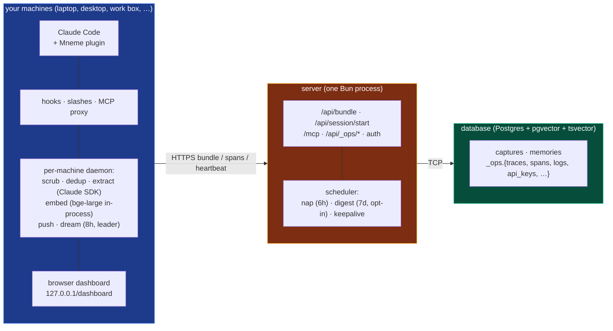

<div align="center">

# Mneme

**Cross-machine memory for your AI coding assistant.**

*Greek muse of memory. Your assistant remembers everything you've worked on, across every machine, every harness, every model.*

</div>

---

You open Claude Code on your laptop. Before you type a single word, the agent already sees a tight digest of what you decided last week, what's pinned, what bug you fixed yesterday, and what summaries the agent wrote at the end of recent sessions.

Later that day on your desktop, you open Claude Code again. Same digest. Same memory.

That's Mneme.

> Full design and rationale: see the [`docs/`](./docs/README.md) folder. Start at [`docs/README.md`](./docs/README.md) — it's a router, not a long read.

---

## The mental model

Three pieces. That's the whole shape.



**Your machines** each run the plugin plus a local daemon. Hooks post to the daemon in sub-millisecond fire-and-forget. The daemon scrubs, dedups per session, calls Claude (via the Agent SDK on the user's existing `claude` login) for atomic observations, embeds with bge-large in-process, and pushes pre-built bundles to the server. The same daemon runs the **dream** worker every 8 hours; one daemon wins a Postgres advisory lock per window and clusters memories into summaries — the others see a held lock and skip. A panel of slash commands (`/mneme:memory`, `/mneme:pin`, `/mneme:recall`, `/mneme:status`, `/mneme:dashboard`, …) lets you write, query, and inspect by hand.

**The server** is one Bun process. It receives pre-built bundles via `/api/bundle`, stores captures + memories atomically, runs **nap** (every 6 hours: decay, shadow-mark exact dupes, link semantically related memories, conservative supersede) and the opt-in **digest** worker (weekly: merge duplicate clusters across machines, cross-cluster supersede), and exposes a single MCP tool (`mneme_sql`) so any AI agent on any harness can read.

**The database** holds everything. Two data tables (`captures`, `memories`) in plain Postgres plus an `_ops` schema for traces, spans, logs, api_keys, and dashboard views. The vector index makes semantic search fast; the text index makes keyword search fast; the rest is JSON.

One database. One server. N machines, each with its own daemon.

---

## What it feels like to use

| When | What happens |
|---|---|
| **Session start** | Pinned facts, rules, recent decisions, and recent session summaries land in your context automatically. No file written. No tool call. |
| **Working** | Every prompt you type and every tool the agent runs is captured in the background. You don't notice. |
| **Wanting something specific** | Ask the agent (*"what was the env var for the timeout fix again?"*) and it queries Mneme via the MCP tool. The bundled skill teaches it the SQL. |
| **Pinning a fact** | `/mneme:pin <one-line truth>` keeps it surfacing in every future session, on every machine. |
| **Switching machines** | Open Claude Code. Same memory. Nothing to sync. |

---

## How it actually works

### Capture → observation → embed → server

The plugin's hooks fire on every prompt / tool call / Stop / SessionEnd and post the event to the daemon at `127.0.0.1:<daemon-port>/capture`. Hooks are intentionally dumb: scrub strings, hash content, POST, exit. Sub-millisecond, fire-and-forget. If the daemon is down, the hook writes the same shape directly to `~/.mneme/outbox/capture/pending/` for the daemon to pick up later.

The **per-machine daemon** is where the work happens. It runs as a launchd / systemd-user / Task Scheduler service that the plugin installs at `/mneme:setup` time. Each capture moves through a four-stage outbox under `~/.mneme/outbox/`, and the directory IS the state:

```
captured/      raw scrubbed capture
   │ extract gate (idle 2 min · 50 captures full · 5 min force · /flush ping)
observations/  { capture, memories[] }   memories carry only LLM-derivable fields
   │ embed
embedded/      memories now have content_hash, chunk_id, embedding, meta
   │ push 4-wide → POST /api/bundle
pushed         success → file deleted
failed/        permanent error → moved with reason
```

- **extract** dedups against the per-session sha+uuid ledger at `~/.mneme/shas/`, coalesces same-session captures inside a ±5-min window, and calls Claude via the Agent SDK (streaming, JSON-shaped) for atomic observations — a decision, a bugfix, a constraint, a discovery, ...
- **embed** runs `BAAI/bge-large-en-v1.5` (quantised int8, ONNX) **in-process** across whatever's queued in `observations/`. Auto-downloads on first run (~1.3GB, one-time per machine) and reaps from RAM after 60s idle.
- **push** posts the pre-built `{capture, memories[]}` bundle to the server's `/api/bundle`, four-wide concurrent.

The server is the dedup wall — `UNIQUE (content_sha256, machine_id)` on captures means duplicate posts are harmless. The whole bundle inserts in one transaction so cross-machine fan-in is atomic.

### Nap, Dream, Digest — how memories become useful

Three time-driven workers shape the steady stream of raw memories into something the agent can actually navigate. Nothing is ever deleted; the workers add flags, links, and summaries that change how rows surface at recall time. (Bitemporal pattern from mempalace: `valid_to` close-out beats `DELETE FROM`, every time.)

- **Nap** — every 6 hours, on the **server**, pure SQL. Decays unpinned importance toward `FLOOR=0.05` (pinned floors at `PIN_FLOOR=0.5`) on a 30-day half-life. Shadows exact-text dupes (`meta.shadow_of`). Links semantically related memories within the same repo (`meta.related_to`, cosine < 0.15). Catches obvious "we now use X" rephrasings as superseded (`meta.superseded_by`, conservative keyword + tight cosine match). Paginated round-robin via `meta.last_napped_at` so one cycle never trips Postgres's 2-min `statement_timeout`.
- **Dream** — every 8 hours, on the **per-machine daemon**, LLM in the loop. Per-repo cosine-NN clustering at distance < 0.10, union-find connected components, distil clusters of size 3–20 into a single `kind='cluster'` summary memory via Sonnet (Claude Agent SDK). Members get `meta.in_cluster` so they're skipped on the next pass. Coordinated across machines via a Postgres advisory lock — when three daemons think it's dream-time, exactly one wins the lock and does the work; the others see a held lock and skip. The cluster row goes through the daemon's normal embed path, so recall finds it like any other memory but ranks it above its members for broad queries.
- **Digest** — weekly, on the **server**, **opt-in** (`MNEME_DIGEST_ENABLED=1`). The cross-cluster pass the per-machine dream can't do: merge duplicate clusters across machines/windows, run cross-cluster supersede via Sonnet over OpenRouter. Conservative refinement; backstop only.

```
capture ──▶ daemon outbox ──▶ /api/bundle ──▶ memories table
                                                │
                                                ├── 6h ──▶ nap     (decay · shadow · related · supersede)
                                                ├── 8h ──▶ dream   (cluster · summarise · supersede, daemon-leader)
                                                └── 7d ──▶ digest  (cross-cluster merge + supersede, opt-in)
```

### Surface

When you start a new session anywhere, the plugin's `SessionStart` hook posts the discovered repos to `/api/session/start`. The server returns a compact markdown digest — pinned facts, rules, recent decisions/features/bugfixes, recent session summaries — and the hook hands it to Claude Code as `additionalContext`. No files written to your project.

---

## Setup in three steps

You need a Postgres database, a host that runs Bun, and Claude Code on at least one machine. Mneme is host-agnostic: Postgres can be Supabase / Neon / RDS / a $5 VPS / your own box; the Bun process can run on Railway / Fly.io / Render / a VPS / your homelab.

### 1 · Database

Any Postgres with the `pgvector` and `pg_cron` extensions. Free tiers cover personal use indefinitely (Supabase, Neon).

You'll need one connection string for writes (`DATABASE_URL`) and a read-only role for the MCP tool (`MNEME_READER_DATABASE_URL`).

### 2 · Server

```bash
git clone <this repo>
cd mneme
bun install
cp .env.example .env       # fill in connection strings + provider config
bun run migrate            # creates the schema, the _ops tables, and the cron jobs
bun run dev                # local dev; for prod, deploy to any Bun-capable host
```

<details>
<summary><b>Provider configuration</b> — what to put in <code>.env</code></summary>

Most LLM and embedder work happens **on the user's machine inside the daemon**, not on the server. The daemon uses the Claude Agent SDK (inheriting your existing `claude` OAuth) for extract + dream, and runs `BAAI/bge-large-en-v1.5` in-process for embeddings — neither needs a server-side env var. The server only needs LLM/embedder env vars if you opt into the **digest** worker (weekly cross-cluster pass), in which case the picker uses OpenRouter or any OpenAI-compatible fallback.

```env
# Database (required)
DATABASE_URL=postgresql://...
MNEME_READER_DATABASE_URL=postgresql://...   # mneme_reader role for /mcp

# Auth root of trust (required)
ADMIN_PASSWORD=...

# Digest worker (optional; off by default)
MNEME_DIGEST_ENABLED=1
LLM_PROVIDER=openrouter
OPENROUTER_API_KEY=...
LLM_MODEL=anthropic/claude-sonnet-4

# Embedder fallback for the digest path (optional)
EMBEDDER_PROVIDER=local
EMBEDDER_URL=https://your-embedder-endpoint
EMBEDDER_BEARER=...
EMBEDDER_MODEL=BAAI/bge-large-en-v1.5
```

**Cost shape:** the daemon owns LLM extract + embed using the user's existing `claude` login, so per-machine compute is free. The server only runs nap (SQL) + the opt-in digest (Sonnet via OpenRouter), so a self-hosted Postgres + a $5 Bun host covers it. Enabling digest adds ~$1–5/mo in API spend depending on volume.

</details>

### 3 · Plugin (per machine)

In Claude Code:

```
/plugin marketplace add j10ra/mneme
/plugin install mneme@j10ra-mneme
/mneme:setup <server-url> <admin-password> [machine-name]
/reload-plugins
```

`/mneme:setup` does the per-machine work in one shot:

- registers the machine (hardware-fingerprint upsert; re-running on the same box rotates the token but reuses the existing `machine_id`)
- writes `~/.mneme/config.json` (mode `0600`)
- installs a per-user service (launchd on macOS, systemd-user on Linux + WSL, Task Scheduler on Windows) that runs the local extract / embed / push daemon at `127.0.0.1:<deterministic-port>`
- `bun install --production` for native deps once per plugin version (or symlink-reuses the prior version's `node_modules` when deps are unchanged)

The daemon owns extract + embed + push on this box. Hooks fire fast and hand off to a local outbox; the daemon coalesces, calls Haiku for observations, embeds with bge-large, and posts bundles to the server.

Repeat the last two lines on every other machine.

To update later:

```
/plugin update mneme
/reload-plugins
```

The plugin's SessionStart hook detects the new version and self-heals the service config — no manual re-run of `/mneme:setup` after a plugin update.

---

## Daily use

| Command | Effect |
|---|---|
| `/mneme:memory <text>` | Save a fact in your own words. The local daemon turns it into structured observations. |
| `/mneme:pin <text-or-id>` | Pin a one-liner so it surfaces every session, on every machine. |
| `/mneme:unpin <text-or-id>` | Stop a memory from surfacing. (It still exists; recall can still find it.) |
| `/mneme:pinned [scope]` | List what's currently pinned. |
| `/mneme:recall <query>` | Hybrid (semantic + keyword + recency) search via the bundled skill. |
| `/mneme:summarise [scope]` | Wrap up the recent thread as a session summary. |
| `/mneme:status` | Workers + daemons + dream history + breakers in one snapshot. |
| `/mneme:dashboard` | Open the local browser dashboard (Activity + Memories tabs). |
| `/mneme:machines` | List your registered machines. |
| `/mneme:rename <name>` | Rename this machine in place (no token reissue). |
| `/mneme:revoke <name-or-id>` | Revoke a machine's token (e.g., lost laptop). |
| `/mneme:help` | List every Mneme slash command. |

Hooks fire on their own. You shouldn't have to think about them.

---

## What's in this repo

| Path | Purpose |
|---|---|
| `packages/server/` | Bun + Hono server: bundle ingest, session surface, MCP, ops, auth, plus the nap / digest / keepalive scheduler |
| `packages/daemon/` | Per-machine Bun daemon: capture intake, four-stage outbox, Claude SDK extract, in-process bge-large embed, push, distributed dream, span forwarder, dashboard server |
| `packages/core/`   | auth, logger, trace store, route + fn instrumentation, AsyncLocalStorage context |
| `packages/shared/` | scrubber + cross-cutting types reachable from any package |
| `packages/plugin/` | Claude Code plugin (hooks, slashes, MCP proxy, skill, dashboard React app) |
| `migrations/`      | sequential SQL migrations applied by `bun run migrate` |
| `docs/`            | architecture as just-in-time docs — start at [`docs/README.md`](./docs/README.md) |

---

## Status

Mneme is a personal tool. One user, several machines. **Phases 0–9 shipped:** capture, extract, embed, surface, nap (decay + shadow + relate + supersede), dream (cluster + distil + supersede, distributed-leader), distributed daemon (extract + embed + dream moved to per-machine), dashboard + ops surface, digest (opt-in cross-cluster pass). Multi-harness rollout (Codex / Cursor / OpenCode) tracked at [#6](https://github.com/j10ra/mneme/issues/6).

> Not multi-tenant. Not team memory. Not a search engine. One human, multiple machines, one continuous memory.
