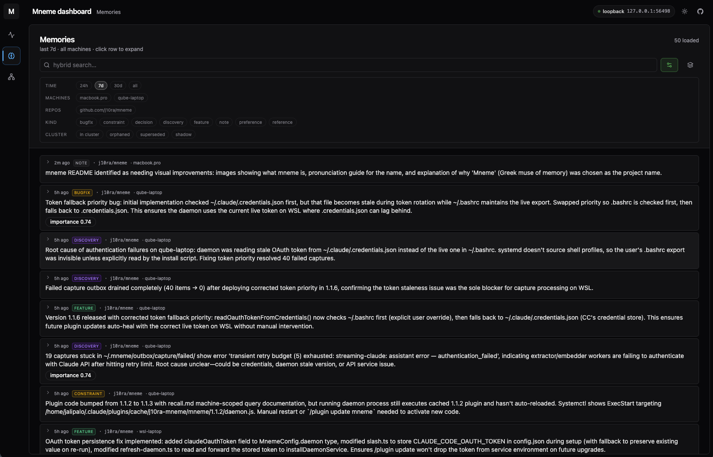
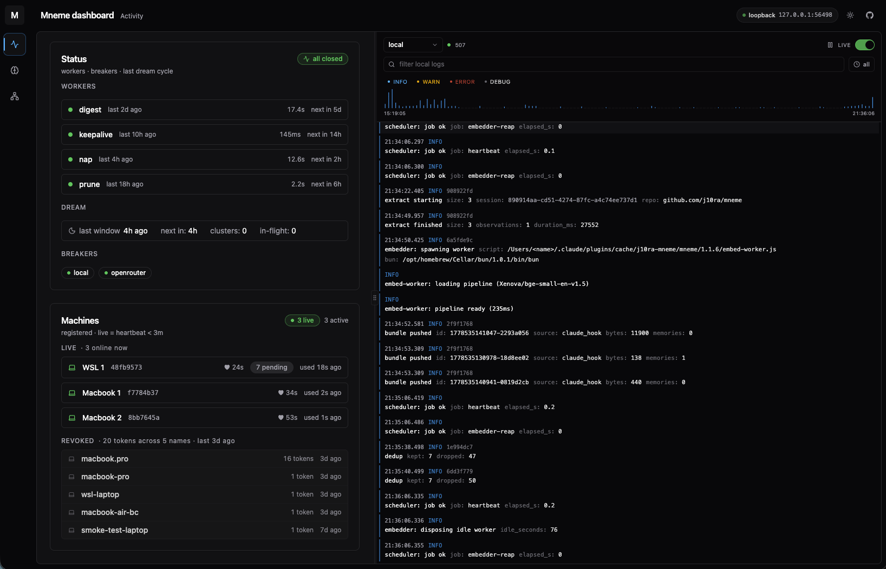
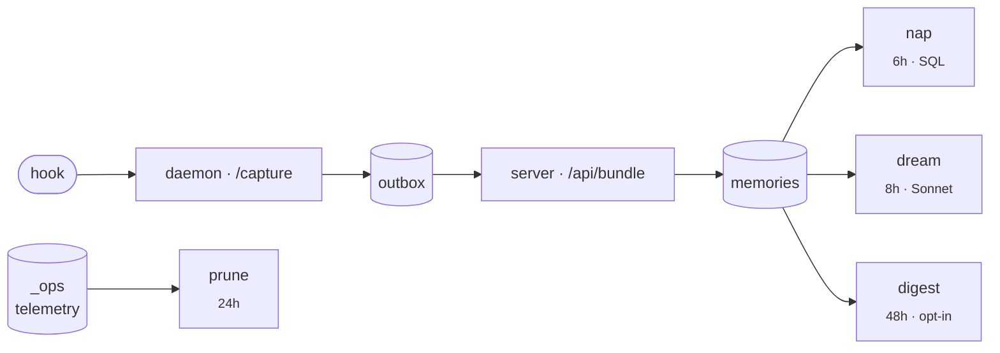

<div align="center">


# Mneme

**Cross-machine memory for your AI coding assistant.**

*Pronounced **NEE-mee**. One of the three original Greek Muses; her name means "memory" itself. Your assistant remembers everything you've worked on, across every machine, every harness, every model.*

</div>

---

You open Claude Code on your laptop. Before you type a single word, the agent already sees a tight digest of what you decided last week, what's pinned, what bug you fixed yesterday, and what summaries the agent wrote at the end of recent sessions.

That digest is **light by design** — short previews, not full memories. The agent only pulls the full content on the ones it actually needs (the same just-in-time / progressive-disclosure pattern Anthropic uses in Skills). Your context window stays free for the work in front of you.

Later that day on your desktop, you open Claude Code again. The same surface, freshly assembled — whatever you worked on is already in it. One continuous memory across every machine — for now inside Claude Code, with every harness and model on the roadmap.

That's Mneme.

<p align="center">
  
  <br />
  <sub><i><code>/mneme:dashboard</code> — Memories tab. Browse, filter, and pivot through everything Mneme has captured.</i></sub>
</p>

<p align="center">
  
  <br />
  <sub><i>Activity tab. Worker status, breakers, registered machines, and the live span feed.</i></sub>
</p>

---

## ⚙️ How it works

The data plumbing under the brain trio below: hooks scrub and post captures to a local file outbox; the per-machine daemon coalesces same-session captures, calls Claude (via the Agent SDK on your existing `claude` login) to distill atomic observations, embeds with `bge-small-en-v1.5` in an isolated subprocess so the ONNX session can't fragment the daemon's address space, then pushes pre-built bundles to the server. The server is a single Bun process — it inserts in one transaction, runs the workers below, and exposes one MCP tool (`mneme_sql`) so any agent on any harness can read. One Postgres holds it all.



For the long version — capture pipeline, the three brain workers (nap / dream / digest), retention, recall, schema, surfaces — go to [`docs/`](./docs/README.md).

---

## 🧠 Why memory stays useful

Most "agent memory" tools are a write-only log: capture → embed → retrieve. That works for a week. Then the recall surface fills with stale duplicates, contradicting facts both rank, and there's no higher-level view of what you've been working on. Mneme keeps the corpus alive with three background workers — the brain trio — each solving a different decay problem.

### 💤 Nap — every 6h, on the server *(SQL, no LLM in the loop)*

**The maintenance pass.** *Without it: importance never decays, exact duplicates pile up, related memories never link, replaced facts keep ranking.*

Each cycle: importance decays with a ~30-day timescale, exact-text duplicates get shadowed onto a canonical row, every memory gets `meta.related_to` edges to cosine-near neighbours in the same repo, and rule-based supersede fires when a newer row clearly replaces an older one (tight cosine + keyword overlap + 12h gap). Pure SQL in one transaction, round-robin paginated via `meta.last_napped_at` so it scales with the corpus.

### 💭 Dream — every 8h, on the daemon *(Sonnet via your `claude` login — no extra cost)*

**The synthesis pass.** *Without it: agents see only atomic captures — never "what's going on with repo X this week" as a theme.*

Each cycle finds tight cosine groups of memories in the same repo, calls Sonnet to write a one-paragraph title + summary per cluster, and persists each summary as a queryable `kind='cluster'` row that outranks its members for broad recall queries. **Cross-machine by design:** a memory captured on your laptop and one on your desktop, both about the same repo and close in embedding space, cluster together. Distributed-leader via Postgres advisory lock — exactly one of your daemons wins the window.

### 🔮 Digest — every 48h, on the server *(opt-in, Sonnet via OpenRouter)*

**The cross-cluster consolidator.** *Without it: two machines independently capture "we use X" then "we use Y" in different dream windows, form two unrelated clusters, never reconcile.*

Each cycle takes a global view of the cluster graph and does two things: merges duplicate clusters that formed independently across machines or windows, and reconciles contradictions that span cluster boundaries via LLM-driven supersede. Off by default (`MNEME_DIGEST_ENABLED=0`) because at one-user/three-machine scale the per-machine dream is usually enough; flip it on when the cluster graph drifts.

**Net effect:** recall doesn't degrade over months. The corpus refines itself in the background while you work.

---

## ✨ What it feels like to use

| When | What happens |
|---|---|
| **Session start** | Pinned facts, rules, recent decisions, and recent session summaries land in your context automatically. No file written. No tool call. |
| **Working** | Every prompt you type and every tool the agent runs is captured in the background. You don't notice. |
| **Wanting something specific** | Ask the agent (*"what was the env var for the timeout fix again?"*) and it queries Mneme via the MCP tool. The bundled skill teaches it the SQL. |
| **Pinning a fact** | `/mneme:pin <one-line truth>` keeps it surfacing in every future session, on every machine. |
| **Switching machines** | Open Claude Code. Same memory. Nothing to sync. |

---

## 📦 Install

You need a Postgres database, a host that runs Bun, and Claude Code on at least one machine. Mneme is host-agnostic: Postgres can be Railway / Supabase / Neon / RDS / a $5 VPS / your own box; the Bun process can run on Railway / Fly.io / Render / a VPS / your homelab.

### 1 · Database

Any Postgres with the `pgvector` extension. Free tiers cover personal use indefinitely. Tested on Railway (pgvector template), Supabase (Free or Pro), Neon. Self-hosted (Postgres 14+) with `CREATE EXTENSION vector` also works. **`pg_cron` is not required** — retention is enforced by an app-level prune worker.

You'll need one connection string for writes (`DATABASE_URL`) and a read-only role for the MCP tool (`MNEME_READER_DATABASE_URL`). The migrations create the `mneme_reader` role; set its password out-of-band with `ALTER ROLE mneme_reader WITH LOGIN PASSWORD '<random>'`, then assemble the reader URL the same shape as `DATABASE_URL` but with the reader credentials.

<details>
<summary><b>Quickest path: Railway pgvector template</b></summary>

1. Provision the [pgvector template](https://railway.com/deploy/3jJFCA) in your Railway workspace. Wait for the service to come online.
2. From the service's **Variables** tab, grab `DATABASE_URL` (proxy/public, used for one-shot scripts) and `DATABASE_URL_PRIVATE` (internal hostname, used by the server in the same project).
3. Run `bun run migrate` against the public URL (see step 2 below) to apply schema and create the `mneme_reader` role.
4. Set the role's password:
   ```bash
   psql "$DATABASE_URL" -c "ALTER ROLE mneme_reader WITH LOGIN PASSWORD '$(openssl rand -hex 24)'"
   ```
5. Assemble `MNEME_READER_DATABASE_URL` from `DATABASE_URL_PRIVATE`'s host with the reader credentials.

Hobby ($5/mo) is plenty for personal use: ~50-100 MB DB after ~10K memories, ~0.3 GB RAM peak.

</details>

### 2 · Server

```bash
git clone <this repo>
cd mneme
bun install
cp .env.example .env       # fill in DATABASE_URL + ADMIN_PASSWORD (see provider section below)
bun run migrate            # applies migrations/*.sql in order
```

**What `bun run migrate` does:** bootstraps `_ops.schema_migrations`, then applies every `migrations/NNNN_*.sql` not yet recorded, in filename order. Creates extensions (`pgcrypto`, `vector`, optionally `pg_cron` when available), the `_ops` schema, `public.captures` + `public.memories` with their indexes (HNSW on `embedding`, GIN on `tsv`), RLS policies, the `mneme_reader` role (NOLOGIN), telemetry views, and retention jobs (pg_cron schedule if available; otherwise the daemon's app-level prune worker covers it). Records each successful file in `_ops.schema_migrations` so it's safe to re-invoke. Dry-run with `bun run migrate:dry`.

**After migrate succeeds, set the read-only role's password and assemble its URL:**

```bash
# 1. Set a password on the mneme_reader role (NOLOGIN by default).
psql "$DATABASE_URL" -c "ALTER ROLE mneme_reader WITH LOGIN PASSWORD '$(openssl rand -hex 24)'"

# 2. Build the reader URL using the same host/port/db as DATABASE_URL but with
#    mneme_reader credentials. Put it in .env as MNEME_READER_DATABASE_URL.
```

The reader role has `SELECT` only on `public.*` (not `_ops.*`), backing the MCP `mneme_sql` tool. RLS on `memories` further restricts cross-machine private rows. Defense in depth.

**Run it:**

```bash
bun run dev                # local dev; for prod, deploy to any Bun-capable host
```

<details>
<summary><b>Provider configuration</b> — what to put in <code>.env</code></summary>

Most LLM and embedder work happens **on the user's machine inside the daemon**, not on the server. The daemon uses the Claude Agent SDK (inheriting your existing `claude` OAuth) for extract + dream, and runs `BAAI/bge-small-en-v1.5` in an isolated subprocess for embeddings — neither needs a server-side env var. The server only needs LLM/embedder env vars if you opt into the **digest** worker (every-48h cross-cluster pass), in which case the picker uses OpenRouter or any OpenAI-compatible fallback.

```env
# Database (required)
DATABASE_URL=postgresql://...
MNEME_READER_DATABASE_URL=postgresql://...   # mneme_reader role for /mcp

# Auth root of trust (required)
ADMIN_PASSWORD=...

# Digest worker (optional; off by default)
MNEME_DIGEST_ENABLED=1
OPENROUTER_API_KEY=...
OPENROUTER_DREAM_MODEL=anthropic/claude-sonnet-4
```

**Cost shape:** the daemon owns LLM extract + embed using the user's existing `claude` login, so per-machine compute is free. The server only runs nap (SQL) + the opt-in digest (Sonnet via OpenRouter), so a self-hosted Postgres + a $5 Bun host covers it. Enabling digest adds ~$1–5/mo in API spend depending on volume.

</details>

### 3 · Plugin (per machine)

In Claude Code:

```
/plugin marketplace add j10ra/mneme
/plugin install mneme@j10ra-mneme
/mneme:setup <server-url> <admin-password> [machine-name]
/reload-plugins
```

- `<server-url>` is wherever you deployed step 2 (e.g. `https://mneme.up.railway.app`).
- `<admin-password>` is the `ADMIN_PASSWORD` you set in `.env` in step 2. It's the root-of-trust the server uses to mint a per-machine token — once mints succeed, the password isn't stored or reused; each machine talks to the server with its own scoped bearer thereafter.
- `[machine-name]` is optional and free-form (e.g. `macbook-pro`, `qube-laptop`). If omitted, Mneme picks a sensible default from the hostname.

`/mneme:setup` does the per-machine work in one shot:

- registers the machine (hardware-fingerprint upsert; re-running on the same box rotates the token but reuses the existing `machine_id`)
- writes `~/.mneme/config.json` (mode `0600`)
- installs a per-user service (launchd on macOS, systemd-user on Linux + WSL, Task Scheduler on Windows) that runs the local extract / embed / push daemon at `127.0.0.1:<deterministic-port>`
- `bun install --production` for native deps once per plugin version (or symlink-reuses the prior version's `node_modules` when deps are unchanged)

Repeat the last two lines on every other machine.

To update later:

```
/plugin update mneme
/reload-plugins
```

The plugin's SessionStart hook detects the new version and self-heals the service config — no manual re-run of `/mneme:setup` after a plugin update.

---

## ⚡ Daily use

| Command | Effect |
|---|---|
| `/mneme:memory <text>` | Save a fact in your own words. The local daemon turns it into structured observations. |
| `/mneme:pin <text-or-id>` | Pin a one-liner so it surfaces every session, on every machine. |
| `/mneme:unpin <text-or-id>` | Stop a memory from surfacing. (It still exists; recall can still find it.) |
| `/mneme:pinned [scope]` | List what's currently pinned. |
| `/mneme:recall <query>` | Hybrid (semantic + keyword + recency) search via the bundled skill. |
| `/mneme:summarise [scope]` | Wrap up the recent thread as a session summary. |
| `/mneme:status` | Workers + daemons + dream history + breakers in one snapshot. |
| `/mneme:dashboard` | Open the local browser dashboard (Activity + Memories tabs). |
| `/mneme:machines` | List your registered machines. |
| `/mneme:rename <name>` | Rename this machine in place (no token reissue). |
| `/mneme:revoke <name-or-id>` | Revoke a machine's token (e.g., lost laptop). |
| `/mneme:help` | List every Mneme slash command. |

Hooks fire on their own. You shouldn't have to think about them.

---

## 📁 What's in this repo

| Path | Purpose |
|---|---|
| `packages/server/` | Bun + Hono server: bundle ingest, session surface, MCP, ops, auth, plus the nap / digest / prune / keepalive scheduler |
| `packages/daemon/` | Per-machine Bun daemon: capture intake, four-stage outbox, Claude SDK extract, bge-small embedder subprocess, push, distributed dream, span forwarder, dashboard server |
| `packages/core/`   | auth, logger, trace store, route + fn instrumentation, AsyncLocalStorage context |
| `packages/shared/` | scrubber + cross-cutting types reachable from any package |
| `packages/plugin/` | Claude Code plugin (hooks, slashes, MCP proxy, skill, dashboard React app) |
| `migrations/`      | sequential SQL migrations applied by `bun run migrate` |
| `docs/`            | architecture as just-in-time docs — start at [`docs/README.md`](./docs/README.md) |

---

## 🚦 Status

Mneme is a personal tool. One user, several machines. **Phases 0–9 shipped:** capture, extract, embed, surface, nap (decay + shadow + relate + supersede), dream (cluster + distil + supersede, distributed-leader), distributed daemon (extract + embed + dream moved to per-machine), dashboard + ops surface, digest (opt-in cross-cluster pass). Multi-harness rollout (Codex / Cursor / OpenCode) tracked at [#6](https://github.com/j10ra/mneme/issues/6).

> Not multi-tenant. Not team memory. Not a search engine. One human, multiple machines, one continuous memory.
