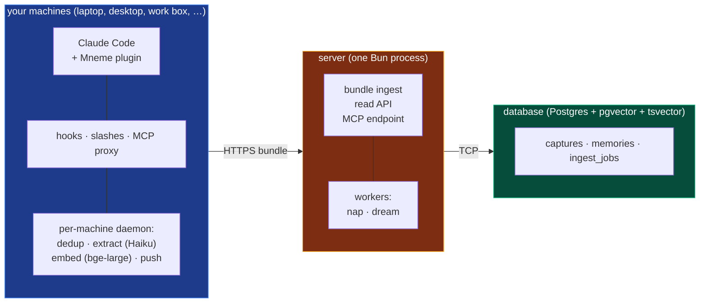

<div align="center">

# Mneme

**Cross-machine memory for your AI coding assistant.**

*Greek muse of memory. Your assistant remembers everything you've worked on, across every machine, every harness, every model.*

</div>

---

You open Claude Code on your laptop. Before you type a single word, the agent already sees a tight digest of what you decided last week, what's pinned, what bug you fixed yesterday, and what summaries the agent wrote at the end of recent sessions.

Later that day on your desktop, you open Claude Code again. Same digest. Same memory.

That's Mneme.

> Full design and rationale: see [ARCHITECTURE.md](./ARCHITECTURE.md).

---

## The mental model

Three pieces. That's the whole shape.



**Your machines** run a small plugin plus a local daemon. Hooks fire on every prompt / tool call / session boundary and write to a local outbox in milliseconds. The daemon coalesces those captures, dedups them per session, runs Haiku for atomic observations, embeds with bge-large, and posts pre-built bundles to the server. A panel of slash commands (`/mneme:memory`, `/mneme:pin`, `/mneme:recall`, …) lets you write or query memory by hand.

**The server** is one Bun process. It receives pre-built bundles, stores captures + memories atomically, and runs two background workers — **nap** (decay, shadow-mark exact dupes, link semantically related memories) and **dream** (cluster + distil into one-paragraph summaries). Dream is coordinated across machines via a Postgres advisory lock so only one daemon owns each window. The server exposes a single MCP tool (`mneme_sql`) so any AI agent on any harness can read.

**The database** holds everything. Three small tables in plain Postgres. The vector index makes semantic search fast; the text index makes keyword search fast; the rest is JSON.

One database. One server. N machines, each with its own daemon.

---

## What it feels like to use

| When | What happens |
|---|---|
| **Session start** | Pinned facts, rules, recent decisions, and recent session summaries land in your context automatically. No file written. No tool call. |
| **Working** | Every prompt you type and every tool the agent runs is captured in the background. You don't notice. |
| **Wanting something specific** | Ask the agent (*"what was the env var for the timeout fix again?"*) and it queries Mneme via the MCP tool. The bundled skill teaches it the SQL. |
| **Pinning a fact** | `/mneme:pin <one-line truth>` keeps it surfacing in every future session, on every machine. |
| **Switching machines** | Open Claude Code. Same memory. Nothing to sync. |

---

## How it actually works

The plugin's hooks fire on every prompt / tool call / Stop / SessionEnd and write the event into a local outbox under `~/.mneme/outbox/capture/captured/`. Hooks are intentionally dumb: scrub strings, hash content, write a JSON file, exit. Sub-millisecond, fire-and-forget.

The **per-machine daemon** is where the work happens. It runs as a launchd / systemd-user / Task Scheduler service that the plugin installs at `/mneme:setup` time. Three independent stage workers tick every two seconds:

- **capture** runs dedup against the per-session sha + uuid ledger at `~/.mneme/shas/`, then coalesces same-session captures and calls Haiku via a long-lived streaming SDK session for atomic observations (a decision, a bugfix, a constraint, a discovery, …)
- **embed** runs bge-large-en-v1.5 (quantized int8, ONNX) in-process across whatever's queued in `observations/`
- **push** posts pre-built `{capture, memories[]}` bundles to `/api/bundle`, four-wide concurrent

The server is the dedup wall — `UNIQUE (content_sha256, machine_id)` on captures means duplicate work is harmless even when the local ledger is empty. The bge-large model auto-downloads on first run (~1.3GB, one-time per machine) and reaps from RAM after 60s idle.

Two server-side workers turn the steady stream of memories into something useful over time:

- **Nap** runs every 6 hours to decay importance, mark exact duplicates, and link semantically related memories.
- **Dream** runs every 24 hours to cluster related memories and write a one-paragraph summary that surfaces above the raw rows for broad questions. Dream is coordinated across machines via a Postgres advisory lock keyed on the time window — so when three daemons simultaneously think it's dream-time, exactly one wins the lock and does the work; the others see a held lock and skip.

When you start a new session anywhere, the plugin asks the server for the relevant slice for the repos you have open, and the server returns a compact markdown digest that lands directly in the agent's context.

---

## Setup in three steps

You need a Postgres database, a host that runs Bun, and Claude Code on at least one machine. Mneme is host-agnostic: Postgres can be Supabase / Neon / RDS / a $5 VPS / your own box; the Bun process can run on Railway / Fly.io / Render / a VPS / your homelab.

### 1 · Database

Any Postgres with the `pgvector` and `pg_cron` extensions. Free tiers cover personal use indefinitely (Supabase, Neon).

You'll need one connection string for writes (`DATABASE_URL`) and a read-only role for the MCP tool (`MNEME_READER_DATABASE_URL`).

### 2 · Server

```bash
git clone <this repo>
cd mneme
bun install
cp .env.example .env       # fill in connection strings + provider config
bun run migrate            # creates the schema, the _ops tables, and the cron jobs
bun run dev                # local dev; for prod, deploy to any Bun-capable host
```

<details>
<summary><b>Provider configuration</b> — what to put in <code>.env</code></summary>

The two decisions: which **LLM provider** runs extract + dream, and which **embedder** turns text into vectors. Both speak OpenAI-compatible HTTP. Defaults assume self-hosted endpoints (Ollama + TEI), but pointing at any cloud API is four env-var changes.

```env
# Database
DATABASE_URL=postgresql://...
MNEME_READER_DATABASE_URL=postgresql://...   # mneme_reader role for /mcp

# LLM (extract + dream distillation)
LLM_PROVIDER=local
LLM_URL=https://your-llm-endpoint
LLM_BEARER=...
LLM_MODEL=qwen2.5:3b-instruct-q4_K_M

# Embedder (1024-dim)
EMBEDDER_PROVIDER=local
EMBEDDER_URL=https://your-embedder-endpoint
EMBEDDER_BEARER=...
EMBEDDER_MODEL=BAAI/bge-large-en-v1.5

# Auth root of trust
ADMIN_PASSWORD=...
```

Cost scenarios (self-hosted, mixed cloud, BYO API keys) live in [ARCHITECTURE.md §13](./ARCHITECTURE.md#13-cost-model).

</details>

### 3 · Plugin (per machine)

In Claude Code:

```
/plugin marketplace add j10ra/mneme
/plugin install mneme@j10ra-mneme
/mneme:setup <server-url> <admin-password> [machine-name]
/reload-plugins
```

`/mneme:setup` does the per-machine work in one shot:

- registers the machine (hardware-fingerprint upsert; re-running on the same box rotates the token but reuses the existing `machine_id`)
- writes `~/.mneme/config.json` (mode `0600`)
- installs a per-user service (launchd on macOS, systemd-user on Linux + WSL, Task Scheduler on Windows) that runs the local extract / embed / push daemon at `127.0.0.1:<deterministic-port>`
- `bun install --production` for native deps once per plugin version (or symlink-reuses the prior version's `node_modules` when deps are unchanged)

The daemon owns extract + embed + push on this box. Hooks fire fast and hand off to a local outbox; the daemon coalesces, calls Haiku for observations, embeds with bge-large, and posts bundles to the server.

Repeat the last two lines on every other machine.

To update later:

```
/plugin update mneme
/reload-plugins
```

The plugin's SessionStart hook detects the new version and self-heals the service config — no manual re-run of `/mneme:setup` after a plugin update.

---

## Daily use

| Command | Effect |
|---|---|
| `/mneme:memory <text>` | Save a fact in your own words. The local daemon turns it into structured observations. |
| `/mneme:pin <text-or-id>` | Pin a one-liner so it surfaces every session, on every machine. |
| `/mneme:unpin <text-or-id>` | Stop a memory from surfacing. (It still exists; recall can still find it.) |
| `/mneme:pinned [scope]` | List what's currently pinned. |
| `/mneme:recall <query>` | Hybrid (semantic + keyword + recency) search via the bundled skill. |
| `/mneme:summarise [scope]` | Wrap up the recent thread as a session summary. |
| `/mneme:machines` | List your registered machines. |
| `/mneme:revoke <name-or-id>` | Revoke a machine's token (e.g., lost laptop). |

Hooks fire on their own. You shouldn't have to think about them.

---

## What's in this repo

| Path | Purpose |
|---|---|
| `packages/server/` | Bun + Hono server and the four workers |
| `packages/core/`   | auth, logger, trace store, route + fn instrumentation |
| `packages/plugin/` | Claude Code plugin (hooks, slashes, MCP proxy, skill) |
| `migrations/`      | sequential SQL migrations applied by `bun run migrate` |
| `ARCHITECTURE.md`  | full design doc, including deferred-items list and cost model |

---

## Status

Mneme is a personal tool. One user, several machines. **Phases 0–7 shipped:** capture, extract, embed, nap (decay + shadow + relate + retry), dream (cluster + distil), surface. Phases 8 (multi-harness: Codex, Cursor, OpenCode) and 9 (polish) are tracked in [ARCHITECTURE.md §16](./ARCHITECTURE.md#16-deferred-items-one-place-to-come-back-to).

> Not multi-tenant. Not team memory. Not a search engine. One human, multiple machines, one continuous memory.
