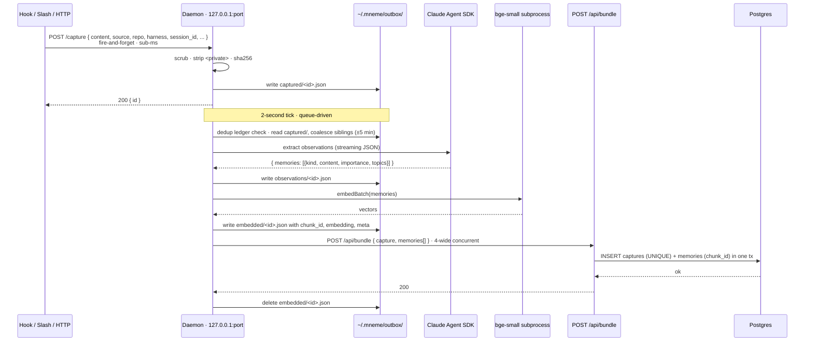

# Capture pipeline

The hot path: raw text from a hook becomes a fully-formed `{capture, memories[]}` bundle in Postgres. **All capture-time extract and embed work happens locally in the daemon.** The server is the dedup wall and the cross-machine fan-in point. (The one server-side embed path is recall-time query embedding for connector clients — see *Bundle vs. `/api/capture`* below.)

> Reads for context: [`concepts.md`](./concepts.md).

---

## End-to-end sequence



**SLA:** the hook → daemon hop is sub-millisecond. The hook never waits for extract or embed. If the daemon is down, the hook writes directly to its outbox at `~/.mneme/outbox/capture/captured/`. If the server is down, the daemon retries with backoff; bundles stay in the outbox until they post or move to `failed/`.

---

## Outbox state machine

`~/.mneme/outbox/` is a file-backed queue. Each capture moves through directories in order; **the directory IS the state**.

```
captured/      raw scrubbed capture body
   │
   │ extract gate (idle | full | force | flush)
   ▼
observations/  { capture, memories[] } — memories carry only LLM-derivable fields
   │
   │ embed
   ▼
embedded/      memories now have content_hash, chunk_id, embedding, meta.extractor_*
   │
   │ push (4-wide concurrent) → POST /api/bundle
   ▼
(deleted)      success path is *no directory* — the file is unlinked on 200

failed/        permanent error during any stage; file moved with reason
```

The four real on-disk directories are `captured/`, `observations/`, `embedded/`, and `failed/`.

**Why files, not SQLite.** A personal daemon with a single writer doesn't need a transactional store. Atomic-rename is enough crash safety; `find`-style scanning is enough query power; the directory structure visualises pipeline depth without any tooling.

**Crash safety.** A daemon kill mid-tick re-runs the affected stage on next start because the file is still in its previous-stage directory. Idempotency comes from `content_sha256` (capture) and `chunk_id` (memory), both `UNIQUE`.

---

## The four stages, in detail

### Stage 1 · Capture intake

Hook posts `{ content, source, repo, harness, session_id, private, ... }` to the daemon's `POST /capture`. The daemon's `handleCapture`:

1. Runs `scrub` + `scrubData` on every string field (the same shared scrubber the server uses, generated into the plugin via `bun run build:plugin-scrub`). The canonical patterns live in [`/packages/shared/src/scrub.ts`](../packages/shared/src/scrub.ts).
2. Computes `content_sha256`.
3. Writes `captured/<uuid>.json` and returns `{ id }`. Sub-millisecond.

If the daemon is unreachable, the hook itself writes the same shape to `~/.mneme/outbox/capture/captured/`. The next daemon tick picks it up.

### Stage 2 · Coalesce + extract

The worker tick's `runDedup()` runs before extract; it drops files whose `content_sha256` matches anything already in `~/.mneme/shas/<session_id>.txt` (the per-session ledger). Surviving captures sharing `(session_id, repo, private)` within ±5 minutes of the oldest pending file are bundled into one LLM call. The gate that triggers extraction has four triggers in priority order:

| Trigger | When | Why |
|---|---|---|
| `/flush` ping | `PreCompact`, `SessionEnd` | Natural session boundaries — extract everything pending |
| `EXTRACT_BATCH_FULL=50` | Pending group hits 50 captures | Runaway protection on long sessions with no real pauses |
| `EXTRACT_IDLE_MS=2 min` | No new captures for 2 minutes | "User took a break" detector |
| `EXTRACT_FORCE_MS=5 min` | Oldest pending file > 5 min | Latency floor for `/recall` freshness |

Per-turn `Stop` events deliberately do **not** flush — captures from many turns coalesce into one Haiku call with cross-turn context.

When the gate fires, the runtime takes up to `MAX_BATCH_SIZE = 20` matching captures into one LLM bundle. Larger backlogs (e.g. when `EXTRACT_BATCH_FULL=50` triggers) split across multiple bundles inside the same tick.

The streaming agent provider (`packages/daemon/src/agents/claude-streaming.ts`) calls the Claude Agent SDK with `pathToClaudeCodeExecutable` (resolved at startup by `findClaudeExecutable` in `claude-path.ts`). The SDK resolves credentials per-platform (Keychain on macOS, Credential Manager on Windows, `~/.claude/.credentials.json` on Linux/WSL); `ANTHROPIC_API_KEY` or `CLAUDE_CODE_OAUTH_TOKEN` env vars override. **Extract uses `EXTRACT_MODEL = "haiku"`; dream uses `DREAM_MODEL = "sonnet"`** (both passed through to the SDK as the model alias). The system prompt (`packages/daemon/src/agents/prompts.ts`) enforces atomic observations, importance ratings (0.1–1.0), and the kind taxonomy.

**Per-cluster failure isolation:** a single bundle's failure doesn't take down the rest of the tick.

### Stage 3 · Embed

`embed.ts` spawns `embed-worker.ts` as a child process on first request (`Bun.spawn` with JSON-lines stdio). The worker lazily loads `BAAI/bge-small-en-v1.5` (384-dim, quantised int8 ONNX) from `@xenova/transformers` — auto-downloaded once per machine (~33 MB), cached under `~/.cache/transformers/`. `embedBatch(texts)` enqueues a request, the parent serialises one batch at a time over the pipe, and the worker writes JSON responses back. After 60 seconds idle, `disposeIfIdle` closes the worker's stdin; the worker exits cleanly on EOF and the OS reclaims the entire ONNX heap. Daemon's steady-state RSS stays at ~80-100 MB regardless of embed bursts.

Each memory gets stamped with:
- `content_hash = sha256(content)`
- `chunk_id = sha256(content_hash + ":" + EMBEDDER_MODEL)` — model-scoped, so a future model swap creates fresh rows without colliding
- `embedding_model` — same string, denormalised onto the row for query-time filters
- `meta.extractor_provider`, `meta.extractor_model` — provenance, queryable forever

### Stage 4 · Push

The push worker runs **4-wide concurrent** `POST /api/bundle` calls against the server. The server's `/api/bundle` handler does the entire write in **one transaction**:

1. Upsert capture (`ON CONFLICT (content_sha256, machine_id) DO UPDATE SET content = EXCLUDED.content`).
2. Upsert memories (`ON CONFLICT (chunk_id) DO UPDATE SET meta = memories.meta || EXCLUDED.meta, importance = GREATEST(memories.importance, EXCLUDED.importance)`).
3. Apply pin actuations from `raw_meta.kind = 'pin'` if present.

| Outcome | What the daemon does |
|---|---|
| `200` | Delete the local file. |
| Retryable (5xx, network, ECONNRESET) | File stays in `embedded/`; next tick retries. |
| Permanent (4xx schema, malformed JSON) | File moves to `failed/<reason>/`. |

---

## Sources (the `source` column)

| Source | Trigger | Default `kind` | Notes |
|---|---|---|---|
| `claude_hook` | Claude Code `UserPromptSubmit` and `PostToolUse` | (extracted by daemon) | Coalesced by `session_id` within ±5-min window |
| `claude_summary` | Claude Code `Stop`, `PreCompact`, `SessionEnd` hooks | (extracted; usually summary) | Skips coalescing |
| `claude_assistant` | Assistant turns transcribed from Claude Code's session JSONL | (extracted) | Lets Mneme see what the agent said, not just what the user prompted |
| `claude_memory` | Claude Code `PostToolUse(Write\|Edit)` on `~/.claude/projects/*/memory/*.md` | (extracted) | Mirrors Anthropic auto-memory; the memory file is captured and extracted like any other source. `claude_memory` is the capture *source*, not a memory `kind` |
| `pi_prompt` / `pi_assistant` / `pi_tool` | Pi harness prompt / assistant / tool events | (extracted) | Pi-harness analogs of the `claude_*` sources |
| `manual:/memory` | `/mneme:memory <text>` slash command | (extracted) | Goes through daemon extract like any other capture |
| `manual:/api/memory` | `POST /api/memory` (used by `/mneme:pin <text>`) | `note` | Direct memory write; bypasses extract; embeds ~2s later |
| `manual` | `/mneme:pin\|unpin\|archive\|supersede` actuations | (n/a) | Actuation captures from slash commands |
| Future: `codex_hook` / `cursor_hook` / `opencode_hook` | harness-native hooks | (extracted) | [#6](https://github.com/j10ra/mneme/issues/6) |

---

## Bundle vs. `/api/capture`

- `POST /api/bundle` — the daemon's path. Bundle arrives with capture + memories already extracted and embedded; server writes both atomically.
- `POST /api/capture` — direct HTTP path for callers without a daemon. The server scrubs and stores the capture row, but no extract/embed runs on those rows.

**Where embedding runs.** Capture-time embedding is daemon-only (Stage 3). The only place the *server* embeds is recall-time query text for connector clients that have no local daemon — gated by `MNEME_SERVER_EMBED=1`, using the same canonical `@mneme/embed` model (`BAAI/bge-small-en-v1.5`, 384-dim) baked into the server image at build, so vectors never drift from the daemon's. See [`recall.md`](./recall.md) and [`oauth.md`](./oauth.md).

---

## Why this shape

- **Server stays simple.** No queue, no extract worker, no embed worker, no LLM keys on the server. Just an HTTP API + three time-driven jobs.
- **Daemon owns the cost.** LLM compute and embedder compute happen on the user's hardware — using a `claude` login the user already has, not API spend the user is paying separately.
- **Cross-machine fans in at the server.** Three machines × three daemons all post to one `/api/bundle`. The `UNIQUE (content_sha256, machine_id)` constraint means the same content captured on two machines produces two rows (correctly), and the same content captured twice on one machine produces one.

---

## Trust boundary — the daemon trusts every loopback caller

The daemon's HTTP listener binds to `127.0.0.1` and runs **no authentication on any route** (`/capture`, `/embed`, `/dashboard`, `/dashboard/api/*`, `/flush`). This is a deliberate, accepted design choice for a single-user personal tool, not an oversight ([#54](https://github.com/j10ra/mneme/issues/54)).

What that means: any process running **on the same machine** can enqueue captures with arbitrary `machine_id`/`content` (which then push to the server under the real per-machine token), use the embedder, or open the dashboard (which proxies `/api/_ops/*` reads with the daemon's stored admin bearer). The `127.0.0.1` bind already removes all network exposure — only local processes can reach it.

**The boundary: run Mneme only on machines whose local user space you trust.** Don't run it on a shared CI runner, a multi-user dev box, or a container that shares a network namespace with untrusted processes. On such a host, add a daemon-local shared secret before deploying (the [#54](https://github.com/j10ra/mneme/issues/54) "option B" sketch). A loopback secret stored in `~/.mneme/config.json` (mode `0600`) buys nothing against an attacker who already runs as you — they can read the secret file, the per-machine token, and the keychain alike — so it's only worth adding when there's a genuine second local user to defend against.

---

## See also

- [`workers/nap.md`](./workers/nap.md), [`workers/dream.md`](./workers/dream.md), [`workers/digest.md`](./workers/digest.md) — what happens to the memories after they land.
- [`/packages/server/src/routes/`](../packages/server/src/routes/), [`/packages/daemon/src/routes/`](../packages/daemon/src/routes/) — endpoint catalogue lives in code.
- [`/packages/shared/src/scrub.ts`](../packages/shared/src/scrub.ts) — scrubber patterns.
- [`/packages/core/src/auth.ts`](../packages/core/src/auth.ts) — server-stamped identity, scope checks.
