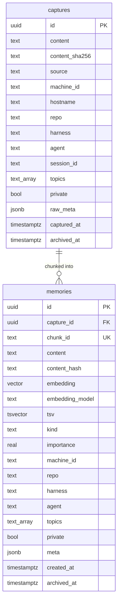

# Data model

Three tables in plain Postgres. Add a fourth only when an actual reader needs it. memsearch / mempalace shape: small surface, lots of derived behaviour in functions and crons.

> Reads for context: [`concepts.md`](./concepts.md). Tuning knobs: [`/packages/server/src/infra/config.ts`](../packages/server/src/infra/config.ts).

---

## The three tables



---

## What lives in `meta jsonb` instead of dedicated tables

| Use | Stored as |
|---|---|
| Near-dup links | `meta.related_to: ["<id>", "<id>", ...]` |
| Cluster membership (on a `kind='cluster'` row) | `meta.member_ids: ["<id>", ...]` |
| Cluster title | `meta.cluster_title: "..."` |
| Member's cluster pointer | `meta.in_cluster: "<cluster_id>"` (sticky — only digest can re-point) |
| Bitemporal supersede | `meta.superseded_by: "<id>"` on the older memory |
| Pinned by user | `meta.pinned: true` |
| Source coalescing window | `meta.coalesced_from: ["<capture_id>", ...]` |
| Cross-machine handoff slug | `meta.handoff_slug: "<kebab-case>"` — set by `/mneme:handoff` and the compact auto-capture path; consumed by `/mneme:resume <slug>` |
| Provenance | `meta.extractor_provider`, `meta.extractor_model`, `meta.distiller_provider`, `meta.distiller_model` |
| Nap pagination | `meta.last_napped_at: timestamptz` |
| Dream pagination | `meta.last_dreamed_at: timestamptz` (watermark for round-robin seed selection) |
| Digest pagination | `meta.last_digested_at: timestamptz` (watermark for Op1 cluster window + Op2 candidates) |

Add typed columns or a fourth table only when a reader needs them. Current candidates that *could* graduate (relations graph, supersede chains, cluster membership) all still index fine via GIN-on-JSONB.

---

## Schema DDL (canonical, abbreviated)

```sql
CREATE EXTENSION IF NOT EXISTS pgcrypto;
CREATE EXTENSION IF NOT EXISTS vector;

-- captures: raw, immutable. sha256 dedup at ingest. Never updated.
CREATE TABLE captures (
  id              UUID PRIMARY KEY DEFAULT gen_random_uuid(),
  content         TEXT NOT NULL,
  content_sha256  TEXT NOT NULL,
  source          TEXT NOT NULL,
  machine_id      TEXT NOT NULL,
  hostname        TEXT NOT NULL,
  repo            TEXT,
  harness         TEXT NOT NULL,
  agent           TEXT,
  session_id      TEXT,
  topics          TEXT[] NOT NULL DEFAULT '{}',
  private         BOOLEAN NOT NULL DEFAULT false,
  raw_meta        JSONB NOT NULL DEFAULT '{}',
  captured_at     TIMESTAMPTZ NOT NULL DEFAULT now(),
  archived_at     TIMESTAMPTZ,
  UNIQUE (content_sha256, machine_id)   -- the dedup wall
);

-- memories: chunked, embedded, BM25-indexed.
-- chunk_id encodes embedding model -> safe re-embed migration.
-- Cluster summaries are also memories (kind='cluster').
CREATE TABLE memories (
  id               UUID PRIMARY KEY DEFAULT gen_random_uuid(),
  capture_id       UUID NOT NULL REFERENCES captures(id),
  chunk_id         TEXT NOT NULL UNIQUE,        -- sha(content_hash + ":" + embedding_model)
  content          TEXT NOT NULL,
  content_hash     TEXT NOT NULL,
  embedding        VECTOR(1024),
  embedding_model  TEXT NOT NULL,
  tsv              TSVECTOR,
  kind             TEXT,
  importance       REAL NOT NULL DEFAULT 1.0,
  machine_id       TEXT NOT NULL,
  repo             TEXT,
  harness          TEXT NOT NULL,
  agent            TEXT,
  topics           TEXT[] NOT NULL DEFAULT '{}',
  private          BOOLEAN NOT NULL DEFAULT false,
  meta             JSONB NOT NULL DEFAULT '{}',
  created_at       TIMESTAMPTZ NOT NULL DEFAULT now(),
  archived_at      TIMESTAMPTZ
);

CREATE INDEX memories_embedding_idx  ON memories USING hnsw (embedding vector_cosine_ops)
  WITH (m = 16, ef_construction = 64);
CREATE INDEX memories_tsv_idx        ON memories USING gin (tsv);
CREATE INDEX memories_meta_idx       ON memories USING gin (meta);
```

Full migrations under [`/migrations/`](../migrations/), applied in order by `bun run migrate`.

---

## Dedup is additive

Captures are immutable. Dedup is additive: nothing is ever deleted; rows get flags or shadows that change how they surface.

Three layers, in order of strictness:

1. **Ingest dedup (hard).** `UNIQUE (content_sha256, machine_id)` on captures. Posting the same content twice from one machine produces one row. Same content from two machines produces two (correctly — they happened in two contexts). `memories.chunk_id UNIQUE` (where `chunk_id = sha256(content_hash + ":" + embedder_model)`) rejects exact re-chunks under the same embedding model — by construction memories cannot have identical content under the same embedder.
2. **Nap maintenance (additive, soft).** Every 4h: importance + recall_weight decay, semantic relations, rule-based supersede, auto-archive of fully decayed orphans. See [`workers/nap.md`](./workers/nap.md). The legacy shadow phase is gone (the chunk_id UNIQUE constraint made it dead code).
3. **Dream dedup (additive, semantic).** Every 8h: clustering produces `kind='cluster'` summaries. Member memories aren't deleted; their importance fades relative to the summary. See [`workers/dream.md`](./workers/dream.md).
4. **Digest consolidation (cross-cluster).** Every 24h, opt-in. Merges near-duplicate cluster summaries (cosine < 0.15) into one canonical cluster + cross-cluster member supersede. See [`workers/digest.md`](./workers/digest.md).

Net effect at recall time: the default hybrid query in the skill filters by `WHERE archived_at IS NULL` and applies a `× 0.3` rank penalty for `meta.superseded_by IS NOT NULL`. Archived entries are invisible by default; superseded entries are visible but rank-penalised; both are recoverable by an explicit query (drop the filter for archived, drop the penalty for superseded).

**Why never DELETE:**
- Every dedup decision is a guess. Hard delete forecloses on revisiting it.
- Importance + shadow flags + superseded flags give the same retrieval behaviour with full reversibility.
- At personal scale, the cost (extra rows in Postgres) is trivial.

This is the bitemporal pattern from mempalace: `valid_to` close-out beats `DELETE FROM`, every time.
