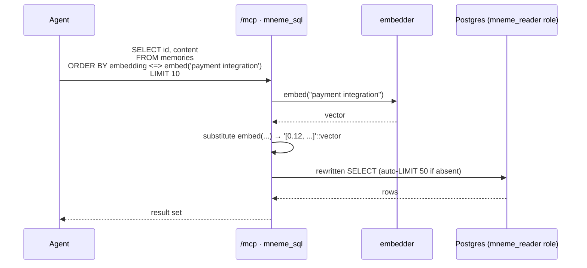

# Recall

How agents read memories. **One read primitive, `mneme_sql`, plus a `mneme_guide` companion tool and a skill that teach query shapes.** Schema changes update the skill and the guide, not the `mneme_sql` surface.

> Reads for context: [`concepts.md`](./concepts.md), [`data-model.md`](./data-model.md).
> The canonical skill: [`/packages/plugin/skills/using-mneme/SKILL.md`](../packages/plugin/skills/using-mneme/SKILL.md).
> Sibling read path: [`surface.md`](./surface.md) (session-start injection).

---

## The MCP tools

`mneme_sql(query)` — the read primitive, read-only. `/mcp` also exposes `mneme_guide` (no args): it returns the schema, the 3-layer search → walk → unfold workflow, and query templates, so a connector client that never loads the using-mneme skill still has the recall playbook. The `mneme_sql` tool description tells clients to call `mneme_guide` first.



> **Who embeds.** For plugin/daemon callers the `embed()` macro is substituted **client-side by the daemon** before the SQL reaches the server (the diagram's embedder step happens locally). The server resolves `embed()` itself only for connector clients running with `MNEME_SERVER_EMBED=1`; with server-embed off (the default), a bare `embed()` that reaches the server is **rejected**, not run. Either way the embedder is the canonical `@mneme/embed` model, so vectors never drift.

**Safety layers, in order:**
1. Comment stripping.
2. Single-statement check.
3. `SELECT`/`WITH` prefix required.
4. `FORBIDDEN_RE` keyword deny-list (18 DML/DDL keywords: `INSERT`, `UPDATE`, `DELETE`, `DROP`, `ALTER`, `CREATE`, `TRUNCATE`, `GRANT`, `REVOKE`, `VACUUM`, `REINDEX`, `REFRESH`, `COPY`, `CALL`, `DO`, `EXECUTE`, `LOCK`, `MERGE`).
5. `embed('text')` macro handling (see *Who embeds* above).
6. Auto-`LIMIT 50` if absent.
7. 5s `statement_timeout`.
8. 1MB result cap.

The connection runs as `mneme_reader` (Postgres role) — `SELECT`-only on `public.*`, blocked from `_ops.*`. RLS policy `USING (private = false)` means private rows are physically unreachable through this tool. The canonical implementation lives in [`/packages/server/src/services/mcp.ts`](../packages/server/src/services/mcp.ts).

**The role + RLS are the real boundary.** The `FORBIDDEN_RE` regex in `services/mcp.ts` that rejects `INSERT`/`UPDATE`/etc. is defense-in-depth — a tarpit that catches typos and obvious abuse — not the primary control. Postgres has many ways past a keyword deny-list. If `mneme_reader` is ever granted additional privileges, revisit the MCP gate and don't rely on the regex.

---

## Default hybrid recall

The canonical template lives in the skill. `/mneme:recall` instructs the agent to run this:

```sql
SELECT id, content, kind, repo, importance,
       meta->'related_to' AS related_to, created_at
FROM memories
WHERE archived_at IS NULL
ORDER BY
  (
    0.6  * (1 - (embedding <=> embed($1))) +
    0.4  * ts_rank(tsv, websearch_to_tsquery('english', $1)) +
    0.05 * importance +
    0.10 * ln(1 + recall_weight)
  )
  * CASE WHEN meta->>'superseded_by' IS NOT NULL THEN 0.3 ELSE 1 END
DESC
LIMIT 10;
```

**Score components:**
- **60% cosine** — semantic similarity via the HNSW index on `memories.embedding`.
- **40% `ts_rank`** — keyword match via the GIN index on `memories.tsv`.
- **5% importance** — small but always-on so [`workers/nap.md`](./workers/nap.md)'s decay actually shifts retrieval.
- **10% `ln(1 + recall_weight)`** — use-driven reinforcement (LTP). The server bumps `recall_weight` on every successful `mneme_sql` query that signals intent; nap decays it each cycle. `ln()` bounds the contribution so a single hot memory can't dominate.

**Filters:**
- Archived rows (`archived_at IS NOT NULL`) are filtered out — nap's auto-archive pass moves fully decayed orphans here.
- Superseded rows are **not** filtered — they get a `× 0.3` rank-down penalty (hardcoded in the using-mneme skill's SQL template) so historical context stays queryable below current truth.

**No `private` filter in the query** — the `mneme_reader` role's RLS makes private rows physically unreachable. The skill explicitly tells the agent not to add a `private` filter.

---

## Useful query shapes

The skill teaches more, but the most-used shapes:

```sql
-- Recent decisions in this repo
SELECT id, content, importance, created_at FROM memories
WHERE archived_at IS NULL
  AND repo = 'github.com/me/mneme'
  AND kind IN ('decision','feature','bugfix')
  AND created_at > now() - interval '7 days'
ORDER BY created_at DESC LIMIT 20;

-- Cluster summaries only (the synthesised view)
SELECT id, content, meta->>'cluster_title' AS title, created_at FROM memories
WHERE archived_at IS NULL AND kind = 'cluster'
ORDER BY embedding <=> embed('extract pipeline')
LIMIT 5;

-- Pivot from a surface row's 8-char id prefix
SELECT * FROM memories WHERE id::text LIKE '31752bec%';

-- Walk a relation graph
SELECT * FROM memories WHERE id::text = ANY(
  SELECT jsonb_array_elements_text(meta->'related_to')
  FROM memories WHERE id = '<seed-id>'
);
```

---

## What recall doesn't use yet

- **Recency boost.** Nap's decay already pulls down old unpinned memories via the importance term; an explicit recency factor would double-count. [`surface.md`](./surface.md) handles "what's fresh" at session-start time.
- `meta.related_to` is selected but not used in scoring. Two natural evolutions when the relation graph fills out:
  1. **Neighbour boost** — bump a memory's rank when its `related_to` ids also appear in the result set (mutual reinforcement).
  2. **Render alongside** — when a memory hits the top-N, fetch its `related_to` ids and render them as context-adjacent suggestions so the agent sees the cluster, not just the centroid.

---

## Why the skill, not more MCP tools

- **One tool to discover, learn, and pick.** A multi-tool surface forces the agent to choose between `search`, `timeline`, `get_observations`, etc., for every question — and the choice is often wrong. One tool removes the decision.
- **Schema changes update the skill, not the MCP surface.** Adding a column or a new `kind` value is a `SKILL.md` edit, not an MCP version bump.
- **Full SQL power for queries we never anticipated.** Want `kind='bugfix'` count per repo per week? It's a query, not a feature request.
- **The pattern: primitive + teach.** Same shape as Claude Code's own `grep` + `read` design — a tiny set of general primitives plus documentation that teaches the patterns, instead of a sprawling tool surface that has to grow with every use case.

`mneme_guide` is the one deliberate exception, and it doesn't reintroduce the routing problem: it takes no query and returns static schema + workflow text. It exists only so connector clients (Claude desktop/web/mobile, ChatGPT) that can't load the using-mneme skill still get the playbook — not as another query path to choose between.

---

## See also

- [`surface.md`](./surface.md) — the other read path; runs at SessionStart and pre-loads context without an explicit tool call.
- [`/packages/server/src/routes/mcp.ts`](../packages/server/src/routes/mcp.ts) — the `/mcp` route handler.
- [`/packages/plugin/src/claude/mcp-proxy.ts`](../packages/plugin/src/claude/mcp-proxy.ts) — the bundled stdio MCP proxy that translates JSON-RPC → `POST /mcp`.
- [`/packages/plugin/skills/using-mneme/SKILL.md`](../packages/plugin/skills/using-mneme/SKILL.md) — the canonical, agent-facing recall guide.
