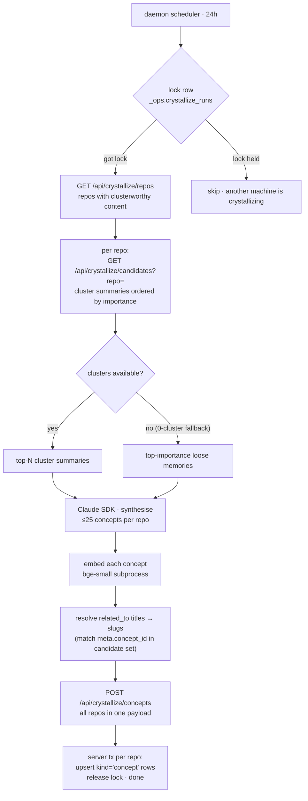

# Crystallize — every 24 hours, on the daemon (LLM in the loop)

The **concept synthesis pass**. Once per 24-hour window, per repo, it reads the cluster corpus (or falls back to the top-importance loose memories when clusters are sparse), calls Claude once to synthesise up to 25 named concepts, embeds them, resolves cross-concept `related_to` titles to stable slugs, then upserts all concepts for all repos in one server round-trip. The result is the `kind='concept'` tier: a curated, mutable-in-place editorial layer that surfaces first in every session.

> Reads for context: [`../concepts.md`](../concepts.md), [`../capture-pipeline.md`](../capture-pipeline.md).
> Sibling workers: [`dream.md`](./dream.md), [`digest.md`](./digest.md).
> Daemon-side constants in [`/packages/daemon/src/infra/config.ts`](../../packages/daemon/src/infra/config.ts) (`CRYSTALLIZE_WINDOW_HOURS`, concept cap, candidate limits).
> Server-side constants in [`/packages/server/src/infra/config.ts`](../../packages/server/src/infra/config.ts) (importance, history cap).

---

## Why daemon-side, not server-side

Same three reasons as dream, applied to concept synthesis:

1. **The user already pays for `claude`.** Crystallize calls Sonnet through the Claude Agent SDK on a machine where the user is already logged in — no extra API key, no separate billing. Server-side crystallize would require an API key the user pays for on top of their `claude` subscription.
2. **One lock row keeps exactly one machine working.** Three daemons, three ticks, one winner. `INSERT INTO _ops.crystallize_runs ... ON CONFLICT DO NOTHING` on the 24-hour slot (`CRYSTALLIZE_WINDOW_HOURS = 24`) lets exactly one daemon proceed; the others skip. Stale claims (no `completed_at` after a generous window) self-reap on the next acquire attempt.
3. **Failures are per-machine and per-cycle.** A bad concept synthesis on one machine releases the lock at cycle end; the next 24-hour window gets a clean attempt on whichever machine wins next.

---

## Flow



---

## Candidate selection

`GET /api/crystallize/candidates?repo=<repo>` returns two possible shapes:

**Normal path (clusters exist):** `kind='cluster'` rows for the repo, ordered by `(importance + RECALL_RANKING_COEF * ln(1 + recall_weight)) DESC`, capped at a server-side constant. These are already synthesised narratives — ideal input for concept extraction.

**0-cluster fallback:** When a repo has no cluster summaries yet (newly tracked repo, or all clusters were pruned), the server returns the top-importance non-cluster, non-archived memories instead. Crystallize still runs; it just works from raw memories rather than distilled ones.

In both cases the daemon receives content the Claude call synthesises into concept rows.

---

## Claude call

One Sonnet call per repo, fed the full candidate set. Returns an array of concept objects, at most 25:

```json
[
  {
    "concept_id": "kebab-slug-stable-identifier",
    "concept_type": "Component | Workflow | Decision | Constraint | Overview | ...",
    "title": "Short factual phrase",
    "body": "2–5 sentences describing the concept",
    "related_to": ["other-concept-id", "..."],
    "importance": 0.85
  },
  ...
]
```

**The Overview concept** (`concept_type = 'Overview'`) is a special singleton — a one-paragraph repo summary that surfaces as the **About** section in every session. The prompt asks for exactly one Overview per repo.

**`concept_id`** is a stable kebab slug the model proposes and maintains across cycles. The upsert key is `(repo, meta.concept_id)`, so concepts evolve in place rather than accumulating duplicate rows.

**`related_to`** uses concept slugs (not UUIDs) in the LLM output. The daemon resolves them to UUIDs against the current candidate set before submitting to the server — unknown slugs are silently dropped rather than rejected.

---

## Concept upsert semantics

Concepts are the **one exception to Mneme's append-only rule**. The server does an `INSERT ... ON CONFLICT (repo, meta.concept_id) DO UPDATE`:

- `content` (the body) is updated in place.
- `meta.title`, `meta.concept_type`, `meta.related_to`, `meta.source_member_ids`, `meta.refreshed_at` are updated.
- `meta.history[]` receives a new entry `{ content, at }` (capped at 10 entries — oldest evicted first). Full version history survives rollback if a concept regresses.
- **`meta.confirmed` is a write guard.** If a user or operator has set `meta.confirmed = true` on a concept, the server refuses to overwrite the `content` field (the body). The crystallize cycle may still update `refreshed_at` and `meta.source_member_ids` so staleness metadata stays accurate, but the curated body is protected.
- `importance` is fixed at **0.85** — above normal cluster importance (0.8) so concepts outrank clusters in recall, below pinned/constraint highs so user curation remains the top signal.

**Cap per repo: 25 concepts.** The cap is applied daemon-side via `drafts.slice(0, CRYSTALLIZE_MAX_CONCEPTS_PER_REPO)` in LLM-emit order before submission; the server does not cap or re-sort by importance. Existing concepts beyond the cap are not deleted — they persist until nap's decay eventually drops their importance below the recall threshold.

---

## Stability guarantees

| Property | Mechanism |
|---|---|
| One machine per window | `_ops.crystallize_runs` INSERT ON CONFLICT DO NOTHING on the 24h slot |
| Concept identity across cycles | `(repo, meta.concept_id)` ON CONFLICT upsert — same slug → same row |
| Body curation protection | `meta.confirmed = true` blocks content overwrite |
| Audit trail | `meta.history[]` (cap 10) tracks body evolution |
| Provenance | `meta.distiller_provider = "anthropic"`, `meta.distiller_model = "claude-sonnet"` on each row (`"claude-sonnet"` is a fixed label, not the resolved model id) |

---

## Surface and recall integration

- **Surface** — `kind='concept'` rows fill the **About** (cap 1, Overview only) and **Concepts** (cap 5, non-Overview) sections at SessionStart, ordered before Pinned and Rules. See [`../surface.md`](../surface.md).
- **Recall** — the hybrid template applies a `× 1.15` boost to `kind='concept'` rows. Importance is only 5% of the score, so the boost is light enough not to bury precise keyword or cosine hits, but strong enough that concepts surface reliably in broad queries. See [`../recall.md`](../recall.md).
- **Digest** — digest's cross-cluster merge pass does not touch concept rows. Concepts are a separate tier above clusters; their `in_cluster` is never set. See [`./digest.md`](./digest.md).
- **Dream** — dream produces the `kind='cluster'` rows that crystallize consumes on the normal candidate path. See [`./dream.md`](./dream.md).

---

## Cost per cycle

One Claude call per repo with clusters. A workspace with 5 tracked repos runs 5 calls per 24-hour window. Each call: ~5k–15k input tokens (cluster summaries) + ~2k output tokens (25 concepts). All paid from the user's `claude` quota.

---

## See also

- [`dream.md`](./dream.md) — produces `kind='cluster'` rows that feed the normal crystallize candidate path.
- [`digest.md`](./digest.md) — cross-cluster consolidation; does not touch concept rows.
- [`../surface.md`](../surface.md) — About + Concepts sections render concept rows at SessionStart.
- [`../recall.md`](../recall.md) — concept `× 1.15` boost in the hybrid recall template.
