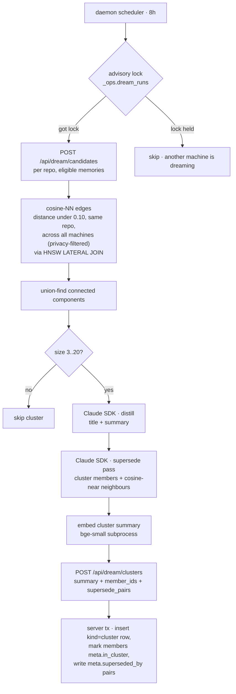

# Dream — every 8 hours, on the daemon (LLM in the loop)

The **distillation pass**. Clusters memories that talk about the same thing, calls Sonnet (via the Claude Agent SDK on the user's `claude` login) to write a one-paragraph summary, and persists that summary as a new `kind='cluster'` row.

Member memories stay queryable; the cluster sits above them and outranks them for broad recall queries. claude-mem's "compact-as-a-new-file" pattern, applied to rows.

> Reads for context: [`../concepts.md`](../concepts.md), [`../capture-pipeline.md`](../capture-pipeline.md).
> Sibling workers: [`nap.md`](./nap.md), [`digest.md`](./digest.md).
> Constants live in [`/packages/server/src/infra/config.ts`](../../packages/server/src/infra/config.ts).

---

## Why daemon-side, not server-side

Three reasons, all rooted in cost and authentication:

1. **The user already pays for `claude`.** Running Sonnet through the Agent SDK on a machine where the user is already logged in costs nothing extra. Server-side dream would require API keys the user separately pays for.
2. **Cross-machine coordination is cheap with one row.** With three machines, three daemons each tick "is it dream-time?". A Postgres advisory lock on `_ops.dream_runs` keyed by the 8-hour window slot makes exactly one of them succeed; the others see a held lock and skip. No leader election protocol, no heartbeats — Postgres is the truth.
3. **Failures are isolated to one machine.** A bad cluster on one daemon doesn't poison the others' next attempt — the lock releases at cycle end and the next slot is fresh.

---

## Flow

---

## Scope: cross-machine, per-repo

Candidates are pulled **across every machine** (Mneme's whole point), scoped by `repo IS NOT DISTINCT FROM` so memories about different codebases don't bleed into each other. The only machine-aware filter is the privacy guard `(private = false OR machine_id = caller)` — a machine sees public rows from anywhere, plus its own private rows, never anyone else's privates. (`private = true` isn't wired at the capture layer yet, but the filter is in place for when it ships.)

---

## Eligibility skip-list

On top of the scope filter, these never enter a cluster:
- `kind='cluster'` rows (the cluster summaries themselves)
- Pinned memories (user-curated, shouldn't be subsumed)
- Shadowed rows (`meta.shadow_of IS NOT NULL`)
- Superseded rows (`meta.superseded_by IS NOT NULL`)
- Anything where `meta.in_cluster IS NOT NULL` (already in a cluster)

---

## Distill prompt

One Sonnet call per cluster, capped at `DREAM_MAX_CLUSTER_SIZE = 20` so prompts stay bounded. Returns `{ title, summary }`:
- **title** — one short phrase
- **summary** — 1–3 sentences synthesising the cluster

The persisted `kind='cluster'` row gets:
- `content = summary`
- `meta.cluster_title`
- `meta.member_ids = [...]`
- `meta.distiller_provider`, `meta.distiller_model` (provenance)
- `importance = 0.8`
- inherits `capture_id` / `machine_id` / `repo` from the seed (oldest) member

The cluster row itself goes through the daemon's normal embed path so it's queryable like any other memory.

**Cluster size bounds:** `DREAM_MIN_CLUSTER_SIZE = 3`, `DREAM_MAX_CLUSTER_SIZE = 20`. Components outside this range are skipped this cycle.

**Cosine threshold:** `DREAM_CLUSTER_DISTANCE = 0.10` (tighter than nap's 0.15 — cluster members must be genuinely about the same thing, not just topically adjacent).

---

## Member marking is sticky

Each member memory gets `meta.in_cluster = <cluster_id>` so the next dream pass on any machine skips it. **Cluster membership is sticky by design** — once set, only the digest worker (see [`digest.md`](./digest.md)) can re-point it via cluster merges.

---

## LLM supersede (post-distill)

After distillation, a second LLM call against `findSupersedes` asks "among these memories, which (if any) are superseded by which?". The candidate set is exactly the cluster's members (the same memories that were just distilled); `findSupersedes` is fed `memberIds` only. Cross-cluster supersede, which pulls cosine-near neighbours from other clusters (`SUPERSEDE_LLM_ADJACENT_COSINE_MAX`, `SUPERSEDE_LLM_ADJACENT_AGE_WINDOW`), is digest's job (see [`digest.md`](./digest.md)).

Returns pairs `[{ old_id, new_id, reason }]`. The daemon posts them unmodified in the `/api/dream/clusters` submission; the **server** validates each pair at the write boundary (`validateSupersedePairs` — both ids must be in the cluster's `member_ids`, and `old.created_at` must be strictly older than `new.created_at`, checked against authoritative DB timestamps). Surviving pairs are written to `meta.superseded_by` inside the same transaction as the cluster insert; rejected pairs are logged and counted (`supersedes_rejected`).

**Cluster-level supersede (one cluster summary subsuming another) is intentionally not implemented in v1.** The rank-down penalty on individual members handles most of what cluster-level would address; the rest is digest's job.

**Validation is structural, not semantic.** The validator checks ordering (`older.created_at < newer.created_at`) and that both ids are in the candidate set. It does **not** fact-check the LLM's "X replaces Y" claim. This is why supersede chains in high-velocity feature work can look noisy — same fact captured four times, three rounds of correctly-validated supersedes.

---

## Cost per cycle

~5–15 clusters × ~3k input tokens × ~200 output tokens, paid in `claude` quota the user already has. Unlike extract, dream isn't latency-sensitive (it runs in the background) so per-cluster timeouts can be generous.

---

## See also

- [`nap.md`](./nap.md) — runs alongside dream; nap handles decay, shadows, relations, rule-based supersede.
- [`digest.md`](./digest.md) — the only worker that can re-point `meta.in_cluster` (via cluster merges).
- [`../recall.md`](../recall.md) — how `kind='cluster'` rows participate in recall scoring.
- [`../surface.md`](../surface.md) — Themes section in the SessionStart surface renders the most-relevant cluster summaries first.
