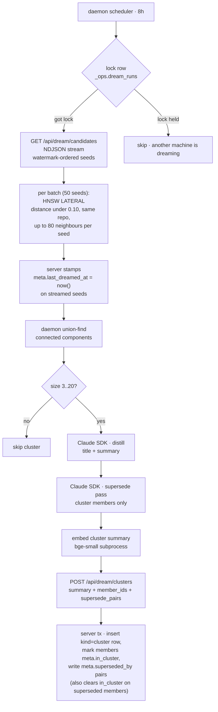

# Dream — every 8 hours, on the daemon (LLM in the loop)

The **distillation pass**. Clusters memories that talk about the same thing, calls Sonnet (via the Claude Agent SDK on the user's `claude` login) to write a one-paragraph summary, and persists that summary as a new `kind='cluster'` row.

Member memories stay queryable; the cluster sits above them and outranks them for broad recall queries. claude-mem's "compact-as-a-new-file" pattern, applied to rows.

> Reads for context: [`../concepts.md`](../concepts.md), [`../capture-pipeline.md`](../capture-pipeline.md).
> Sibling workers: [`nap.md`](./nap.md), [`digest.md`](./digest.md).
> Daemon-side constants in [`/packages/daemon/src/infra/config.ts`](../../packages/daemon/src/infra/config.ts) (cluster size, window).
> Server-side constants in [`/packages/server/src/infra/config.ts`](../../packages/server/src/infra/config.ts) (cosine distance, candidate caps, stream batch sizes).

---

## Why daemon-side, not server-side

Three reasons, all rooted in cost and authentication:

1. **The user already pays for `claude`.** Running Sonnet through the Agent SDK on a machine where the user is already logged in costs nothing extra. Server-side dream would require API keys the user separately pays for.
2. **Cross-machine coordination is cheap with one row.** With three machines, three daemons each tick "is it dream-time?". A durable lock row in `_ops.dream_runs` keyed by the 8-hour window slot (INSERT ON CONFLICT DO NOTHING) makes exactly one of them succeed; the others see a held lock and skip. No leader election protocol, no heartbeats — Postgres is the truth. Stale claims (no `completed_at` after 30 min) self-reap inside the next acquire attempt.
3. **Failures are isolated to one machine.** A bad cluster on one daemon doesn't poison the others' next attempt — the lock releases at cycle end and the next slot is fresh.

---

## Flow

---

## Watermark-paginated candidate selection

Dream is round-robin over the whole corpus, not "newest N rows". The server picks `DREAM_MAX_CANDIDATES_PER_CYCLE = 3000` seeds ordered by `meta.last_dreamed_at NULLS FIRST, created_at ASC` (indexed via migration 0027). The watermark advances per-batch as the stream progresses; the next cycle picks up where this one left off. Full corpus sweep in `ceil(corpus / 3000)` cycles.

---

## NDJSON streaming candidates endpoint

`/api/dream/candidates` (with `Accept: application/x-ndjson`) picks seed ids upfront (fast, partial-index hit), then loops `DREAM_STREAM_SEED_BATCH = 50` seeds at a time through the LATERAL with `DREAM_MAX_NEIGHBORS_PER_MEMORY = 80`. Each batch's edges flush as NDJSON `edge` frames the moment they're ready; `stampDreamedSeeds(batch)` stamps `meta.last_dreamed_at` on that batch's seed ids before the next batch starts. A `done` frame closes the stream. Neighbor content streams after edges in `neighbor` frames, batched at `DREAM_STREAM_NEIGHBOR_BATCH = 200`.

The daemon (`parseNdjsonCandidates`) accumulates the frames into a `{ repos: { seeds, edges } }` shape. Per-batch stamping means a mid-stream abort still preserves the progress of every batch that completed before the abort — the next cycle re-attempts only the unfinished slice.

---

## Scope: cross-machine, per-repo

Candidates are pulled **across every machine** (Mneme's whole point), scoped by `repo IS NOT DISTINCT FROM` so memories about different codebases don't bleed into each other. The only machine-aware filter is the privacy guard `(private = false OR machine_id = caller)` — a machine sees public rows from anywhere, plus its own private rows, never anyone else's privates.

---

## Eligibility skip-list

On top of the scope filter, these never enter a cluster:
- `kind='cluster'` rows (the cluster summaries themselves)
- Pinned memories (user-curated, shouldn't be subsumed)
- Superseded rows (`meta.superseded_by IS NOT NULL`)
- Anything where `meta.in_cluster IS NOT NULL` (already in a cluster)
- Archived rows (`archived_at IS NOT NULL`)

---

## Distill prompt

One Sonnet call per cluster, capped at `DREAM_MAX_CLUSTER_SIZE = 20` so prompts stay bounded. Returns `{ title, summary }`:
- **title** — one short phrase (4-10 words, third-person factual)
- **summary** — 2-6 sentences synthesising the cluster

The persisted `kind='cluster'` row gets:
- `content = summary`
- `meta.cluster_title`
- `meta.member_ids = [...]`
- `meta.distiller_provider = "anthropic"`, `meta.distiller_model = "claude-sonnet"` (provenance)
- `importance = 0.8`
- inherits `capture_id` / `machine_id` / `repo` / `harness` / `agent` from the seed (first) member
- `chunk_id = sha256(content_hash + ":" + embedder_model)` for ON CONFLICT idempotency on re-runs

**Cluster size bounds:** `DREAM_MIN_CLUSTER_SIZE = 3`, `DREAM_MAX_CLUSTER_SIZE = 20`. Components outside this range are skipped this cycle.

**Cosine threshold:** `DREAM_CLUSTER_DISTANCE = 0.10` (tighter than nap's 0.15 — cluster members must be genuinely about the same thing, not just topically adjacent). Asymmetric with digest's looser merge threshold of 0.20 (see [`digest.md`](./digest.md)).

---

## Member marking is sticky

Each member memory gets `meta.in_cluster = <cluster_id>` so the next dream pass on any machine skips it. **Cluster membership is sticky by design** — once set, only the digest worker (see [`digest.md`](./digest.md)) can re-point it via cluster merges.

---

## LLM supersede (post-distill)

After distillation, a second LLM call against `findSupersedes` asks "among these memories, which (if any) are superseded by which?". The candidate set is exactly the cluster's members (the same memories that were just distilled); `findSupersedes` is fed `memberIds` only. Cross-cluster supersede, which pulls cosine-near neighbours from other clusters (`SUPERSEDE_LLM_ADJACENT_COSINE_MAX = 0.15`), is digest's job (see [`digest.md`](./digest.md)).

Returns pairs `[{ old_id, new_id, reason }]`. The daemon posts them unmodified in the `/api/dream/clusters` submission; the **server** validates each pair at the write boundary (`validateSupersedePairs` — both ids must be in the cluster's `member_ids`, and `old.created_at` must be strictly older than `new.created_at`, checked against authoritative DB timestamps). Surviving pairs are written: `meta.superseded_by = new_id` AND `meta.in_cluster` is cleared atomically (a superseded row should not keep claiming cluster membership). Rejected pairs are logged and counted (`supersedes_rejected`).

**Validation is structural, not semantic.** The validator checks ordering (`older.created_at < newer.created_at`) and that both ids are in the candidate set. It does **not** fact-check the LLM's "X replaces Y" claim. This is why supersede chains in high-velocity feature work can look noisy — same fact captured four times, three rounds of correctly-validated supersedes.

---

## Persistence + idempotency

Each cluster moves through three outbox stages on the daemon side (`~/.mneme/outbox/dream/<window>/`):
- `distilled/<cluster_id>.json` — written after Sonnet returns `{title, summary, supersede_pairs}`. Survives daemon crash.
- `embedded/<cluster_id>.json` — written after the bge-small subprocess embeds the summary. Survives crash too.
- (deleted) — server confirmed write to `memories`.

`cluster_id = sha256(sorted member_ids)` so a resume after crash recognises which clusters are already done at each stage. `resumeDreamCycles()` on daemon startup walks the outbox and re-submits anything stuck in `distilled/` or `embedded/`.

---

## Cost per cycle

~5-15 clusters × ~3k input tokens × ~200 output tokens, paid in `claude` quota the user already has.

---

## See also

- [`nap.md`](./nap.md) — runs alongside dream; nap handles decay, archive, relations, rule-based supersede.
- [`digest.md`](./digest.md) — the only worker that can re-point `meta.in_cluster` (via cluster merges).
- [`../recall.md`](../recall.md) — how `kind='cluster'` rows participate in recall scoring.
- [`../surface.md`](../surface.md) — Themes section in the SessionStart surface renders the most-relevant cluster summaries first.
