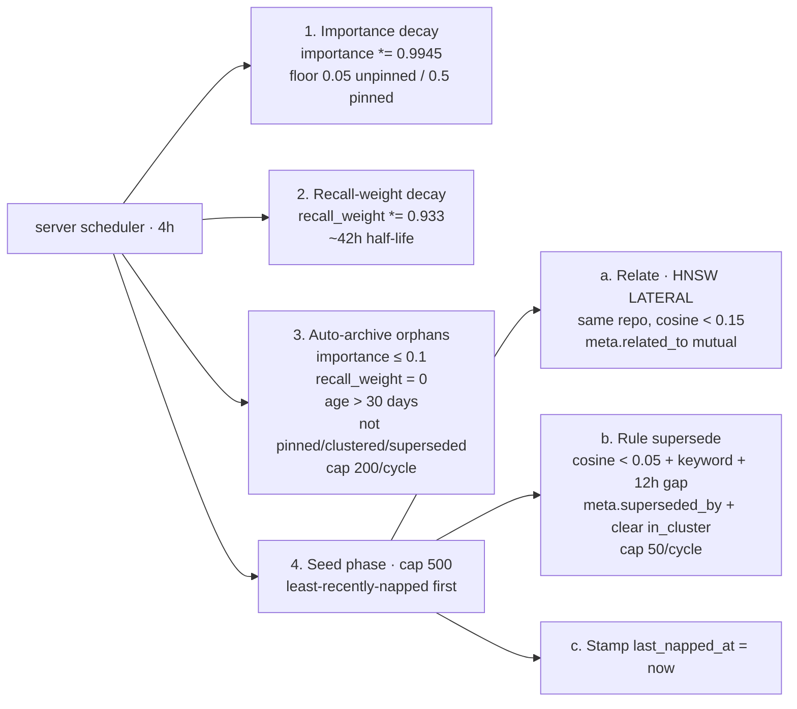

# Nap — every 4 hours, on the server (pure SQL)

The **maintenance pass**. No LLM, no embedder, no per-row HTTP calls — all SQL, four independent phases per cycle. Runs server-side because the only thing it needs is fast access to Postgres.

> Reads for context: [`../concepts.md`](../concepts.md), [`../data-model.md`](../data-model.md).
> Sibling workers: [`dream.md`](./dream.md), [`digest.md`](./digest.md).
> Constants live in [`/packages/server/src/infra/config.ts`](../../packages/server/src/infra/config.ts).

---

## What nap does, top to bottom

Four phases, each its own SQL call (not one transaction — a slow phase fails in isolation instead of rolling back the rest):

1. **Importance decay (with asymmetric floors).** Every non-archived memory's `importance` shrinks by age — exponential decay with τ = 30 days. Per-cycle factor is `NAP_DECAY_PER_CYCLE = exp(-1/180) ≈ 0.9945` (6 naps/day × 30 days = 180). A `GREATEST(...)` clamp inside the UPDATE enforces asymmetric floors: `NAP_PIN_FLOOR = 0.5` for `meta.pinned = true`, `NAP_FLOOR = 0.05` for everything else. Pinned content stays in recall's high zone; a fresh pin (1.0) still outranks a stale one (0.5). Keyset-paginated so a full-table pass never trips the Postgres `statement_timeout = 2 min`.

2. **Recall-weight decay (LTP).** Multiplies `recall_weight` by `RECALL_LTD_DECAY = 0.933` per cycle so use-driven reinforcement fades when unused. With 6 cycles/day this preserves a ~42 hour half-life from a single recall hit. Same keyset pagination as importance decay.

3. **Auto-archive orphans.** `napArchiveOrphans` sets `archived_at = now()` on memories matching ALL of:
   - `importance ≤ NAP_ARCHIVE_IMPORTANCE_MAX` (0.1) — fully decayed
   - `recall_weight = 0` — never accessed since extraction (or fully LTD-decayed)
   - `created_at` older than `NAP_ARCHIVE_MIN_AGE_DAYS` (30 days) — fair shot at being useful
   - NOT pinned, NOT in_cluster, NOT superseded

   `kind='cluster'` rows get a longer grace window via `NAP_CLUSTER_ARCHIVE_MIN_AGE_DAYS = 60`. Capped at `NAP_ARCHIVE_PER_CYCLE_CAP = 200` so a one-time eligibility bloom doesn't dump thousands at once. Archived rows stay in the table and are still queryable via `mneme_sql` — they just stop appearing on the SessionStart surface. `/mneme:unarchive <uuid>` restores.

4. **Seed phase (relate + rule-based supersede + last_napped_at stamp).** One transaction over a `NAP_PER_CYCLE_CAP = 500` slice of least-recently-napped rows:

   a. **Semantic relations.** For each seed, find up to `NAP_RELATE_MAX_NEIGHBORS = 5` nearest same-repo neighbours at cosine `< NAP_RELATE_DISTANCE = 0.15` via a `LATERAL JOIN` over the HNSW index. Write each into the other's `meta.related_to` (mutual, idempotent — `DISTINCT` merge with the existing array).

   b. **Rule-based supersede (conservative).** Find pairs `(older, newer)` where:
   - cosine `< SUPERSEDE_RULE_COSINE_MAX = 0.05` (very tight rephrasing distance),
   - newer is at least `SUPERSEDE_RULE_AGE_GAP = '12 hours'` newer,
   - newer's content matches a supersede-keyword regex: `instead of`, `no longer`, `replaced`, `now uses`, `previously`, `updated to`, `deprecated`, `swapped`,
   - neither is pinned or already superseded.

     Set `older.meta.superseded_by = newer_id` AND clear `meta.in_cluster` atomically (a superseded row should not keep claiming cluster membership). Per-cycle write cap (`SUPERSEDE_RULE_PER_CYCLE_CAP = 50`) keeps blast radius bounded. The obvious "we now use X" cases get caught for free; nuanced supersedes are dream's job.

   c. **Stamp `meta.last_napped_at = now()`** on every seed in the slice, whether or not relate or supersede found anything. This is the round-robin gate.

---

## Pagination via `meta.last_napped_at`

Postgres on Railway has a `statement_timeout = 2 min` ceiling. At corpus scale, a one-shot pass would trip the timeout.

Nap solves this with **round-robin pagination**: the seed phase picks `NAP_PER_CYCLE_CAP = 500` rows ordered by `meta.last_napped_at NULLS FIRST, created_at`, processes them, and stamps `meta.last_napped_at = now()` as part of the same transaction. Stamped rows naturally drop to the back of the queue. Over a few cycles, every row gets touched once; under steady-state arrival the queue stabilises at the cap. Indexed via the partial functional index from migration 0027.

The decay phases (importance + recall_weight) also paginate via keyset on `id` so the full-table pass stays bounded.

The inner `LATERAL JOIN` for relate-pass still scans the full memories table for HNSW lookups, so a seed in this cycle can still link to non-seed neighbours — pagination only limits which rows we examine **as seeds**.

---

## Why server-side, not pg_cron

Same reason any process loop lives in code:
- Shares the same observability stream (logs and spans go to `_ops.*`).
- Doesn't depend on a Postgres extension (keeps Mneme provider-portable across Railway / Neon / Supabase / self-host without needing `pg_cron` available).
- The scheduler in `worker/scheduler.ts` persists `next_run_at` to `_ops.worker_runs` so a Railway redeploy mid-cycle doesn't skip the schedule.

The same reasoning applies to [`prune.md`](./prune.md) (telemetry retention) — same portability win.

---

## Retry semantics

Retries live in the **daemon's outbox**, not in nap. A failed push leaves the file in `embedded/` for the next tick; a permanent failure moves the file to `failed/<reason>/`.

---

## See also

- [`dream.md`](./dream.md) — clustering pass that runs every 8h on the daemon.
- [`digest.md`](./digest.md) — 24h cross-cluster pass on the server (opt-in).
- [`../recall.md`](../recall.md) — how nap's outputs (importance, related_to, superseded_by, archived_at) interact at recall time.
