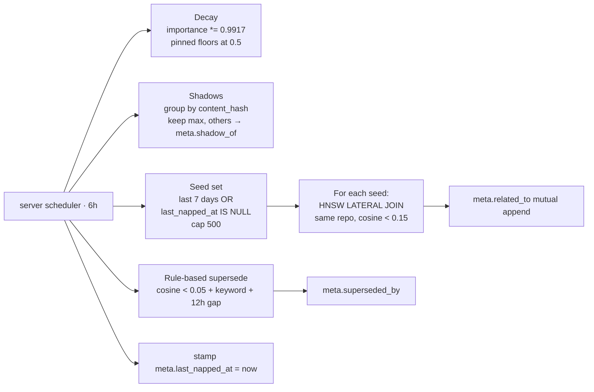

# Nap — every 6 hours, on the server (pure SQL)

The **maintenance pass**. No LLM, no embedder, no per-row HTTP calls — all SQL, in one transaction per cycle. Runs server-side because the only thing it needs is fast access to Postgres.

> Reads for context: [`../concepts.md`](../concepts.md), [`../data-model.md`](../data-model.md).
> Sibling workers: [`dream.md`](./dream.md), [`digest.md`](./digest.md).
> Constants live in [`/packages/server/src/infra/config.ts`](../../packages/server/src/infra/config.ts).

---

## What nap does, top to bottom

1. **Decay.** Every non-archived memory's `importance` shrinks by age — exponential decay with τ = 30 days. Per-cycle factor is `exp(-1/120) ≈ 0.9917` (4 naps/day × 30 days = 120). Pinned memories decay too, just with a higher floor.

2. **Asymmetric floors.** `NAP_PIN_FLOOR = 0.5` for `meta.pinned = true`, `NAP_FLOOR = 0.05` for everything else. This is what gives "pin" its meaning: pinned content stays in recall's high zone forever, while a fresh pin (1.0) still outranks a stale one (0.5) so newer pins surface first without disappearing the older ones.

3. **Exact-text shadows.** Group by `content_hash`; keep the highest-importance row, mark the rest with `meta.shadow_of = <kept_id>` and hard-decay (`× 0.1`, `NAP_SHADOW_DECAY`) on the same cycle. Default queries filter shadows out via `(meta->>'shadow_of') IS NULL`.

4. **Semantic relations.** For each "seed" memory (recent — last 7 days — OR never napped), find up to 5 nearest same-repo neighbours at cosine `< 0.15` (`NAP_RELATE_DISTANCE`) via a `LATERAL JOIN` over the HNSW index. Write each into the other's `meta.related_to` (mutual, idempotent — `DISTINCT` merge with the existing array).

5. **Rule-based supersede (conservative).** Find pairs `(older, newer)` where:
   - cosine `< 0.05` (`SUPERSEDE_RULE_COSINE_MAX` — very tight rephrasing distance),
   - newer is at least 12 hours newer (`SUPERSEDE_RULE_AGE_GAP`),
   - newer's content matches a supersede-keyword regex: `instead of`, `no longer`, `replaced`, `now uses`, `previously`, `updated to`, `deprecated`, `swapped`,
   - neither is pinned or already superseded.

   Set `older.meta.superseded_by = newer_id`. Per-cycle write cap (`SUPERSEDE_RULE_PER_CYCLE_CAP = 50`) keeps blast radius bounded. The obvious "we now use X" cases get caught for free; nuanced supersedes are dream's job.

---

## Pagination via `meta.last_napped_at`

Postgres on Railway has a `statement_timeout = 2 min` ceiling. With ~7k memories and growing, a one-shot pass eventually trips the timeout.

Nap solves this with **round-robin pagination**: each cycle picks `NAP_PER_CYCLE_CAP = 500` rows ordered by `meta.last_napped_at NULLS FIRST, created_at`, processes them, and stamps `meta.last_napped_at = now()` as part of the same transaction. Stamped rows naturally drop to the back of the queue. Over a few cycles, every row gets touched once; under steady-state arrival the queue stabilises at the cap.

The inner `LATERAL JOIN` for relate-pass still scans the full memories table for HNSW lookups, so a seed in this cycle can still link to non-seed neighbours — pagination only limits which rows we examine **as seeds**.

---

## Why server-side, not pg_cron

Same reason any process loop lives in code:
- Shares the same observability stream (logs and spans go to `_ops.*`).
- Doesn't depend on a Postgres extension (keeps Mneme provider-portable across Railway / Neon / Supabase / self-host without needing `pg_cron` available).
- The scheduler in `worker/scheduler.ts` persists `next_run_at` to `_ops.worker_runs` so a Railway redeploy mid-cycle doesn't skip the schedule.

The per-cycle SQL runs in **one transaction** — atomic, no LLM in the loop, no external dependencies.

The same reasoning applies to [`prune.md`](./prune.md) (telemetry retention), which used to run as a `pg_cron` job on Supabase and has since moved fully to app-level for the same portability win.

---

## Retry semantics

Retries live in the **daemon's outbox**, not in nap. A failed push leaves the file in `embedded/` for the next tick; a permanent failure moves the file to `failed/<reason>/`. The legacy `ingest_jobs` queue (and the nap pass that retired its errors) was dropped in migration 0021 along with the table itself.

---

## See also

- [`dream.md`](./dream.md) — clustering pass that runs every 8h on the daemon.
- [`digest.md`](./digest.md) — weekly cross-cluster pass on the server (opt-in).
- [`../recall.md`](../recall.md) — how nap's outputs (importance, shadow, related_to, superseded_by) interact at recall time.
